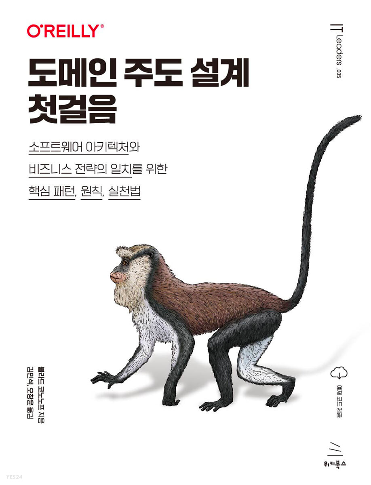

# 책 표지

YES24: https://www.yes24.com/Product/Goods/109708596

## 소개말 내용 요약

> DDD는 전략적인 부분과 전술적인 부분으로 나뉜다. 
> 
> DDD의 전략적 도구는 비즈니스 도메인과 전략을 분석하고 다양한 이해당사자 간의 공유된 비즈니스 이해를 촉진시키는 데 
> 쓰인다. 또한 이런 비즈니스 도메인 지식을 활용하여 시스템을 구성요소로 분해하고 통합 패턴을 정의하는 등 높은 수준의 설계 의사 결정을 
> 내리는 데 사용된다.

 
> DDD의 전술적 도구는 다양한 측면의 커뮤니케이션 이슈를 다룬다. DDD의 전술적 패턴은 비즈니스 도메인을 반영하고 목표를 다루며, 
> 비즈니스 언어를 구사하는 방식으로 코드를 작성하게한다. 

> DDD의 전략적, 전술적 패턴과 실무는 모두 소프트웨어 설계를 비즈니스 도메인과 일치시키는데 사용된다. 
> 여기에서 바로 **(비즈니스) 도메인 주도 (소프트웨어) 설계**라는 용어가 유래했다.

> 소프트웨어 설계와 비즈니스 전략의 연결이 단단할수록 
> 비즈니스 요건을 충족하도록 시스템을 유지보수하고 발전시키기가 더 쉬워지고 궁극적으로 좀 더 성공하는 소프트웨어 프로젝트로 이어진다.
