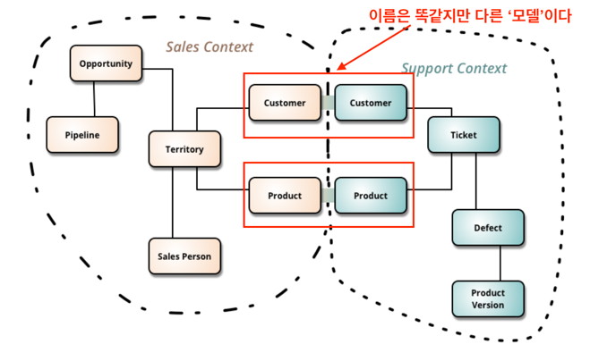

# 전략적 설계 - BOUNDED CONTEXT 

## BOUNDED CONTEXT

* 하위 도메인마다 같은 용어라도 의미가 다르고 같은 대상이라도 지칭하는 용어가 다를 수 있기 때문에 한 개의 모델로 모든 하위 도메인을 표현하려는 시도는 올바른 방법이 아니며 표현할 수도 없다.
* 하위 도메인마다 사용하는 용어가 다르기 때문에 올바른 도메인 모델을 개발하려면 **하위 도메인마다 모델을 만들어야 한다**. 
* `모델은 특정한 컨텍스트(문맥)하에서 완전한 의미를 갖는다`. 
* `이렇게 구분되는 경계를 갖는 컨텍스트`를 DDD에서는 `BOUNDED CONTEXT`라고 부른다.



## 좋은 BOUNDED CONTEXT
* 하나의 BOUNDED CONTEXT는 하나의 팀에만 할당되어야 한다. 
* 하나의 팀은 여러 개의 BOUNDED CONTEXT를 다룰 수 있다. 
* 각각의 BOUNDED CONTEXT는 각각의 개발 환경을 가질 수 있다.

## CONTEXT MAP
* 컨텍스트 맵은 **상호 교류하는 시스템의 목록을 제공**하고, **팀 내 의사소통의 촉매 역할**을 한다.

## 프로젝트와 조직 관계
* 파트너십(Partnership) : 두 CONTEXT가 하나의 트랜잭션으로 묶여 있다.
* 공유 커널(Shared kernel) : 상호 의존하는 공유 모델을 관리한다.
* 고객-공급자(Customer-Supplier Development) : 업스트림(서버:공급자), 다운스트림(클라이언트:고객)로 단방향으로 의존한다.
* 순응주의자(Conformist) : 업스트림(서버)이 모든 것을 제어한다.
* 오픈 호스트 서비스(Open Host Service) : REST/API, RPC, Socket
* 분리된 방법(Seprate Ways) : 의존 없음
* 큰 진흙공(Big ball of mud) : 안티 패턴

## DDD vs OOP
* OOP는 상속이나 재활용성을 위해서 공통된 데이터를 공유하는 것을 중요시
* DDD는 도메인 분리를 중시

```markdown
언급하셨다시피, DDD의 진정한 힘은 유비쿼터스 언어와 BOUNDED CONTEXT부터 시작합니다.
유비쿼터스 언어를 반영해야 전술적 설계가 의미가 있는 셈이죠.
OOP에 근간하지만 OOP 원칙을 정면으로 위배하는 패턴도 몇 있어요.
예를 들어 ID를 이용해서 애그리거트 간 decoupling을 시킨다든지,
도메인 서비스는 행동을 객체에서 의도적으로 분리시키는 패턴이 OOP와는 다른 개념입니다.
밸류 타입을 사용하는 것을 권장하는 등, 저는 DDD의 전술적 설계가 순수 OOP보다 더 적용하기 심플한 측면이 있다고 개인적으로 생각해요.
```
