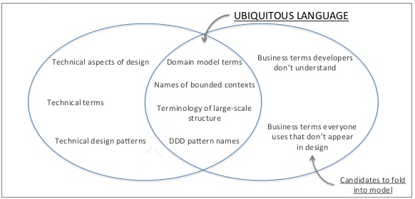

# 전략적 설계

## 유비쿼터스 언어(UBIQUITOUS LANGUAGE)

* 도메인에서 사용하는 용어를 코드에 반영하지 않으면 그 코드는 개발자에게 코드의 의미를 해석해야 하는 부담을 준다.
* 코드의 가독성을 높여서 코드를 분석하고 이해하는 시간을 절약한다.
* 용어가 정의 될 때마다 **용어 사전에 이를 기록하고 명확하게 정의** 함으로써 **추후 또는 다른 사람들도 공통된 언어를 사용할 수 있도록 한다**.



## 효과적인 모델링
* 사용자와 개발자는 동일한 언어로 이야기하는가? 
* 해당 언어가 애플리케이션에서 수행해야 할 내용에 관한 논의를 이끌어갈 만큼 풍성한가? 
* 표현해야 할 것을 더 쉽게 말하는 방법을 찾아낸 다음 그러한 새로운 아이디어를 다이어그램과 코드에 적용한다.

### 평소 개발자가 말하는 방식
```markdown
* RoutingService에 출발지, 목적지, 도착 시간을 전달하면 화물이 멈춰야 할 지점을 찾고, 그것을 데이터베이스에 삽입한다.

* 출발지, 목적지 등등 이것들을 모두 RoutingService에 넣으면 필요한 것이 모두 담긴 Plan를 돌려받는다.

* RoutingService는 RouteSpecification을 만족하는 Plan 찾는다.
```

### 한 팀, 한 언어
* 사업팀도 해당 모델을 이해하지 못한다면 모델이 뭔가 잘못된 것이다.

### UML (Unified Modeling Language)
모델 기반 의사소통은 UML 상의 다이어그램으로 한정돼서는 안 된다.

[UML: 클래스 다이어그램과 소스코드 매핑](https://www.nextree.co.kr/p6753/)
[[UML] 클래스 다이어그램 작성법 - Heee's Development Blog](https://gmlwjd9405.github.io/2018/07/04/class-diagram.html))


> UML은 Unified Modeling Language의 약자이고, 통합 모델링 언어라고 한다.


