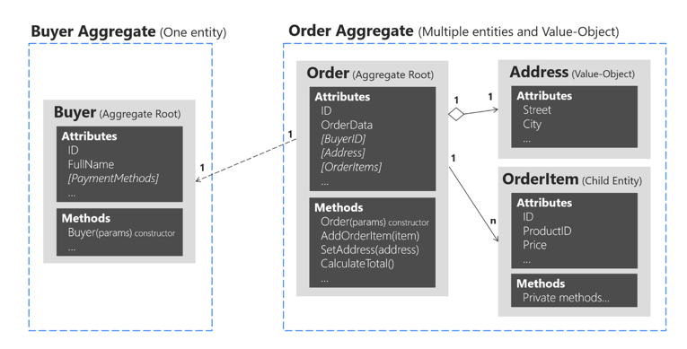
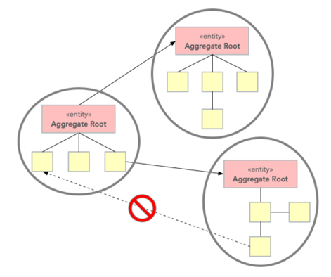

# 전술적 설계 - AGGREGATE와 REPOSITORY

## AGGREGATE
* `관련 객체를 하나로 묶은 군집`
* `애그리거트`는 `군집에 속한 객체들을 관리하는 루트 엔티티를 갖는다`.
* `애그리거트로 묶어서 바라보면 좀 더 상위 수준에서 도메인 모델 간의 관계를 파악할 수 있다`. (불필요한 세부사항이 아니라 관계에 더 집중해서 볼 수 있음)
* `애그리거트에 속한 객체`는 `유사하거나 동일한 라이프사이클을 갖는다`.
* **한 애그리거트에 속한 객체**는 `다른 애그리거트에 속하지 않는다`.
* `두 개 이상의 엔티티로 구성되는 애그리거트`는 `드물게 존재`한다.

## Aggregate pattern 



## AGGREGATE ROOT

* `애그리거트 루트의 핵심 역할`은 `애그리거트의 일관성이 깨지지 않도록 하는 것`이다.
* 애그리거트 루트는 `애그리거트가 제공해야 할 도메인 기능을 구현`한다.
* 이는 `애그리거트의 내부 구현을 숨겨서 애그리거트 단위로 구현을 캡슐화할 수 있도록 돕는다`. ('애그리거트 단위로 구현을 캡슐화'하는 것이 핵심)
* `루트 엔티티`는 `애그리거트에 속해 있는 엔티티와 밸류 객체를 이용해서 애그리거트가 구현해야 할 기능을 제공`한다.



## AGGREGATE 참조
* **애그리거트를 직접 참조할 때 발생할 수 있는 가장 큰 문제**는 `편리함을 오용할 수 있다`.
* `ID 참조를 사용하면` `모든 객체가 참조로 연결되지 않고 한 애그리거트에 속한 객체들만 참조로 연결`된다.
* `ID를 이용한 참조 방식을 사용하면` `복잡도를 낮추는 것과 함께 한 애그리거트에서 다른 애그리거트를 수정하는 문제를 원천적으로 방지할 수 있다`.

## REPOSITORY
* **엔티티나 밸류 오브젝트가** **요구사항에서 도출되는 도메인 모델**이라면 `리포지터리는 구현을 위한 도메인 모델`
* `애그리거트 단위`로 `도메인 객체를 저장하고 조회하는 기능을 정의`한다.
* `애그리거트를 구하는 리포지터리 메서드`는 `완전한 애그리거트를 제공`해야 한다.
* `리포지터리가 완전한 애그리거트를 제공하지 않으면, 필드나 값이 올바르지 않아 애그리거트의 기능을 실행하는 - 도중에 NullPointerException과 같은 문제가 발생하게 된다`.
* `리포지토리는 애그리거트(루트) 단위로 존재`하며 `테이블 단위로 존재하는 것이 아니다`.

```java
public interface OrderRepository {
    public Order findByNumber(OrderNumber number);
    public void save(Order order);
    public void delete(Order order);
}
```
