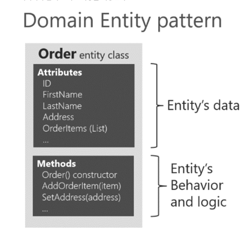

# 전술적 설계 - ENTITY와 VALUE OBJECT

## ENTITY와 VALUE OBJECT
* **도출한 모델**은 크게 `ENTITY`와 `VALUE OBJECT`로 **구분**
* 데이터와 함께 도메인 기능을 제공한다.




## ENTITY
* 식별자를 갖는다.
* `객체의 상태 중 해당 객체의 고유한 성질을 표현할 수 있는 상태들`을 `식별자`라고 부른다.
* 식별자는 엔티티 **객체마다 고유해서** 각 **엔티티는 서로 다른 식별자를 갖는다**.

```markdown
식별자 생성
- 특정 규칙에 따라 생성
- UUID 사용
- 값을 직접 입력
- 일련번호 사용(시퀀스나 DB의 자동 증가 칼럼 사용)
```

## 도메인 모델에 set 메서드 넣지 않기

* **도메인 모델에 getter 메서드와 setter 메서드를 무조건 추가하는 것은 좋지 않은 버릇**
* 특히 setter 메서드는 `도메인의 핵심 개념이나 의도를 코드에서 사라지게 한다`.
* setter 메서드의 또 다른 문제는 `도메인 객체를 생성할 때 완전한 상태가 아닐 수도 있다는 것`이다.
* `도메인 객체가 불완전한 상태로 사용되는 것을 막으려면 생성 시점에 필요한 것을 전달해 주어야 한다`.

```markdown
* changeShippingInfo() vs setShippingInfo()
* completePayment() vs setOrderState()
```

## VALUE OBJECT

* 밸류 타입은 불변
* `의미를 명확하게 표현`하거나 `두 개 이상의 데이터가 개념적으로 하나인 경우 밸류 타입을 이용`
* `시스템이 성숙함에 따라 데이터 값을 객체로 대체`
* **밸류 객체의 값을 변경하는 방법**은 `새로운 밸류 객체를 할당하는 것뿐`이다.
* 정말 String으로 우편 번호를 표현할 수 있는가?
* `항상 equals() 메서드를 오버라이드할 것을 권고`한다. (물론 hashCode()도 재정의해야 함)

## 불변 객체
> 모든 클래스를 상태를 변경할 수 없는 불변 클래스(immutable class)로 만들면 유지 보수성이 크게 향상된다.

1. 불변 객체에는 아래의 ‘식별자 변경(identity mutability)’ 문제가 발생하지 않는다.

```java
Map<Cash, String> map = new HashMap<>();
Cash five = new Cash("$5");
Cash ten = new Cash("$10");
map.put(five, "five");
map.put(ten, "ten");
five.mul(2);
```

2. 객체가 완전하고 견고한 상태이거나 아니면 아예 실패하는 `실패 원자성(failure atomicity)`을 가진다.

```java
public class Cash {
    private int dollars;
    private int cents;

    public mul(final int factor) {
        this.dollars *= factor;
    
        if (/* 뭔가 잘못 됐다면 */) {
            throw new RuntimeException("oops...");
        }
        
        this.cents *= factor;
    }
);

```

3. `시간적 결합(temporal coupling)을 없앨 수 있다`.

```java
    // 가변
    Cash price = new Cash();
    price.setDollars(29);
    price.setCents(95);
    System.out.println(price); // "$29.95"

    // 불변
    Cash price = new Cash();
    price.setDollars(29);
    System.out.println(price); // "$29.00"!
    price.setCents(95);
```

4. `스레드 안정성` 
   * `객체가 여러 스레드에서 동시에(concurrently) 사용될 수 있고 예측 가능한(predictable) 결과를 보장하는 객체의 품질`
5. `단순성`(simplicity), `객체가 더 단순해질 수록 응집도는 더 높아지고, 유지보수는 더 쉬워진다`.
6. `불변 객체의 크기가 작은 이유`는 `불변 객체의 경우 생성자 안에서만 상태를 초기화할 수 있기 때문`이다.


