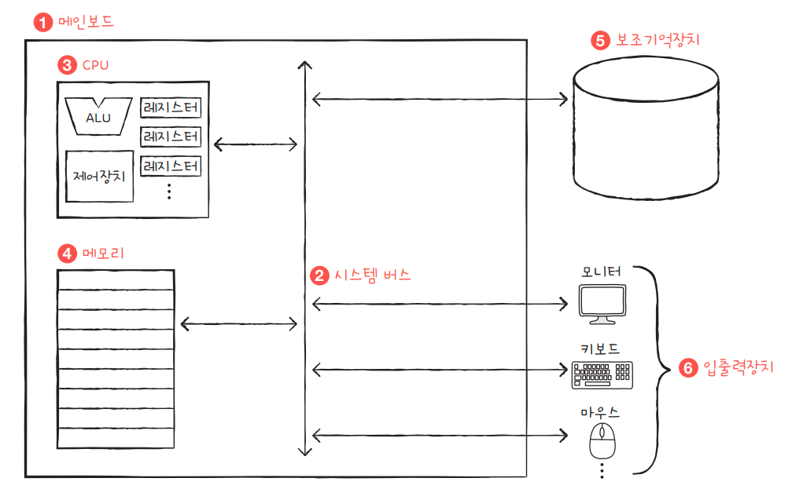

# 컴퓨터 구조를 공부해야하는 이유 
> 컴퓨터 구조에서 배우는 내용은 '성능', '용량', '비용'과 직결되는 내용이기 때문에 단순히 입력과 출력에만 집중하는
> 개발을 넘어 성능, 용량, 비용까지 고려하며 개발하는 개발자가 되기 위해서는 필수적으로 알아야한다.
> 
> 또한 문제 해결 능력이 향상된다. 

* 컴퓨터 구조
  * 컴퓨터가 이해하는 정보
  * 컴퓨터의 네 가지 핵심 부품

## 컴퓨터가 이해하는 정보 

컴퓨터는 0, 1로 표현된 정보만을 이해하는데, 이렇게 0과 1로 표현되는 정보는 크게 2가지 종류가 있다. 
하나는 '데이터', 다른 하나는 '명령어'이다. 

이 둘중 컴퓨터를 실질적으로 작동시키는 더 중요한 정보는 명령어이다.
데이터는 명령어 없이 아무것도 할 수 없지만 명령어는 데이터를 움직이고 컴퓨터를 작동시키는 정보이기 때문이다.

## 컴퓨터의 네 가지 핵심 부품

* CPU(중앙처리장치)
* 주기억장치(=메모리)
* 보조기억장치
* 입출력장치

  

1. 가장 큰 사각형은 **메인보드**입니다.
2. 메인보드 안에 **시스템 버스**(양방향 수직 화살표)가 있다.
3. **CPU** 내부에는 ALU(산술논리연산장치), CU(제어장치)와 여러 레지스터가 있다.
   * CPU는 메인보드 내 시스템 버스와 연결되어 있다. 
4. **메모리**는 메인보드 내 시스템 버스와 연결되어 있다. 
5. **보조기억장치**는 메인보드 내 시스템 버스와 연결되어 있다. 
6. 모니터, 키보드, 마우스 등은 메인보드 내 시스템 버스와 연결되어 있는데 이들을 **입출력장치**라고 부른다.

### 메모리 

> 컴퓨터가 이해하는 정보는 명령어와 데이터라고 했다. **메모리**는 현재 실행되는 프로그램의 명령어와 데이터를 저장하는 부품이다.
> 즉, 프로그램이 실행되려면 반드시 메모리에 저장되어있어야한다. 

컴퓨터가 빠르게 동작하기 위해서는 메모리 속 명령어와 데이터가 중구난방으로 저장되어 있으면 안된다. 
저장된 명령어와 데이터의 위치는 정돈되어 있어야 한다. 그래서 메모리에는 저장된 값에 빠르고 효율적으로 접근하기 위해 **주소**(address)라는 개념이 사용된다.

### CPU
> CPU는 컴퓨터의 두뇌이다. CPU는 메모리에 저장된 명령어를 읽어 들이고, 읽어 들인 명령어를 해석하고, 실행하는 부품이다.
> CPU 내부 구성 요소 중 가장 중요한 세 가지는 **산술논리연산장치**(ALU), **레지스터**, **제어장치**(CU)이다.
> ALU는 쉽게말하면 계산기로써 컴퓨터 내부에서 수행되는 대부분의 계산은 ALU가 도맡아 수행한다.
> 
> 레지스터는 CPU 내부의 작은 임시 저장 장치이다. 프로그램을 실행하는 데 필요한 값들을 임시로 저장한다. CPU 안에는 여러 개의 레지스터가 존재하고 각기 다른 이름과 역할을 가지고 있다. 
> 
> **제어장치**는 **제어 신호**라는 전기 신호를 내보내고 명령어를 해석하는 장치이다. 
> 여기서 제어 신호란 컴퓨터 부품들을 관리하고 작동시키기 위한 일종의 전기 신호이다.

### 보조기억장치
> 메모리는 실행되는 프로그램의 명령어와 데이터를 저장한다고 했지만, 이는 가격이 비싸 저장 용량이 작고, 전원이 꺼지면 저장된 내용을 잃는다는 단점이 있다. 
> 메모리보다 크기도 크고 전원이 꺼져도 저장된 내용을 잃지 않는 메모리를 보조할 저장 장치가 필요하게 되어있데, 이 저장 장치가 **보조기억장치**이다. 

하드 디스크, SSD, USB 메모리, DVD, CD-ROM과 같은 저장 장치가 보조기억장치의 일종이다. 

### 입출력장치 
> **입출력장치**는 마이크, 스피커, 프린터, 마우스, 키보드처럼 컴퓨터 외부에 연결되어 컴퓨터 내부와 정보를 교환하는 장치를 의미한다. 

컴퓨터 주변에 붙어있는 장치라는 의미에서 **주변장치**라 통칭하기도 한다.

### 메인보드와 시스템 버스 
> 앞에서 설명한 컴퓨터의 핵심 부품들을 모두 **메인보드**라는 판에 연결된다. 메인보드는 **마더보드**라고도 부른다. 
> 메인보드에는 앞서 소개한 부품을 비롯한 여러 컴퓨터 부품을 부착할 수 있는 슬롯과 연결 단자가 있다. 

> 메인보드에 연결된 부품들은 서로 정보를 주고받을 수 있는데, 이는 메인보드 내부에 **버스**라는 통로가 있기 때문이다. 
> 컴퓨터 내부에는 다양한 종류의 통로, 즉 버스가 있다. 하지만 여러 버스 가운데 컴퓨터의 네 가지 핵심 부품을 연결하는 가장 중요한 버스는 **시스템 버스**이다.

#### 시스템 버스
> 시스템 버스는 주소 버스, 데이터 버스, 제어 버스로 구성되어 있다. **주소 버스**는 주소를 주고받는 통로, **데이터 버스**는 명령어와 데이터를 주고받는 통로, **제어 버스**는 제어 신호를 주고받는 통로이다.

앞에서 얘기했던 CPU가 메모리 속 명령어를 읽어 들이기 위해 제어장치에서 '메모리 읽기'라는 신호를 내보낸다고 했다. 
그런데 사실 CPU가 메모리를 읽을 땐 제어 신호만 내보내지 않는다. 
실제로 제어버스로 '메모리 읽기' 제어 신호를 내보내고, 주소 버스로 읽고자하는 주소를 내보낸다. 그러면 메모리는 데이터 버스로 CPU가 요청한 주소에있는 내용을 보낸다. 
그리고 메모리에 어떤 값을 저장할 때도 CPU는 데이터 버스를 통해 메모리에 저장할 값을, 주소 버스를 통해 저장할 주소를, 제어 버스를 통해 '메모리 쓰기' 제어 신호를 내보낸다. 
