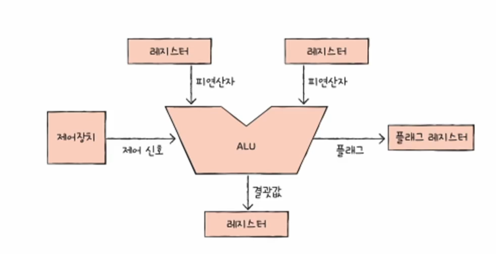
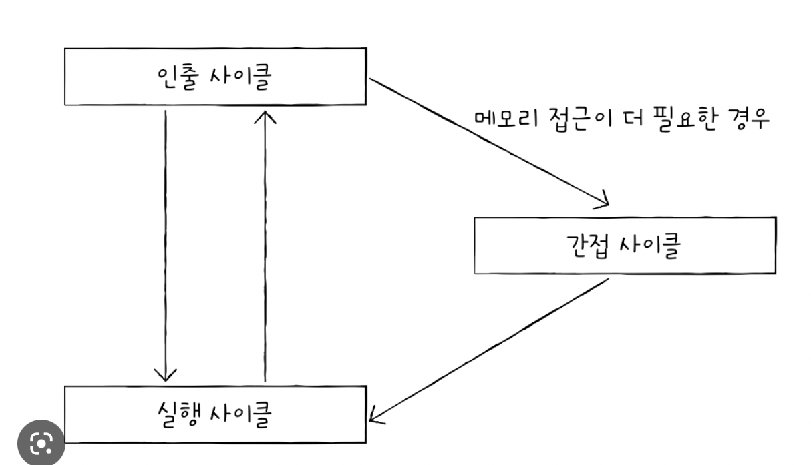

# 1. ALU와 제어장치

## ALU

ALU가 계산을 하기 위해서는 피연산자와 수행할 연산이 필요하다. 

그래서 `ALU`는 레지스터를 통해 `피연산자`를 받아들이고, 제어장치로부터 수행할 연산을 알려주는 `제어 신호`를 받아들인다. 

CPU가 메모리에 접근하는 속도는 레지스터에 접근하는 속도보다 훨씬 느리다. 
ALU가 연산할 때마다 결과를 메모리에 저장한다면 당연하게도 CPU는 메모리에 자줒 접근하게 되고, 이는 CPU가 프로그램 실행속도를 늦출 수 있다. 
그래서 ALU의 결과값을 메모리가 아닌 레지스터에 우선 저장한다. 

ALU는 `플래그`도 내보낸다. 
플래그는 **연산 결과에 대한 추가적인 정보**를 내보낸다.

ALU가 내보내는 대표적인 플래그는 부호 플래그, 제로 플래그, 캐리 플래그, 오버플로 플래그, 인터럽트 플래그, 슈퍼바이저 플래그 등이 있다. 

플래그들은 **플래그 레지스터** 레지스터에 저장된다.
플래그 레지스터는 플래그 값들을 저장하는 레지스터이다. 

## 제어장치
`제어장치`는 제어 신호를 내보내고 명령어를 해석하는 부품이다. 
그리고 `제어 신호`는 컴퓨터 부품들을 관리하고 작동시키기 위한 일종의 전기 신호이다. 

제어장치는 `클럭 신호`를 받아들이다. 

**클럭**(clock)이란 컴퓨터의 모든 부품을 일사불란하게 움직일 수 있게 하는 시간 단위이다. 
클럭은 일정한 시간 간격으로 전기 신호를 발생시키는데, 이 신호를 클럭 신호라고 한다.

제어장치는 `해석해야 할 명령어`를 받아들인다. 

제어장치는 `플래그 레지스터 속 플래그 값`을 받아들인다

제어장치는 `시스템 버스`, 그중에서 **제어 버스**로 전달된 제어 신호를 받아들이다. 

# 2. 레지스터 
프로그램 속 명령와 데이터는 실행 전후로 반드시 레지스터에 저장된다. 따라서 레지스터에 저장된 값만 잘 관찰해도 프로그램의 실행 흐름을 파악할 수 있다. 
다시 말해 레지스터 속 값을 유심히 관찰하면 프로그램을 실행할 때 CPU 내에서 무슨 일이 벌어지고 있는지, 어떤 명령어가 어떻게 수행되는지 알 수 있다. 

## 반드시 알아야 할 레지스터

상용화된 CPU 속 레지스터들은 CPU마다 이름, 크기, 종류가 매우 다양하다. 
이들은 각 CPU 제조사 홈페이지나 공식 문서 등에서 확인할 수 있다.

* 프로그램 카운터
  * 메모리에서 가져올 명령어의 주소를 저장한다. 프로그램 카운터를 **명령어 포인트**라고 부르는 CPU도 있다.  
* 명령어 레지스터
  * 해석할 명령어, 즉 방금 메모리에서 읽어 들인 명령어를 저장하는 레지스터이다. 제어장치는 명령어 레지스터 속 명령어를 받아들이고 이를 해석한 뒤 제어 신호를 내보낸다.  
* 메모리 주소 레지스터
  * 메모리의 주소를 저장하는 레지스터이다. CPU가 읽어 들이고자 하는 주소 값을 주소 버스로 보낼 때 메모리 주소 레지스터를 거치게 된다. 
* 메모리 버퍼 레지스터
  * 메모리 버퍼 레지스터는 메모리와 주고받을 값을 저장하는 레지스터이다. 즉, 메모리에 쓰고 싶은 값이나 메모리로부터 전달받은 값은 메모리 버퍼 레지스터를 거친다. CPU가 주소 버스로 내보낼 값이 메모리 주소 레지스터를 거친다면, 데이터 버스로 주고받을 값은 메모리 버퍼 레지스터를 거친다. 
* 범용 레지스터
  * 이름 그대로 다양하고 일반적인 상황에서 자유롭게 사용할 수 있는 레지스터이다. 메모리 버퍼 레지스터는 데이터로 주고받을 값만 저장하고, 메모리 주소 레지스터는 주소 버스로 내보낼 주소값만 저장한다. 범용 레지스터는 데이터와 주소를 모두 저장할 수 있다. 일반적으로 CPU 안에는 여러 개의 범용 레지스터들이 있고, 현대 대다수 CPU는 모두 범용 레지스터를 가지고 있다.  
* 플래그 레지스터
  * 플래그 레지스터는 연산 결과 또는 CPU 상태에 대한 부가적인 정보를 저장하는 레지스터이다. 
* 스택 포인터
  * 스택의 꼭대기를 가리키는 레지스터이다. 즉, 스택 포인터는 스택에 마지막으로 저장한 값의 위치를 저장하는 레지스터이다. 
* 베이스 레지스터

https://github.com/kangtegong/self-learning-cs

# 3. 명령어 사이클과 인터럽트 

하나의 명령어를 처리하는 정형화된 흐름을 `명령어 사이클`이라고 한다. 

## 명령어 사이클 
프로그램은 수 많은 명령어로 이루어져 있고, CPU는 이 명령어들을 하나씩 실행한다. 
이때 프로그램 속 각각의 명령어들은 일정한 주기가 반복되며 실행되는데, 이 주기를 `명령어 사이클`이라고 한다. 
즉, 프로그램 속 각각의 명령어들은 명령어 사이클이 반복되며 실행된다. 

명령어를 CPU로 가지고 오는 단계를 **인출 사이클**이라고 한다. 
CPU로 가져온 명령어를 실행하는 단계를 **실행 사이클**이라고 한다.

프로그램을 이루는 수많은 명령어는 일반적으로 인출과 실행 사이클을 반복하며 실행된다.

명령어를 실행하기 위해서는 메모리에 접근을 한 번 더 해야하는 경우가 있는데, 이 단계를 **간접 사이클**이라고 한다. 

## 인터럽트 

인터럽트는 영어로 interrupt이며, '방해한다', '중단시키다'를 의미한다. 
즉, CPU가 수행 중인 작업은 방해를 받아 잠시 중단될 수 있는데, 이렇게 CPU의 작업을 방해하는 신호를 `인터럽트`라고 한다. 

인터럽트는 크게 `동기 인터럽트`와 `비동기 인터럽트`로 나뉜다. 

* 동기 인터럽트 
  * CPU에 의해 발생하는 인터럽트
  * CPU가 명령어들을 수행하다가 예상치 못한 상황에 마주쳤을 때, 발생하는 인터럽트가 동기 인터럽트이다. 
  * 동기 인터럽트는 `예외`(Exception)라고 부른다. 
* 비동기 인터럽트
  * 주로 입출력장치에 의해 발생하는 인터럽트
  * 입출력 장치에 의한 비동기 인터럽트는 세탁기 완료 알림, 전자레인지 조리 완료 알림과 같은 알림 역할을 한다.
  * 일반적으로 비동기 인터럽트를 `인터럽트`라고 칭한다. 
  * **하드웨어 인터럽트**라는 표현으로 쓰이기도 한다.

## 하드웨어 인터럽트 
**하드웨어 인터럽트**는 알림과 같은 인터럽트이다. CPU는 입출력 작업 도중에도 효율적으로 명령어를 처리하기 위해 이런 알림과 같은 하드웨어 인터럽트를 사용한다. 
하드웨어 인터럽트는 입출력 작업 중에도 CPU로 하여금 효율적으로 명령어를 처리할 수 있게 한다. 

인터럽트를 처리하는 방법은 입출력장치마다 다르므로 각기 다른 인터럽트 서비스 루틴을 가지고있다. 
즉, 메모리에는 위 그림처럼 여러 개의 인터럽트 서비스 루틴이 저장되어 있다. 

CPU는 수 많은 인터럽트 서비스 루틴을 구분하기 위해 인터럽트 벡터를 이용한다. 
`인터럽트 벡터`는 인터럽트 서비스 루틴을 식별하기 위한 정보이다. 

.png)
