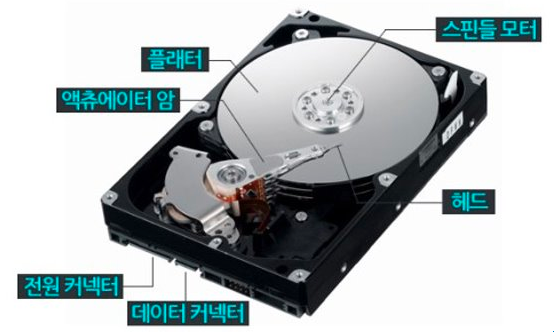
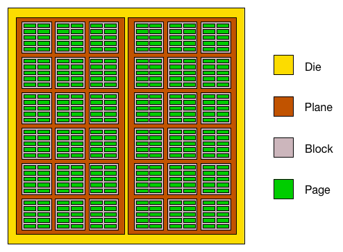

# 보조기억장치 
> 보조기억장치의 대중적인 것은 하드 디스크와 플래시 메모리이다. 

## 하드 디스크
> 하드 디스크는 자기적인 방식으로 테이블을 지정하는 보조기억장치이다. (= 자기디스크로 취급하기도 한다)

하드 디스크에서 실질적으로 데이터가 저장되는 곳은 동그란 원판인 `플래터`(platter)이다.
플래터는 자기 물질로 덮여있어 수많은 N극과 S극을 저장한다. (N극, S극은 0과 1의 역할을 수행)

그 플래터를 회전시키는 구성 요소를 `스핀들`(spindle)이라고 한다.
스핀들이 플래터를 돌리는 속도를 '분당 회전수'인 `RPM`이라는 단위로 표현된다. 

프래터를 대상으로 데이터를 읽고 쓰는 구성 요소를 `헤드`(head)라고 한다.
헤드는 플래터 위에서 미세하게 떠 있는 채로 데이터를 읽고 쓰는, 마치 바늘같이 생긴 부품이다. 
그래서 헤드는 원하는 위치로 헤드를 이동시키는 `디스크 암`(disk arm)에 부착되어있다.

CD나 LP에 비해 하드 디스크는 훨씬 더 많은 양의 데이터를 저장해야 하므로 일반적으로 여러 겹의 플래터로 이루어져 있고 플래터 양면을 모두 사용할 수 있다.
양면 플래터를 사용하면 위아래로 플래터당 두 개의 헤드가 사용된다. 

### 동작 방식(데이터를 저장)
플래터는 `트랙`과 `섹터`라는 단위로 데이터를 저장한다. (플래터를 여러 동심원으로 나누었을 때, 그중 하나의 원을 트랙이라고 부른다)
여러 겹의 플래터 상에서 같은 트랙의 위치 한 곳을 모아 연결한 논리적 단위를 `실린더`(cylinder)라고 부른다.
연속된 정보는 보통 한 실린더에 기록되게되는데 그 이유는 디스크 암을 움직이지 않고도 바로 데이터에 접근할 수 있기 때문이다. 

### 동작 방식(저장된 데이터를 접근)
하드 디스크가 데이터에 접근하는 시간을 크게 `탐색 시간`, `회전 지연`, `전송 시간`으로 나눌 수 있다.

* `탐색 시간`은 접근하려는 데이터가 저장된 트랙까지 헤드를 이동시키는 시간을 의미한다. 
* `회전 지연`은 헤드가 있는 곳으로 플래터를 회전시키는 시간을 의미한다.
* `전송 시간`은 하드 디스크와 컴퓨터 간에 데이터를 전송하는 시간을 의미한다. 

하드 디스크의 성능은 많이 향상되었지만 하드 디스크에서 다량의 데이터를 탐색하고 읽어 들이는 시간은 생각보다 어마어마하다.

## 플래시 메모리
> 플래시 메모리는 전기적인 방식으로 테이블을 지정하는 보조기억장치이다. (= 전기적인 방식으로 테이블을 지정하는 보조기억장치이다.)

사실 플래시 메모리는 보조기억장치 범주에만 속한다기보다는 다양한 곳에서 널리 사용하는 저장 장치로 보는 것이 옳다. 
주기억장치 중 하나인 ROM에도 사용되고, 우리가 일상적으로 접하는 거의 모든 전자제품 안에 플래시 메모리가 내장되어 있다고 봐도 무방하다. 

(깨알 지식: 플래시 메모리는 크게 NAND 플래시 메모리와 NOR 플래시 메모리로 나뉜다.  그리고대용량 저장 장치로 많이 사용되는 프랠시 메모리는 NAND 플래시 메모리이다.)

플래시 메모리에는 `셀`(cell)이라는 단위가 있다. 셀이란 플래시 메모리에서 데이터를 저장하는 가장 작은 단위이다. 
이 셀이 모이고 모여 MB, GB, TB 용량을 갖는 저장 장치가 되는 것이다. 
한 셀에 1비트를 저장할 수 있는 플래시 메모리를 `SLC`(Single Level Cell), 한 셀에 2비트를 저장할 수 있는 플래시 메모리를 `MLC`(Multi Level Cell),
한 셀에 3비트를 저장할 수 있는 플래시 메모리를 `TLC`(Triple Level Cell)이라고 한다. (4비트 저장 가능한 QLC도 있음)

### SLC 타입 
SLC 타입은 한 셀로 두 개의 정보를 표현할 수 있다.
SLC 타입은 MLC나 TLC 타입에 비해 비트의 빠른 입출력이 가능하다.
수명도 MLC나 TLC 타입보다 길어서 수만에서 수십만 번 가까이 데이터를 쓰고 지우고를 반복할 수 있다. 
하지만 SLC 타입은 용량 대비 가격이 높다. (고성능의 빠른 저장 장치가 필요한 경우에 SLC 타입을 사용한다)

### MLC 타입
한 셀로 네 개의 정보를 표현할 수 있다. 
SLC 타입보다 일반적으로 속도와 수명은 떨어지지만, 한 셀에 두 비트씩 저장할 수 있다는 점에서 MLC 타입은, SLC보다 대용화하기 쉽고, 용량 대비 가격이 저렴하다. 
(일반적으로 사용되는 플래시 메모리는 MLC 타입이다.)

### TLC 타입
한 셀당 3비트씩 저장할 수 있는 TLC 타입은 한 셀로 여덟 개의 정보를 표현할 수 있다. 그렇기에 대용화하기가 유리하다. 
일반적으로 SLC, MLC 타입보다 수명과 속도가 떨어지지만 용량 대비 가격도 저렴하다.

플래시 메모리의 셀 다음으로 작은 단위는 `페이지` > `블록` > `플레인`(plane), `다이`(die)가 된다. 

플래시 메모리에서 읽기와 쓰기는 페이지 단위로 이루어진다. 하지만 삭제는 페이지보다 큰 블록 단위로 이루어진다. 
읽기/쓰기 단위와 삭제 단위가 다르다는 것이 플래시 메모리의 가장 큰 특징 중 하나이다. 

페이지는 아래의 세 개의 상태를 가질 수 있다.
* `Free`: 어떠한 데이터도 저장하고 있지 않아 새로운 데이터를 저장할 수 있는 상태
* `Valide`: 이미 유효한 데이터를 저장하고있는 상태를 의미
* `Invalid`: 쓰레기값이라 부르는 유효하지 않은 데이터를 저장하고 있는 상태를 의미한다.

플래시 메모리는 하드 디스크와는 달리 덮어쓰기가 불가능하여 Valid 상태인 페이지에는 새 데이터를 저장할 수 없다.

쓰레기 값이 계속 쌓이기만하면 사용하지 않을 공간인데도 불구하고 용량을 차지하고 있어 불필요한 용량이 낭비될 수 있다.
최근 SSD를 비롯한 플래시 메모리는 이런 쓰레기값을 정리하기 위해 `가비지 컬렉션`(garbage collection)이라는 기능을 제공한다.

## RAID의 정의와 종류

> RAID는 여러 개의 하드 디스크(or SSD)를 묶어서 하나의 저장 장치처럼 사용하는 기술이다.`
> 데이터의 안정성 또는 성능을 향상시키기 위해 여러 개의 물리적 보조기억장치를 마치 하나의 논리적 보조기억장치처럼 사용하는 기술이다. 

## RAID의 종류 
RAID의 구성 방법을 `RAID 레벨`이라 표현하는데, RAID 레벨은 0부터 6까지 총 7가지가 있다. 또한 그로부터 파생된 RAID 10, RAID 50 등이 있다. 

* RAID 0 : 여러 개의 보조기억장치에 데이터를 단순히 나누어 저장하는 구성 방식.
  * 장점: 데이터가 분산되어 저장되면(= 스트라이핑) 저장된 데이터를 읽고 쓰는 속도가 빨라진다. 하나의 대용량 처리 저장 장치를 이용했더라면 여러 번에 걸쳐 읽고 썼을 데이터를 동시에 읽고 쓸 수 있기 때문이다.
  * 단점: RAID 0으로 구성된 하드 디스크 중 하나에 문제가 생긴다면 다른 모든 하드 디스크의 정보를 읽는 데 문제가 생길 수 있다.
* RAID 1 : 복사본을 만드는 방식이다. 마치 거울처럼 완전한 복사본을 만드는 구성이기에 `미러링`이라고도 부른다.
  * 장점: 복구가 매우 간단하다. 
  * 단점: 하드 디스크 개수가 한정되었을 때, 사용 가능한 용량이 적어지는 단점이 있다.
* RAID 2 : ??
* RAID 3 : ??
* RAID 4 : RAID 1처럼 완전한 복사본을 만드는 대신 오류를 검출하고 복구하기 위한 정보를 저장한 장치를 두는 구성 방식이다. 이때 오류를 검출하고 복구하기 위한 정보를 `패리트 비트`(parity bit)라고 한다.
  * 장점: RAID 1보다 적은 하드 디스크로도 데이터를 안전하게 보관할 수 있다. 
  * 단점: 어떤 새로운 데이터가 저장될 때마다 패리티를 저장하는 디스크에도 데이터를 쓰게되므로 패리티를 저장하는 장치에는 병목 현상이 발생한다.
* RAID 5 : 패리티 정보를 분산하여 저장하는 방식으로 RAID 4의 문제인 병목 현상을 해소한다.
  * 단점: 
* RAID 6 : 구성은 기본적으로 RAID 5와 같지만, 서로 다른 두 개의 패리티를 두는 방식이다. 이는 오류를 검출하고 복구할 수 있는 수단이 두 개가 생긴 셈이다. 따라서 RAID 6은 RAID 4, 5보다 안전한 구성이라 볼 수 있다. 
  * 단점: 새로운 정보를 저장할 때마다 함께 저장할 패리티가 두 개이므로, 쓰기 속도는 RAID 5보다 느리다.

