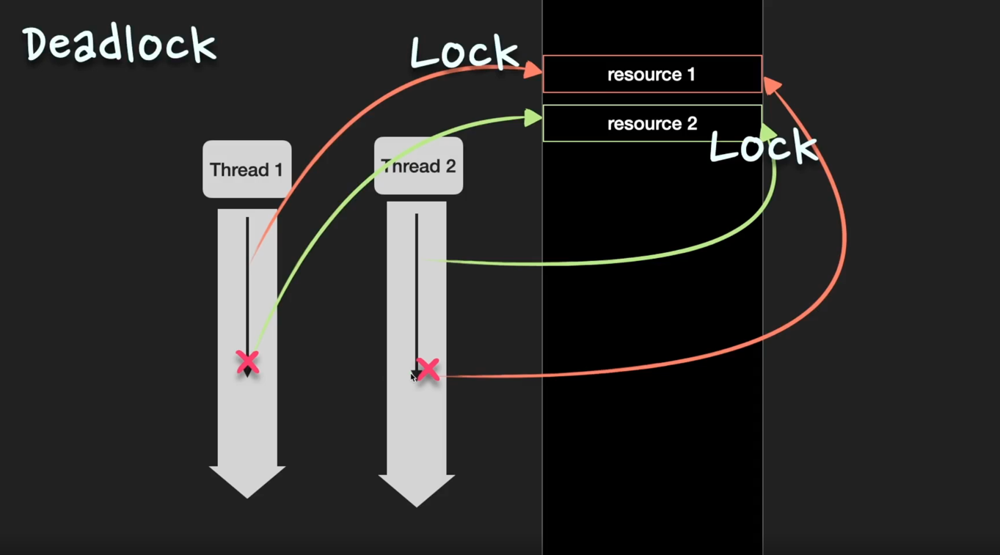

Q. 교착상태(Deadlock)에 대해서 간단히 설명해 주세요.

둘 이상의 thread가 각기 다른 thread가 점유하고 있는 자원을 서로 기다릴 때, 무한 대기에 빠지는 상황을 말한다.

deadlock이 발생하는 조건은 **상호 배제**(mutual exclusion), **점유 대기**(hold-and-wait), **비선점**(no preemption), **순환 대기**(circular wait)이다. 
이 4가지 조건이 동시에 성립할 때, 발생할 수 있다. 

deadlock 문제를 해결하는 방법에는 **무시**, **예방**, **회피**, **탐지-회복**의 4가지 방법이 있다.

> 면접 TIP
> 
> 면접에서 deadlock 질문이 나온다면, deadlock이 발생하기 위한 조건과 해결방법을 묻는 것이다. 
> deadlock이 발생하는 조건은 상호배제, 점유대기, 비선점, 순환대기 4가지 이고, 이를 해결하는 방법은 무시, 예방, 회피, 탐지-회복 4가지 이다.

## Deadlock

### Deadlock 발생 조건 
deadlock은 다음 4가지 조건이 동시에 성립할 때, 발생할 수 있다. 

1. **상호 배제**(mutual exclusion)
   * 동시에 한 thread만 자원을 점유할 수 있는 상황이다. 
   * 다른 thread가 자원을 사용하려면 자원이 방출될 때까지 기다려야 한다.
2. **점유 대기**(hold-and-wait)
   * thread가 자원을 보유한 상태에서 다른 thread가 보유한 자원을 추가로 기다리는 상황이다. 
3. **비선점**(no preemption)
   * 다른 thread가 사용 중인 자원을 강제로 선점할 수 없는 상황이다. 
   * 자원을 점유하고 있는 thread에 의해서만 자원이 방출된다. 
4. **순환 대기**(circular wait)
   * 대기 중인 thread들이 순환 형태로 자원을 대기하고 있는 상황이다. 

### Deadlock 해결 방법 
deadlock 문제를 해결하는 방법에는 (1) 무시, (2) 예방, (3) 회피, (4) 탐지-회복의 4가지 방법이 있다. 

| 기법    | 설명                                                                 | 비고                                                                                                      |
|-------|--------------------------------------------------------------------|---------------------------------------------------------------------------------------------------------|
| 무시    | deadlock 발생 확률이 낮은 시스템에서 아무런 조치도 취하지 않고 deadlock을 무시하는 방법          | - 무시 기법은 **시스템 성능 저하가 없다**는 큰 장점이 있다.  - 현대 시스템에서는 deadlock이 발생하지 않고, 해결 비용이 크기 때문에 무시 방법이 많이 사용된다. |
| 예방    | 교착 상태의 4가지 발생 조건중 하나가 성립하지 않게 하는 방법                                | - 순환 대기 조건이 성립하지 않도록 하는 것이 현실적으로 가능한 예방 기법이다. - 자원 사용의 **효율성이 떨어지고 비용이 크**다.                        |
| 회피    | thread가 앞으로 자원을 어떻게 요청할지에 대한 정보를 통해 순환 대기 상태가 발생하지 않도록 자원을 할당하는 방법 | - 자원 할당 그래프 알고리즘, 은행원 알고리즘 등을 사용하여 자원을 할당하여 deadlock을 회피한다.                                             |
| 탐지-회복 | 시스템 검사를 통해 deadlock 발생을 탐지하고, 이를 회복시키는 방법                          | - 자원 사용의 **효율성이 떨어지고 비용이 크**다.                                                                          |

## 심화문제 

Q. deadlock은 언제 발생하게 되나요?

deadlock은 상호 배제(mutual exclusion), 점유 대기(hold-and-wait), 비선점(no preemption), 순환 대기(circular wait)의 
4가지 조건이 **동시에 성립**할 때 발생할 수 있다.

**상호 배제**는 동시에 한 thread만 자원을 점유할 수 있는 상황이고,
**점유 대기**는 thread가 자원을 보유한 상태에서 다른 thread가 보유한 자원을 추가적으로 기다리는 상황이다.
또 **비선점**은 다른 thread가 사용 중인 자원을 강제로 선점할 수 없는 상황을 뜻하고, 
**순환 대기**는 대기 중인 thread들이 순환 형태로 자원을 대기하는 상황을 말한다.

