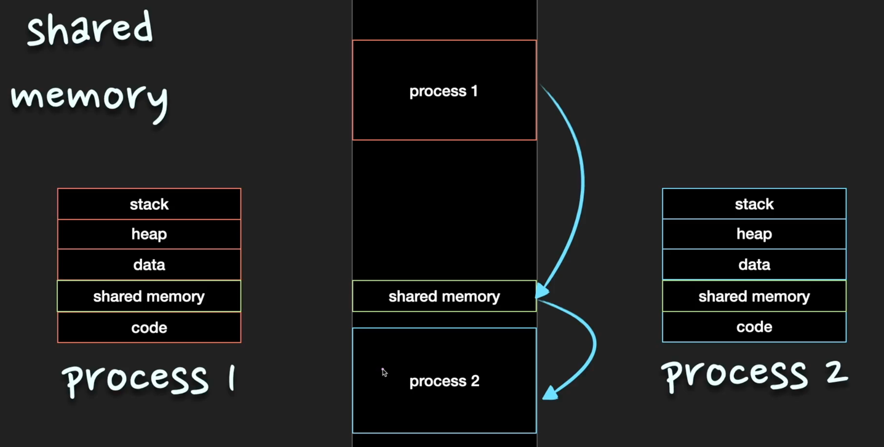
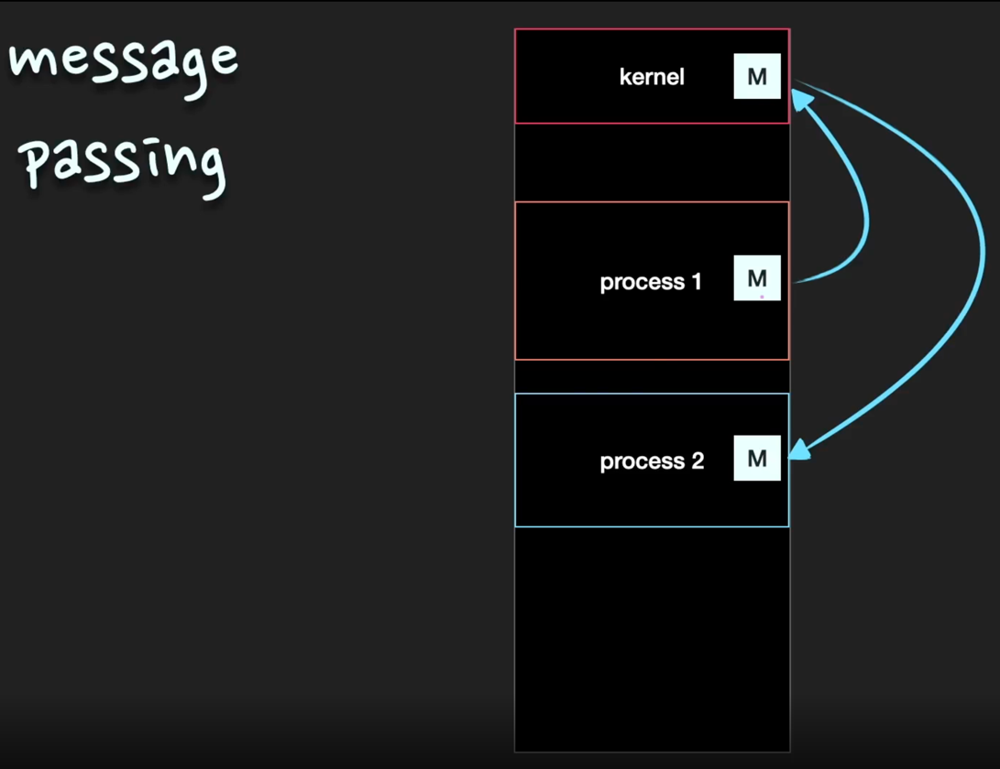

# multi process환경에서 process간에 데이터를 어떻게 주고 받을까? 

Q. ⭐⭐ multi process환경에서 process간에 데이터를 어떻게 주고 받을까?

원칙적으로 process는 독립적인 주소 공간을 갖기 때문에, 다른 process의 주소 공간을 참조할 수 없다. 
하지만 경우에 따라 운영체제는 process 간의 자원 접근을 위한 매커니즘인 프로세스 간 통신(IPC, Inter Process Communication)를 제공한다. 

프로세스 간 통신(IPC) 방법으로는 파이프, 파일, 소켓, 공유메모리 등을 이용한 방법이 있다. 

> TIP)
> 
> IPC는 면접에서도 굉장히 자주 나오는 질문이다. multi thread와 다르게 process끼리는 데이터 공유를 하고 있지 않는다. 
> 따라서 데이터를 주고 받기 위해서 IPC기법을 사용한다. IPC는 크게 **공유메모리 방식**과 **메시지 전달방식**으로 나뉘는데 
> 이 둘의 장단점과 차이점을 중심으로 공부해가야한다! 

## IPC (Inter-Process Communication)

process는 각자 자신만의 독립적인 주소공간을 가지는데, 다른 process가 이 주소공간을 참조하는 것은 허용하지 않는다. 
그렇기 때문에 다른 process와 데이터를 주고받을 수 없다.
이를 해결하고자 운영체제는 IPC 기법을 통해 process들 간에 통신을 가능하게 해준다. 

process간 통신(IPC)에는 기본적으로 `공유메모리(shared memory)`와 `메시지 전달(message passing)`의 두 가지 모델이 있다. 

### 공유메모리(shared memory)

공유메모리 방식에서는 process들이 주소 공간의 일부를 공유한다. 공유한 메모리 영역에 읽기/쓰기를 통해서 통신을 수행한다. 
process가 공유 메모리 할당을 kernel에 요청하면 kernel은 해당 process에 메모리 공간을 할당해준다. 
공유 메모리 영역이 구축된 이후에는 모든 접근이 일반적인 메모리 접근으로 취급되기 때문에 더이상 kernel의 도움없이도 각 process들이 해당 메모리 영역에 접근할 수 있다. 
따라서 커널의 관여 없이 데이터를 통신할 수 있기 때문에 IPC `속도가 빠르다`는 장점이 있다.

공유 메모리 방식은 process간의 통신을 수월하게 만들지만 동시에 같은 메모리 위치에 접근하게 되면 `일관성 문제`가 발생할 수 있다. 이에 대해서는 커널이 관여하지 않기 때문에
process들 끼리 직접 공유 메모리 접근에 대한 동기화 문제를 책임져야 한다. 

### 메시지 전달(message passing)

메시지 전달 방법은 통상 system call을 사용하여 구현된다. kernel을 통해 send(message)와 receive(message)라는 두 가지 연산을 제공받는다. 
예를 들면, process1이 kernel로 message를 보내면 kernel이 process2에게 message를 보내주는 방식으로 동작한다. 

메모리 공유보다는 속도가 느리지만, `충돌을 회피할 필요가 없기` 때문에 적은양의 데이터를 교환하는 데 유용하다. 또, 구현하기가 쉽다는 장점이 있다. 

대표적인 예시로는 pipe, socket, message queue 등이 있다. 

## 심화

Q. IPC의 예시를 들어줄 수 있는가?

IPC는 크게 공유 메모리 모델과 메시지 전달 모델로 나눌 수 있다. 공유 메모리 모델은 주소 공간의 일부를 공유하며 공유한 메모리 영역에 read/write를 통해 통신하게 되는데,
예시로는 **공유메모리**와 **POSIX**가 있다. 메시지 전송 모델의 경우에는 kernel을 통해 send/service 연산을 통해 데이터를 전송한다. 예시로는 **Pipe**, **socket**, **message queue** 등이 있다.

Q. 공유메모리와 메시지 전달 모델의 장단점을 설명해 주세요.

공유 메모리 모델은 초기에 공유 메모리 할당을 제외하면 kernel의 관여 없이 통신할 수 있기 때문에 속도가 빠른 장점이있다. 
하지만 여러 process가 동시에 메모리에 접근하는 문제가 발생할 수 있어서 별도의 동기화 과정이 필요하다는 단점이 있다. 

메세지 전달 모델은 kernel을 통해서 데이터를 주고받기 때문에 통신 속도가 느리다는 단점이 있다. 
kernel에서 제어를 해주기 때문에 안전하며 kernel이 동기화를 제공해준다는 장점이 있다.

