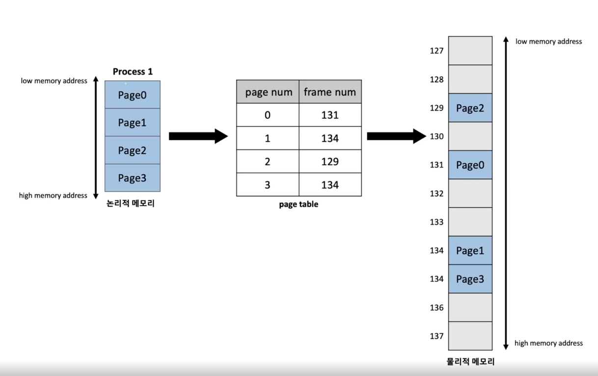
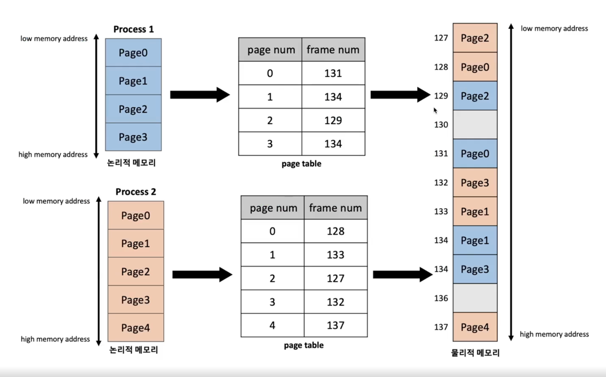

Q. Paging이란 무엇인가?

Paging이란 process가 할당받은 메모리 공간을 일정한 `page 단위`로 나누어, 물리 메모리에서 연속되지 않는 `서로 다른 위치`에 저장하는 메모리 관리 기법이다.

> 면접 Tip 
> 
> 면접에서 자주나오진 않지만, 중요한 내용들이 많이 있어서 알아두면 깊이있는 질문이 나올 때 잘 답변을 할 수 있다. 
> 특히 논리적주소와 물리적주소의 차이를 이해해야하고, 물리 메모리의 연속되지 않는 서로 다른 위치에 page단위만큼 저장한다는 점을 설명할 수 있어야 한다.

### 용어 정리 

* `논리적 주소`(logical address)란?
  * process가 memory에 적재되기 위한 독자적인 주소 공간인 논리적 주소(logical address)가 생성된다. 논리적 주소는 각 process마다 독립적으로 할당되며, 0번지부터 시작된다.
* `물리적 주소`(physical address)란?
  * 물리적 주소(physical address)는 process가 실제로 메모리에 적재되는 위치를 말한다. 
* `주소 바인딩`(address binding)이란?
  * CPU가 기계어 명령을 수행하기 위해 process의 **논리적 주소가 실제 물리적 메모리의 어느 위치에 매핑되는지 확인하는 과정**을 주소 바인딩(address binding)이라고 한다.

## Paging 
> paging 기법은 process의 메모리 공간을 동일한 크기의 page 단위로 나누어 물리적 메모리의 서로 다른 위치에 page들을 저장하는 메모리 관리 기법이다. 
> paging 기법에서는 물리적 메모리를 **(1)page와 같은 크기의 frame**으로 미리 나누어둔다. 
>
> paging 기법에서는 주소 바인딩(address binding)을 위해 (2)모든 프로세스가 각각의 주소 변환을 위한 page table을 갖는다.

(1) page 단위로 메모리 적재가 이뤄지기 때문에 미리 분할해두면 빠르게 메모리 할당이 이뤄질 수 있다.
(2) page 기법에서는 하나의 프로세스 내에서도 페이지 단위로 다른 물리적 메모리에 저장되기 때문에 주소 바인딩을 위해서는 별도의 page table이 필요하다.

Q. paging 기법 사용시 발생할 수 있는 **메모리 단편화(Memory fragmentation)** 문제에 대해 설명하라.

물리적 메모리 공간이 작은 조각으로 나눠져서 메모리가 충분히 존재함에도 할당이 불가능한 상태를 보고 메모리 단편화가 발생했다고 말한다.

paging 기법에서는 process의 논리적 주소 공간과 물리적 메모리가 같은 크기의 page 단위로 나누어지기 때문에 (1)**외부 단편화 문제**가 발생하지 않는다. 
하지만 process 주소 공간의 크기가 page 크기의 배수라는 보장이 없기 때문에, 프로세스의 주소 공간 중 가장 마지막에 위치한 page에서는 (2)**내부 단편화 문제**가 
발생할 가능성이 있다.

(1): 외부 단편화 문제란 메모리상의 비어있는 공간의 크기가 작아서, 빈 메모리 공간임에도 활용되지 못하는 문제이다.
(2): 내부 단편화 문제란 프로세스가 필요한 양보다 더 큰 메모리가 할당되어서 메모리 공간이 낭비되는 상황이다. 

