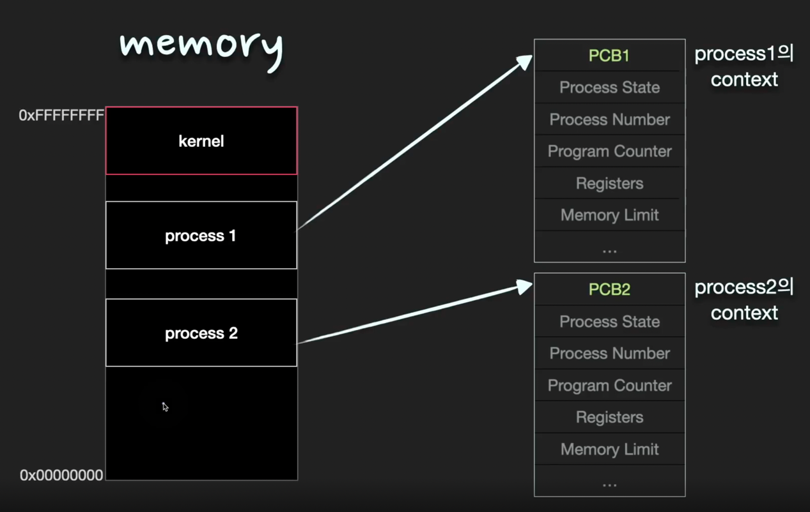
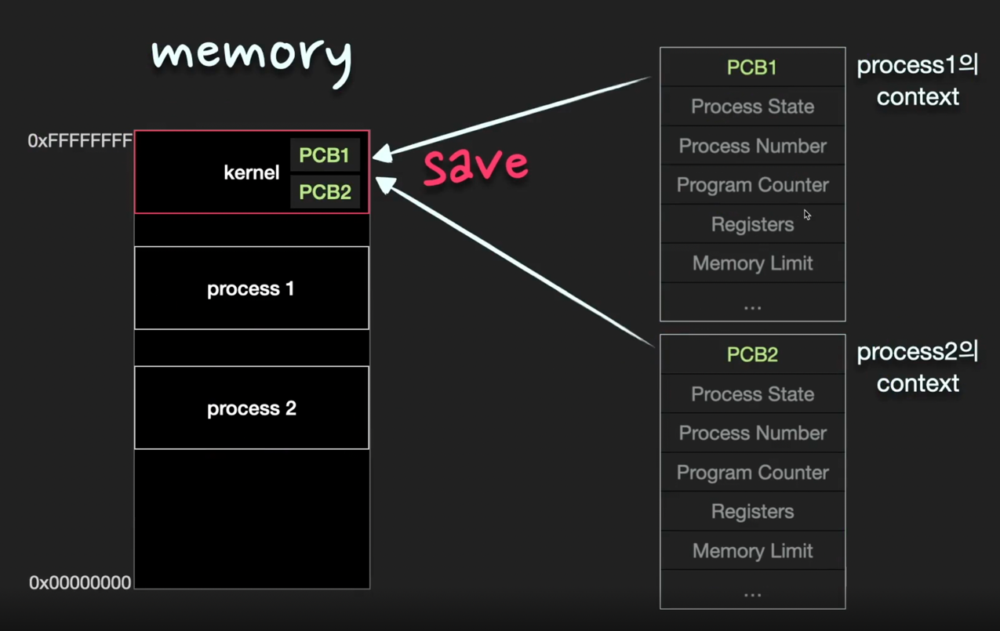
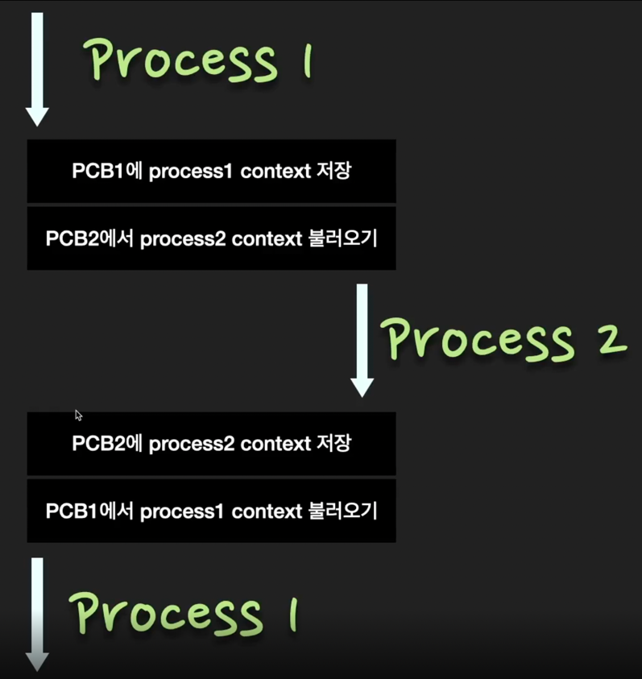

# Multi Process

Q. ⭐⭐⭐⭐ Multi process에 대해서 설명하라.️

Multi Process란 2개 이상의 process가 동시에 실행되는 것을 말한다. 
동시에라는 말은 `동시성`(concurrency)과 `병렬성`(paralleism) 두 가지를 의미한다. 

`동시성`은 CPU core가 1개일 때, 여러 process를 짧은 시간동안 번갈아 가면서 연산을 하게 되는 시분할 시스템(time sharing system)으로 실행되는 것이다. 

`병렬성`은 CPU core가 여러개일 때, 각각의 core가 각각의 process를 연산함으로써 process가 동시에 실행되는 것이다.

> TIP) 요새 우리가 쓰는 노트북은 CPU core가 여러개이다. core가 여러개여서 실제로 여러 process가 동시에 처리되는 것을 병렬성이라고한다. 
> 하지만 면접에서는 병렬성에 대한 깊은 질문은 거의 나오지 않는다. 다만 병렬성이 어떤 뜻인지 정도만 넘어가면 된다. 
> 면접에서 병렬성보다 훨씬 중요한 것은 `동시성`이다. 한 개의 CPU core는 당연히 한번에 하나의 연산밖에 못한다. 그런데 도대체 어떻게 동시에 처리할까? 
> 정답은 `동시성`이다. 동시성을 통해 multi process가 작동되는 원리를 잘 이해하면 된다.  
> 면접에서는 시분할 시스템을 시작으로 context, PCB, context switching, process의 memory 영역을 설명하면 완벽한 답변이 될 것이다. 

## 동시성(Concurrency) vs 병렬성(Parallelism)

| 동시성                | 병렬성                   |
|--------------------|-----------------------|
| Single Core        | Multi Core            |
| 동시에 실행되는 것 같아 보인다. | 실제로 동시에 여러 작업이 처리 된다. |

앞으로 설명할 모든 내용은 Single Core의 동시성에 초점을 맞춘다. 

## Multi Process

> Multi process란 2개 이상의 process가 동시에 실행되는 것을 말한다. 이 때 process들은 CPU와 메모리를 공유하게된다.
> 
> memory의 경우에는 여러 process들이 각자의 memory 영역을 차지하여 동시에 적재된다. 
> 
> 반면 하나의 CPU는 매 순간 하나의 process만 연산할 수 있다. 하지만 CPU의 처리 속도가 워낙 빨라서 수 ms 이내의 짧은 시간동안 여러 process들이 CPU에서
> 번갈아 실행되기 때문에 사용자 입장에서는 여러 프로그램이 동시에 실행되는 것처럼 보인다. 이처럼 CPU의 작업시간을 여러 process들이 조금씩 나누어쓰는 시스템을 
> 시분할 시스템(time sharing system)이라고 부른다.

## 메모리 관리 
> 여러 process가 동시에 memory에 적재된 경우, 서로 다른 process의 영역을 침범하지 않도록 각 process가 자신의 memory영역에만 접근하도록
> `운영체제가 관리`해준다. 

## CPU의 연산과 PC register 

> CPU는 PC(Program counter) register가 가리키고 있는 명령어를 읽어들여 연산을 진행한다. 
> PC register에는 다음에 실행될 명령어의 주소값이 저장되어 있다. multi process 시스템에서는 process1이 진행되고 있을 때는 
> process1의 code 영역을 PC register가 가리키다가, process2가 진행되면 process2의 code 영역을 가리키게 된다. 
> CPU는 PC register가 가리키는 곳에 따라 process를 변경해가면서 명령어를 읽어들이고 연산을 하게 된다. 

## Context 
> 시분할 시스템에서는 한 process가 매우 짧은 시간동안 CPU를 점유하여 일정부분의 명령을 수행하고, 다른 process에게 넘긴다. 
> 그 후 차례가 되면 CPU를 점유하여 명령을 수행한다. 따라서 이전에 어디까지 명령을 수행했고, register에는 어떤 값이 저장되어 있었는지에 대한 정보가
> 필요하게 된다. `process가 현재 어떤 상태로 수행되고 있는지에 대한 총체적인 정보`가 바로 context이다. 
> context 정보들은 `PCB(Process Control Block)에 저장`을 한다. 

## PCB(Process Control Block)
> PCB는 `운영 체제가 프로세스를 표현한 자료구조`이다. PCB에는 프로세스의 중요한 정보가 포함되어 있기 때문에, 일반 사용자가 접근하지 못하도록 
> 보호된 메모리 영역 안에 저장이 된다. 일부 운영 체제에서 PCB는 커널 스택에 위치한다. 이 메모리 영역은 보호를 받으면서도 비교적 접근하기가 편리하기 때문이다. 

(커널스택을 간단하게 말하자면 운영체제 그 자체를 의미한다.)

PCB에는 일반적으로 다음과 같은 정보가 포함된다. 

| PCB                 |                                                            |
|---------------------|------------------------------------------------------------|
| Process State       | new, running, waiting, halted 등의 state가 있다.               |
| Process Number      | 해당 process의 number                                         |
| Program counter(PC) | 해당 process가 다음에 실행할 명령어의 주소를 가리킨다.                 |
| Registers           | 컴퓨터 구조에 따라 다양한 수와 유형을 가진 register 값들                |
| Memory limits       | base register, limit register, page table 또는 segment table 등 |
| ...                 ||

운영체제도 하나의 프로세스이다.
커널 영역은 항상 맨 위쪽 메모리에 적재되서 실행이된다.

각각의 PCB= 정보들을 kernel에 저장한다. 

## Context switch 
> Context switch란 한 프로세스에서 다른 프로세스로 `CPU 제어권을 넘겨`주는 것을 말한다. 
> 
> 이 때, 이전의 프로세스의 상태를 `PCB에 저장하여 보관`하고 새로운 프로세스의 `PCB를 읽어서 보관된 상태를 복구`하는 작업이 이루어진다. 

## 심화 질문 
(거의 중복되는 질문이지만 이 개념에 대해 명확하게 이해하고 가야한다는 뜻임! )

Q. process의 context가 무엇인지 설명하라 

context란 process가 현재 어떤 상태로 수행되고 있는지에 대한 정보이다. 
해당 정보는 PCB(Process Control Block)에 저장을 한다. 

Q. PCB(Process Control Block)에 저장되는 것들은 무엇이 있는지 설명하라 

PCB는 운영체제가 process에 대해 필요한 정보를 모아놓은 자료구조이다.
PCB에는 일반적으로 다음과 같은 정보가 포함된다. 

* Process number
* Process state
* Program Counter (PC), 레지스터 
* CPU 스케쥴링 정보, 우선순위
* 메모리 정보 (해당 process의 주소 공간 등)

Q. Context switch에 대해서 설명하라 

Context switch란 한 프로세스에서 다른 프로세스로 `CPU 제어권을 넘겨`주는 것을 말한다. 

이 때, 이전의 프로세스의 상태를 `PCB에 저장하여 보관`하고 새로운 프로세스의 `PCB를 읽어서 보관된 상태를 복구`하는 작업이 이루어진다. 

Q. process의 state에는 어떤 것들이 있는가? 

프로세스는 `실행`(running), `준비`(ready), `봉쇄`(wait, sleep, blocked) 세 가지 상태로 구분된다.

|     |                                                  |
|-----|--------------------------------------------------|
| 실행  | 프로세스가 CPU를 점유하고 명령을 수행중인 상태                      |
| 준비  | CPU만 할당받으면 즉시 명령을 수행할 수 있도록 준비된 상태               |
| 봉쇄  | CPU를 할당받아도 명령을 실행할 수 없는 상태 - ex. I/O 작업을 기다리는 경우 |

