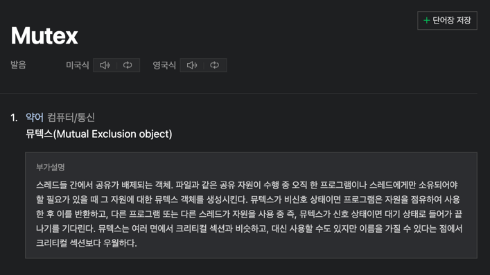
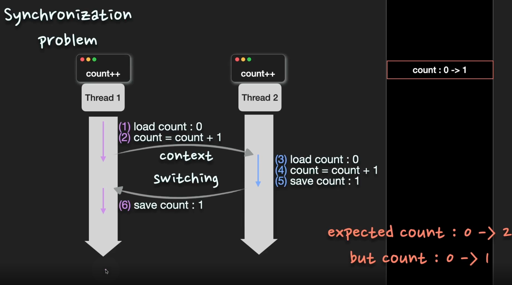
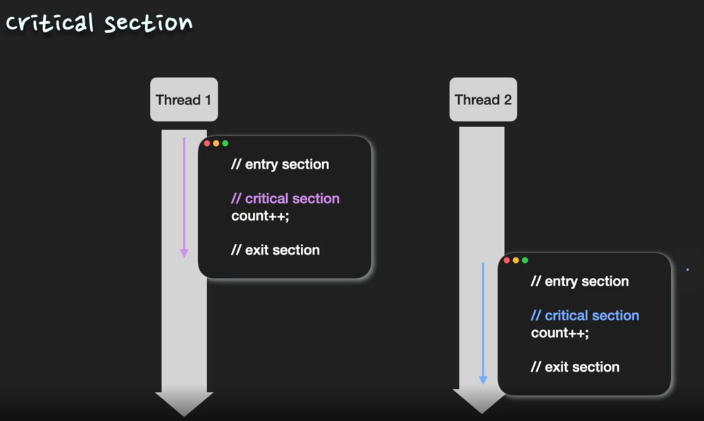
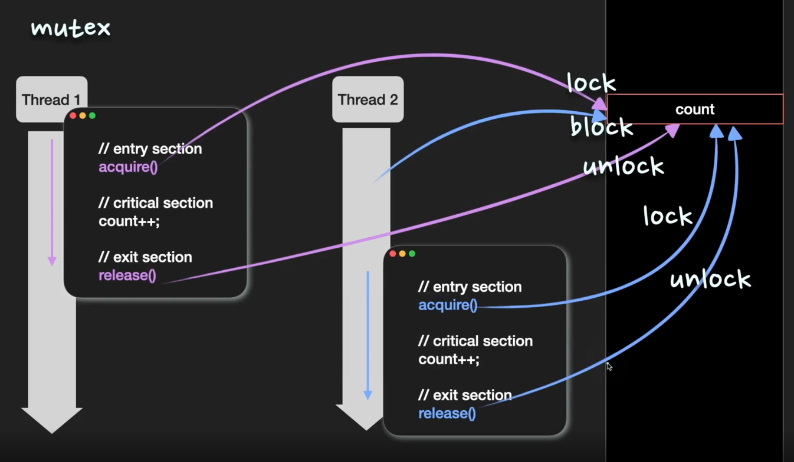
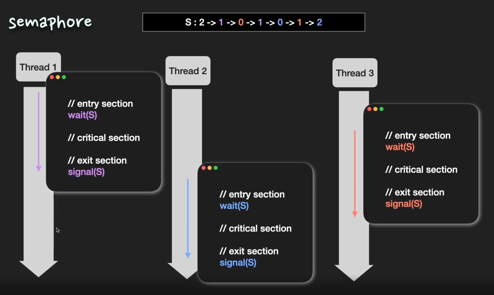

<details>
<summary>Q. ⭐ Multi process/thread 환경에서 동기화 문제를 어떻게 해결하나요?</summary>
<div markdown="1">

`동기화문제`를 해결하기 위해 mutex, semaphore 기법 등을 사용할 수 있다. 

Mutex란 1개의 스레드만이 공유 자원에 접근할 수 있도록 하여, 경쟁 상황(race condition)를 방지하는 기법이다.
공유 자원을 점유하는 thread가 lock을 걸면, 다른 thread는 unlock 상태가 될 때까지 해당 자원에 접근할 수 없다.

Semaphore란 S개의 thread만이 공유 자원에 접근할 수 있도록 제어하는 동기화 기법이다.
Semaphore 기법에서는 정수형 변수 S(세마포) 값을 가용한 자원의 수로 초기화하고, 자원에 접근할 때는 `S--`연산을 수행하여 세마포 값을 감소시키고 
자원을 방출할 때는 `S++` 연산을 수행하여 세마포 값을 증가시킨다. 이 때, 세마포 값이 0이 되면 모든 자원이 사용 중임을 의미하고,
이후 자원을 사용하려는 프로세스는 세마포 값이 0보다 커질 때까지 block 된다.

> 동기화 문제란..
> 
> 서로 다른 thread가 메모리 영역을 공유하기 때문에 여러 thread가 **동일한 자원에 동시에 접근**하여 엉뚱한 값을 읽거나 수정하는 문제이다.

Mutex 설명


[사전 뜻]
semaphore: n.수기, n.신호, v.수기로 알리다. 

</div>
</details>


> 면접 TIP
> 
> mutex와 semaphore는 면접 질문에서 자주 나오는 용어이다. 이를 설명하기 위해서는 동기화 문제가 무엇이고 왜 발생하는지에 대해서 설명을 할 줄 알아야한다. 
> 이를 설명하기 위해서는 동기화 문제가 무엇이고 왜 발생하는지에 대해서 설명을 할줄 알아야 한다. multi process/thread 환경에서는 서로 다른 thread가 메모리 영역을 공유하기 때문에 
> 여러 thread 환경에서는 서로 다른 thread가 메모리 영역을 공유하기 때문에 여러 thread가 동일한 자원에 동시에 접근하여 엉뚱한 값을 읽거나 수정하게 되는 동기화 문제가 발생할 수 있다. 
> 더 잘 이해하기 위해 atomic operation과 경쟁상황을 살펴봐야한다. 
> 
> 동기화 문제를 해결하기 위해 임계영역을 설정하고, mutex와 semaphore 기법을 사용한다. 각 기법의 특징을 중심으로 답변하면된다. 


## 동기화 문제 

동기화 문제란 서로 다른 thread가 메모리 영역을 공유하기 때문에 여러 thread가 **동일한 자원에 동시에 접근**하여 엉뚱한 값을 읽거나 수정하는 문제이다. 

예시) 



`count++`를 CPU 입장에서 분해해보면 3개의 atomic operations으로 나뉜다. 
1. `count` 변수의 값을 가져온다. 
2. `count` 변수의 값을 1 증가시킨다.
3. 변경된 `count` 값을 저장한다. 

CPU는 atomic operation을 연산하게 된다. 따라서 `count++`을 하기 위해 3번의 연산을 하게 된다. 

시분할 시스템으로 작동하는 multi proces/multi thread 시스템에서, 두 개의 thread가 동일한 데이터인 `count`에 동시에 접근을 하여 조작을 하는 상황을 가정하자.

thread1에서도 `count++`를 하고, thread2에서도 `count++`를 한다면 그 실행 결과가 접근이 발생한 순서에 따라 달라질 수 있다. 이를 경쟁상황(race condition)이라고 한다. 

즉, 둘 이상의 thread가 동일한 자원에 접근하여 조작하고, 그 실행 결과가 접근이 발생한 순서에 따라 달라지는 경쟁상황에 의해서 동기화 문제가 발생할 수 있다. 
경쟁 상황으로부터 보호하기 위해, 우리는 한 순간에 하나의 process/thread만 해당 자원에 접근하고 조작할 수 있도록 보장해야한다. 
다시 말해서 process/thread들이 동기화되도록 할 필요가 있다. 

## 임계영역(critical section)


둘 이상의 process/thread가 동시에 동일한 자원에 접근하도록 하는 프로그램 코드 부분을 의미한다. 
중요한 특징중 하나는, 한 process/thread가 자신의 임계구역에서 수행하는 동안에는 다른 process/thread들은 그들의 임계구역에 들어갈 수 없어야 한다는 사실이다. 
즉, 임계영역 내의 코드는 원자적으로(automically) 실행이 되어야 한다. 

원자적으로 실행 되기 위해서 각각의 process/thread는 자신의 임계구역으로 진입하려면 진입 허가를 요청해야한다. 
이 부분을 entry section이라고 하고, 진입이 허가되면 임계영역을 실행할 수 있다. 임계영역이 끝나고 나면 exit section으로 퇴출하게된다.
임계영역의 원자성을 보장하여 process/thread들이 동기화되도록할 수 있다. 

동기화 방법은 대표적으로 **Mutex**와 **Semaphore**가 있다.

### Mutex



동기화 방법중 하나로 **mut**ual **ex**clusion의 축약어이다. 공유자원에 접근할 수 있는 process/thread의 수를 1개로 제한한다. 
임계영역을 보호하고, 경쟁상황을 방지하기 위해 mutex lock을 사용한다. 즉 process/thread는 임계영역에 들어가기 전에 반드시 lock을 획득해야 하고, 
임계구역을 빠져나올 때 lock을 반환해야 한다.

acquire()함수가 lock을 획득하고 release()함수가 lock을 반환한다. 

```
    acquire() // entry section

    // critical section

    release() // exit section
```

#### acquire함수 
```
    acquire() {
        while(!available); // busy wait
        available = false;
    }
```

#### release함수
```
    release() {
        available = true;
    }
```

busy wating은 다른 process/thread가 생산적으로 사용할 수 있는 `CPU를 낭비한다는 단점`이 있다.


### Semaphore 



동기화 방법중 하나로, mutex와 가장 큰 차이점은 공유 자원에 접근할 수 있는 process/thread의 개수가 2개 이상이 될 수 있다는 것이다. 

semaphore 변수 S(세마포)에 동시에 접근 가능한 process/thread의 갯수를 저장한다. 
S가 0보다 크면 임계영역으로 들어갈 수 있고, 임계영역에 들어가면 S값을 1 감소시킨다. 
S값이 0이 되면 다른 process/thread는 임계영역으로 접근할 수 없다. 
임계영역에서의 작업이 끝나고 임계영역에서 exit하면서 S값을 1 증가시킨다. 

```
    wait(S) // entry section
    
    // critical section
    
    signal(S)

```
semaphore 값이 0, 1만 가질 수 있는 경우 binary semaphore라고 하는데, 이는 mutex랑 거의 유사하게 작동한다. 

#### wait함수
```
    wait(S) {
        while (S <= 0); // busy wait
        S--;
    }
```

#### signal함수
```
    signal(S) {
        S++;
    }
```

## 심화문제 

<details>
<summary>Q. mutex와 semaphore 기법을 비교 설명하라.</summary>
<div markdown="1">

mutex는 오직 1개의 process/thread만이 공유 자원에 접근할 수 있고, semaphore는 세마포 변수의 값만큼의 process/thread들이 동시에 자원에 접근할 수 있다. 
mutex는 binary semaphore라고 할 수 있다.

</div>
</details>
