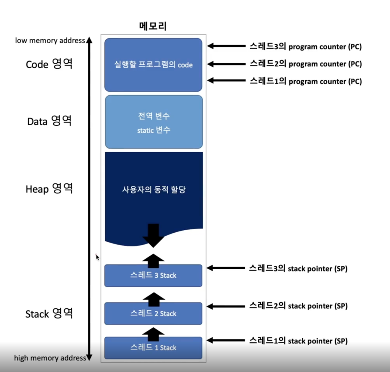

# Multi Thread

Q. ⭐⭐ Multi thread에 대해서 설명하라.️

Thread는 한 process 내에서 실행되는 **동작(기능 function)의 단위**이다. 
각 thread는 속해있는 process의 Stack 메모리를 제외한 나머지 memory 영역을 공유할 수 있다.

Multi thread란 하나의 process가 동시에 여러개의 일을 수행할 수 있도록 해주는 것이다.
즉, 하나의 process(실행이 된 하나의 program에서)에서 여러 작업을 병렬로 처리하기 위해 multi thread를 사용한다.
Multi Thread에서는 한 process 내에 여러 개의 thread가 있고, 각 thread들은 Stack 메모리를 제외한 나머지 영역(Code, Data, Heap) 영역을 공유하게 된다. 

> TIP) thread는 process내에서 독립적인 기능을 수행한다. 즉, 독립적으로 함수를 호출함을 의미하고 
> 이를 위해 stack memory가 각자 필요하다. thread가 무엇인지 이해하고, multi process와 어떤 점이 다른지를 생각해보면서 공부하자!
> 
> 또한, 독립적인 stack memory와 PC Register가 필요하다는 점을 잘 기억하자!

엄밀히 따져보면 하나의 프로세스도 여러가지 프로그램을 독립적으로 실행한다.  
유튜브가 동영상만 랜더링하지 않는다. 1)동영상 데이터를 받고, 동시에 2)랜더링도 할 수 있고, 3) 댓글도 쓸 수 있다.
이런 것들이 한 프로세스 내에서 동시에 실행이되고있는 독립적인 기능들이다. 

## Thread와 Multi Thread
Thread는 Process 내에서 독립적인 기능을 수행한다. 각 Thread가 독립적인 기능을 수행한다는 것은 독립적으로 함수를 호출함을 의미한다.

### Single Thread Concurrency

Multi Process에서는 각 프로세스가 단일 스레드로 구성되어있다는 가정하에 설명했기에 CPU가 각 프로세스만 왔다갔다하며 동작하는 것이라 했으나, 
실제로는 하나의 프로세스에서도 여러 스레드를 Context Switching하며 동작한다!

### Stack memory & PC register 

thread가 함수를 호출하기 위해서는 인자 전달, Return Address 저장, 함수 내 지역변수 저장 등을 위한 독립적인 
stack memory 공간을 필요로 한다. **결과적으로 thread는 process로부터 Stack memory 영역은 독립적으로 할당받고, 
Code, Data, Heap 영역은 공유하는 형태**를 갖게 된다. 

또한 multi thread에서는 각각의 thread마다 PC register를 가지고 있어야한다. 
그 이유는 한 process내에서도 thread끼리 context switch가 일어나게 되는데, 
PC register에 code address가 저장되어있어야 이어서 실행을 할 수 있기 때문이다.

위와 같이 메모리 영역은 나뉘는데, 만약 스레드가 여러개라면 각각의 스레드에 (Stack, PC Register)를 
갖고있어야한다. 각각 스레드가 stack과 PC(Program Counter)을 가짐 

Q. thread는 왜 독립적인 stack memory 영역이 필요한가?

Stack 영역은 함수 호출 시 전달되는 `인자`, 함수의 `Return Address`, 함수 내 `지역변수` 등을 저장하기 위한 memory 영역이다. 
thread가 process 내에서 "**독릭적인 기능을 실행**"한다는 것은 "**독립적으로 함수를 호출**"함을 의미한다. 
따라서 각 thread가 독립적인 동작을 실행하기 위해서는 각 thread의 stack memory 영역이 독립적이여야 한다. 

Q. process와 thread를 비교설명 해주세요.

process는 운영체제로부터 자원을 할당받는 작업의 단위이고 thread는 process가 할당받은 자원을 이용하는 실행의 단위이다. 
즉, process는 실행파일(program)이 memory에 적재되어 **CPU를 할당**받아 **실행**되는 것이다.
thread는 한 process 내에서 실행되는 **동작의 단위**이다.

process는 memory 공간에 code, data, heap, stack 영역이 있는데, thread는 process내에서 stack 영역을 
제외한 code, data, heap 영역을 공유한다.

