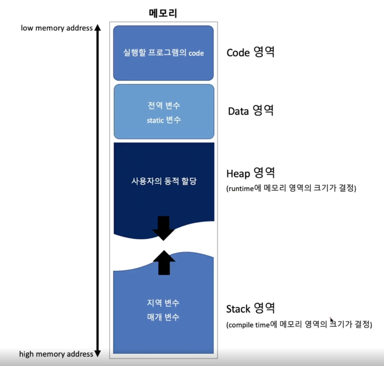

# Process 

Q. process를 간단히 설명하라️

       

실행파일(program)이 `memory에 적재`되어 `CPU를 할당받아` 실행되는 것을 process라고 한다.

> TIP) 운영체제를 관통하는 핵심적인 단어 하나를 뽑는다면 그건 바로 process이다. 운영체제가 작동하는 다양한 원리들이 바로 process를 위해 존재하는 것이다.
> 따라서 process의 정의를 잘 이해한다면 앞으로 나올 내용들도 자연스럽게 이해가 갈 것이다.
> process를 `memory`와 `CPU관점`으로 면접관에게 설명을하면 된다.

##  Process

> 프로세스(process)란 **실행중인 프로그램**(program in execution)을 뜻한다. 
> 즉, 실행파일 형태로 존재하던 program이 memory에 적재되어 CPU에 의해 실행(연산)되는 것을 process라고 한다.
> 
> (+ program은 단순히 명령어 리스트를 포함하는 파일이다.)

## Memory에 적재 

> memory는 CPU가 직접 접근할 수 있는 컴퓨터 내부의 기억장치이다. program이 CPU에서 실행되려면 해당 내용이 memory에 적재된 상태여야만 한다. 
> (program이 하드디스크에 있을 때는 CPU가 직접 접근할 수 없지만 메모리에 적재된 상태에서는 직접 접근을 해서 실행을 할 수 있다)
> 
> 프로세스에 할당되는 memory 공간은 Code, Data, Stack, Heap 4개의 영역으로 이루어져 있으며, 각 process마다 독립적으로 할당을 받는다.

| 영역       | 설명                                         |
|----------|--------------------------------------------|
| Code 영역  | 실행할 프로그램의 코드가 저장되는 메모리 영역                  |
| Data 영역  | 프로그램의 전역 변수와 static 변수가 저장되는 메모리 영역        |
| Heap 영역  | 프로그래머가 직접 공간을 할당(malloc)/해제(free)하는 메모리 영역 |
| Stack 영역 | 함수 호출 시 생성되는 지역 변수와 매개 변수가 저장되는 임시 메모리 영역  |

(code 영역이 더 낮은 주소값을 가지고있고 stack 영역이 더 높은 주소값을 가지고있다)

## CPU의 연산 
> 프로그램의 코드를 토대로 CPU가 실제로 연산을 해야만 프로그램이 실행된다고 볼 수 있다. 
> 그럼 어떤 코드를 읽어야 하는가를 정하는 것은 CPU 내부에 있는 PC(Program counter) register에 저장되어있다. 
> PC register에는 다음에 실행될 코드(명령어, instruction)의 주소값이 저장되어 있다. 즉, memory에 적재되어있는 process code 영역의 명령어 중 
> 다음번 연산에서 읽어야할 명령어의 주소값을 PC register가 순차적으로 가리키게 되고, 해당 명령어를 읽어와서 CPU가 연산을 하게 되면 process가 실행이 되는 것이다.

## 심화 질문 

Q. ⭐️ process의 memory영역(code, data, stack, heap)에 대해서 설명하라

       

프로세스가 운영체제에서 할당받는 메모리 공간은 code, data, stack, heap 영역으로 구분된다. 
* code 영역은 실행한 프로그램의 코드가 저장되는 메모리 영역이다. 
* data 영역은 프로그램의 전역 변수와 static 변수가 저장되는 메모리 영역이다. 
* heap 영역은 프로그래머가 직접 공간을 할당(malloc)/해제(free)하는 메모리 영역이다. 
* stack 영역은 함수 호출 시 생성되는 지역 변수와 매개 변수가 저장되는 임시 메모리 영역이다.

