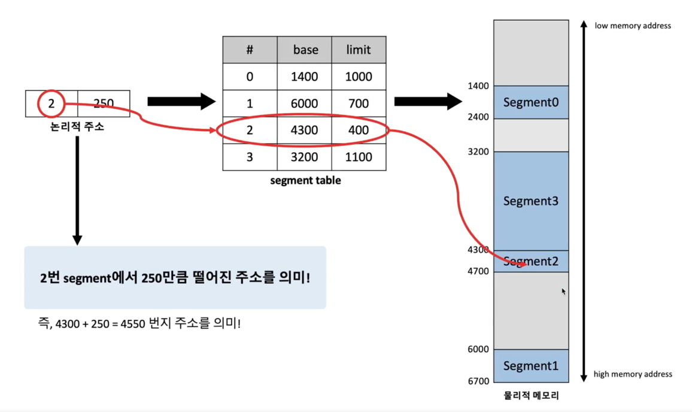

Q. segmentation에 대해서 설명해 주세요.

segmentation이란 process가 할당받은 메모리 공간을 `논리적 의미 단위(segment)`로 나누어, `연속되지 않는 물리 메모리 공간에 할당`될 수 있도록하는 
메모리 관리 기법이다.

> 면접 TIP 
> 
> page와 같이 면접에 자주나오진 않지만, 메모리에 대해서 이해하는데 중요한 내용이 많이 담겨져있기 때문에 알아두면 좋다. 
> 일정한 크기의 단위로 나누어 할당을 했던 page와 다르게, segmentation은 의미 단위로 물리 메모리에 할당을 하는 기법임을 설명할 수 있어야한다. 
> 특히 code, data, heap, stack등의 기능(의미) 단위로 나눈다는 점을 기억하자!

## Segmentation

> segmentation 기법은 process가 할당받은 메모리 공간을 **논리적 의미 단위(segment)**로 나누어, 연속되지 않는 물리 메모리 공간에 할당될 수 있도록 하는 메모리 관리 기법이다. 
>
> 일반적으로 process의 메모리 영역 중 `Code, Data, Heap, Stack 등의 기능 단위로 segment를 정의`하는 경우가 많다. 
>
> segmentation 기법에서는 주소 바인딩(address binding)을 위해 모든 프로세스가 각각의 주소 변환을 위한 segment table을 갖는다.

페이지는 같은 크기의 메모리로 나눈데 비해서 세그먼테이션은 의미단위로 나누기 때문에 크기가 일정하지 않음. 
따라서 그 크기를 segment table에 그 데이터의 시작점(base + segment에서 떨어진 거리)와 limit 만큼의 데이터 크기 

## 심화질문

Q. segmentation의 **메모리 단편화(Memory fragmentation)** 문제에 대해 설명해 주세요. 

segmentation 기법에서 segment의 크기만큼 메모리를 할당하므로 내부 단편화 문제가 발생하지 않는다.
하지만 서로 다른 크기의 segment들이 메모리에 적재되고 제거되는 일이 반복되면, 외부 단편화 문제가 발생할 가능성이 있다.

Q. paging과 segmentation의 차이는 뭔가요? 

paging은 일정한 크기의 단위로 나누어 할당을 하는데, 이에 반해 segmentation은 code, data, heap, stack등의 기능(의미) 단위로 물리 메모리에 할당을 하는 기법이다.

paging의 경우 내단편화의 문제가 발생할 수 있는데, 이에 반해 segmentation은 외단편화의 문제가 발생할 수 있다.

Q. paged segmentation 기법에 설명하라. 

paged segmentation이란 segmentation을 기본으로 하되 이를 다시 동일 크기의 page로 나누어 물리 메모리에 할당하는 메모리 관리 기법이다. 
즉, 프로그램을 **의미 단위의 segment**로 나누고 개별 **segment의 크기를 page의 배수**가 되도록 하는 방법이다. (paging과 segmentation의 장점을 둘다 취한 것!)

이를 통해 segmentation 기법에서 발생하는 **외부 단편화 문제를 해결**하고, 동시에 segment 단위로 process 간의 공유나 process 내의 접근 권한 보호가 
이루어지도록 해서 paging 기법의 단점을 해결한다. 

