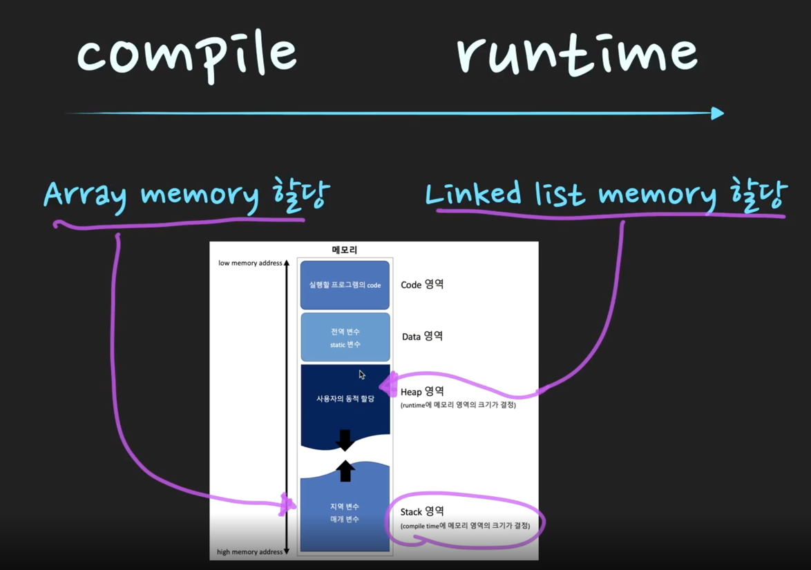

# Array vs Linked List

Q. ⭐Array vs Linked List를 비교해서 설명해주세요.️

       

Array는 메모리 상에서 연속적으로 데이터를 저장하는 자료구조이다. Linked List는 메모리상에서는 연속적이지 않지만, 각각의 원소가 다음 원소의 
메모리 주소값을 저장해 놓음으로써 논리적 연속성을 유지한다.

그래서 각 operation의 시간복잡도가 다르다. 데이터 조회는 Array의 경우 O(1), Linked List는 O(n)의 시간복잡도를 갖는다. 
삽입/삭제는 Array O(n), Linked List O(1)의 시간복잡도를 갖는다. 

따라서 얼마만큼의 데이터를 저장할지 미리 알고있고, 조회를 많이 한다면 Array를 사용하는 것이 좋다.
반면에 몇개의 데이터를 저장할 지 불확실하고 삽입 삭제가 잦다면 Linked List를 사용하는 것이 유리하다.

> TIP) Array와 Linked List의 주된 차이점들은 메모리 구조에 기인한다. Array는 메모리상에서 연속적으로 데이터를 저장하고, Linked List는 불연속적으로 저장한다. 
> 메모리 구조의 차이로 인해 operation 구현방법이 다르고 시간복잡도도 다르다. 또한 메모리 활용도에서도 차이가 있다. 
> 상황에 따라 메모리를 효율적으로 사용할 수 있는 자료구조가 달라진다. 

### 조회 (look up)

Array는 메모리상에서 연속적으로 데이터를 저장하였기 때문에 저장된 데이터에 즉시 접근(random access O(1))할 수 있다. 
이와 반면 Linked List는 메모리 상에서 불연속적으로 데이터를 저장하기 때문에 순차 접근(Sequential Access)만 가능하다.
즉, 특정 index의 데이터를 조회하기 위해 O(n)의 시간이 걸리게 된다. 

### 삽입/삭제 (insert/delete)

Array의 경우 맨 마지막 원소를 추가/삭제하면 시간복잡도가 O(1)이다. 하지만 맨 마지막 원소가 아닌 중간에 있는 원소를 삽입/삭제하면 
해당 원소보다 큰 인덱스의 원소들을 한 칸씩 shift 해줘야 하는 비용(cost)이 발생한다. 따라서 이 경우에는 시간복잡도가 O(n)이 된다.

Linked List는 어느 원소를 추가/삭제 하더라도 node에서 다음주소를 가르키는 부분만 다른 주소 값으로 변경하면 되기 때문에 shift를 할 필요가 없어
시간 복잡도가 O(1)이 된다. 

하지만 Linked List의 경우 추가/삭제를 하려는 index까지 도달하는데 O(n)의 시간이 걸리기 때문에, 실질적으로 Linked List도 추가/삭제 시에 
O(n)의 시간이 걸린다고 볼 수 있다. 

### memory 

> Array의 주된 장점은 데이터 접근과 append가 빠르다는 것이다. 하지만 메모리 낭비라는 단점이 있다.
> 배열은 선언시에 fixed size를 설정하여 메모리 할당을 한다. 
> 즉, 데이터가 저장되어 있지 않더라도 메모리를 차지하고 있기 때문에 메모리 낭비가 발생한다. 
> 
> 이와 반면에 Linked List는 runtime 중에서도 size를 늘리고 줄일 수 있다. 그래서 initial size를 고민할 필요없고, 필요한 만큼 
> memory allocation을 하여 메모리 낭비가 없다. (But Linked List는 노드에 값 말고도 address 주소를 저장하기위한 메모리를 추가로 더 사용하기 때문에... 
> 사전에 데이터를 얼마나 저장할지 알고있다면 Array가 더 메모리를 효율적으로 사용할 수 있다.)

## 심화 질문 

Q. 어느 상황에 Linked List를 쓰는게 Array보다 나을까?️

       

* O(1)으로 삽입/삭제를 자주해야할 때
* 얼마만큼의 데이터가 들어올지 예측을 할 수 없을 때
* 조회 작업을 별로 하지 않을 때

Q. 어느 상황에 Array를 쓰는게 Linked List보다 나을까?️

       

* 조회 작업을 자주 해야할 때
* Array를 선언할 당시에 데이터의 갯수를 미리 알고 있을 때
* 데이터를 반복문을 통해서 빠르게 순회할 때
* 메모리를 적게 쓰는게 중요한 상황일 때, Linked List보단 Array가 메모리를 적게 차지하기 때문에 미리 들어올 데이터의 양을 알고만 있다면 Array가 메모리를 더 효율적으로 사용한다.

 
## + 심화 질문 

Q. Array와 Linked List의 memory allocation은 언제 일어나며, 메모리의 어느 영역을 할당 받나요?

       

* **Array**는 compile 단계에서 memory allocation이 일어난다. 이를 `Static Memory Allocation`이라고하고 이 경우 `Stack Memory` 영역에 할당된다.
* **Linked List**의 경우 runtime 단계에서 새로운 node가 추가될 때마다 memory allocation이 일어난다. 이를 `Dynamic Memory Allocation`이라고 부르고 이 경우에는 Heap 메모리 영역에 할당된다.

(Stack이나 Heap은 OS 시간 때, 자세하게 배울 예정임)

