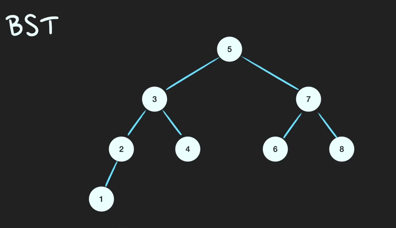
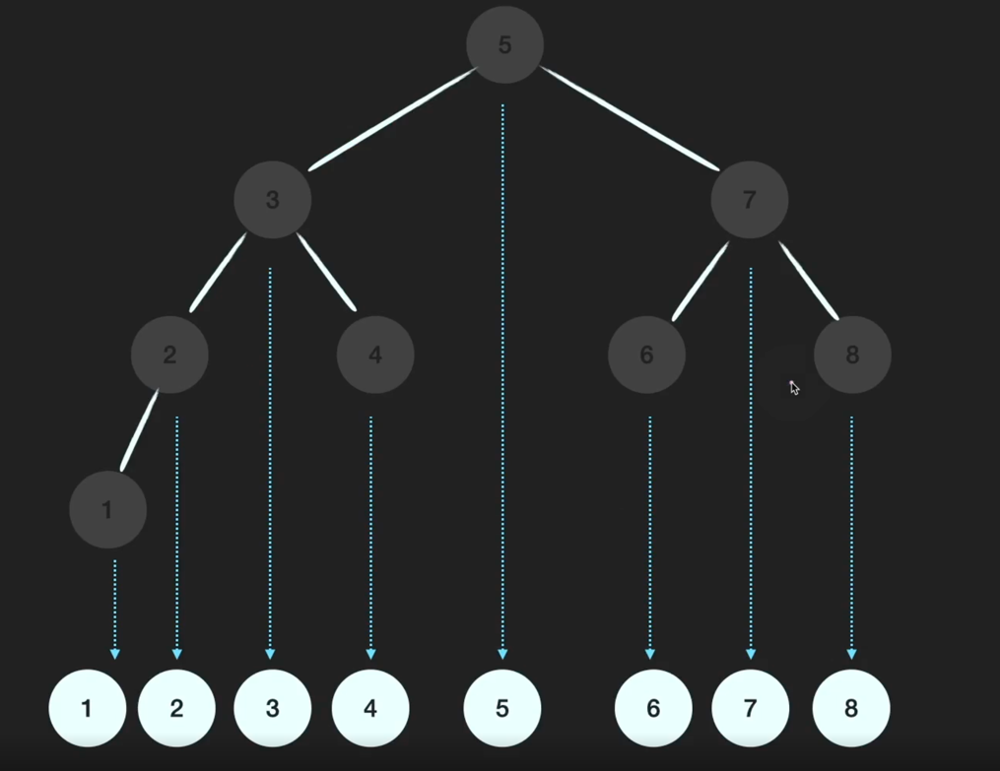
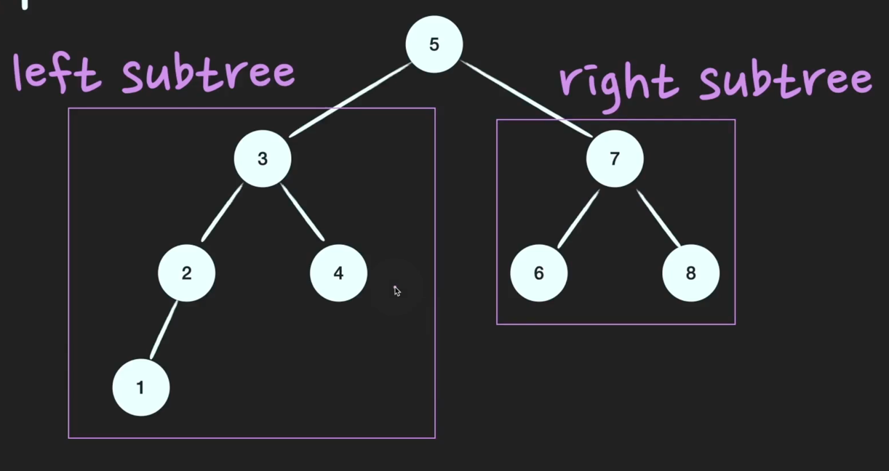
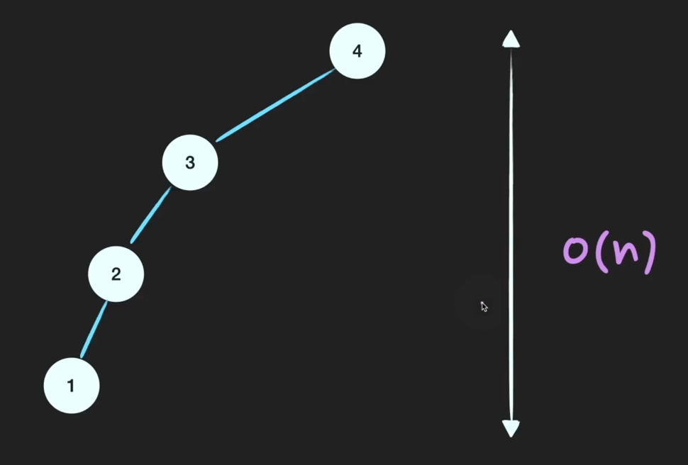

# BST (Binary Search Tree)

Q. ⭐⭐️BST는 어떤 자료구조인가?

       

**이진탐색트리**는 `정렬된 트리`이다. 어느 노드를 선택하든 해당 노드의 왼쪽 서브트리에는 그 노드의 값보다 작은 값들을 지닌 노드들로만 이루어져 있고, 
노드의 오른쪽 서브트리에는 그 노드의 값보다 큰 값들을 지닌 노드들로만 이루어져 있는 이진 트리이다. 

검색과 저장, 삭제의 시간복잡도는 모두 O(logN)이고, worst case는 한쪽으로 치우친 트리가 됐을 때 O(N)이다. 

> TIP) BST는 저장과 동시에 정렬을 하는 자료구조이다. 따라서 새로운 데이터를 저장할 때 일정한 규칙에 따라 저장을 하게 된다. 
> Heap을 공부했었을 때와 마찬가지로, 저장하는 방식을 그림으로 설명할 수 있으면 좋다.
> 이진탐색트리가 되기 위한 조건이 무엇인지, 시간복잡도, worst case, worst case가 발생하지 않게 하기 위해서는 어떻게 해야하는지를 
> 대답할 수 있으면 된다. BST는 자주 나오면서 꽤 어려운 자료구조이기 때문에 충분한 학습을 하고 면접을 봐야한다. 

> Heap은 이진완전탐색트리인 반면에 BST는 이진트리이기만 하면 된다.  

BST는 정렬이된 트리이다. 

### 이진탐색트리(BST) 조건
1. root node의 값보다 작은 값은 왼쪽 subtree에, 큰 값은 오른쪽 subtree에 있다. 
2. subtree도 1번 조건을 만족한다. (Recursive)

## 심화 질문

Q. 이진트리(Binary tree)는 어떤 자료구조인가?

       

모든 node의 child nodes의 갯수가 2이하인 트리를 이진 트리라고한다. 

Q. BST의 worst case 시간복잡도는 O(n)이다. 어떠한 경우에 worst case가 발생하는가?

       

**균형이 많이 깨져서 한 쪽으로 치우친 BST의 경우**에 worst case가 된다. `이렇게 되면 Linked list와 다를게 없어진다.`
따라서 탐색시에 O(logN)이 아니라 O(n)이 된다.

Q. 해결방법은 무엇인가?

       

자가 균형 이진 탐색 트리(Self-Balancing BST)는 알고리즘으로 이진 트리의 균형이 잘 맞도록 유지하여 높이를 가능한 낮게 유지한다.
대표적으로 **AVL트리**와 **Red-black tree**가 있다. JAVA에서는 Hashmap의 separate chaning으로써 Linked List와 Red-black tree를 병행하여 저장한다. 

### 사소한 정보
> 자바에서는 HashTable Default Length를 16으로 둔다. 
> bucket의 Max 값은 2^30개 이다. 
