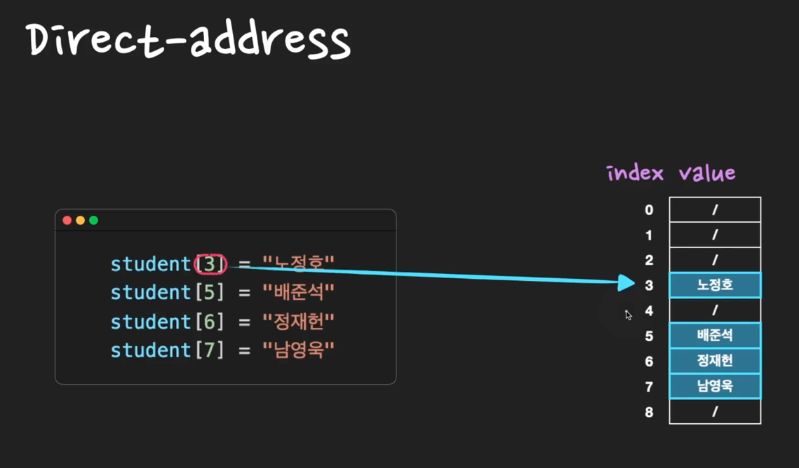
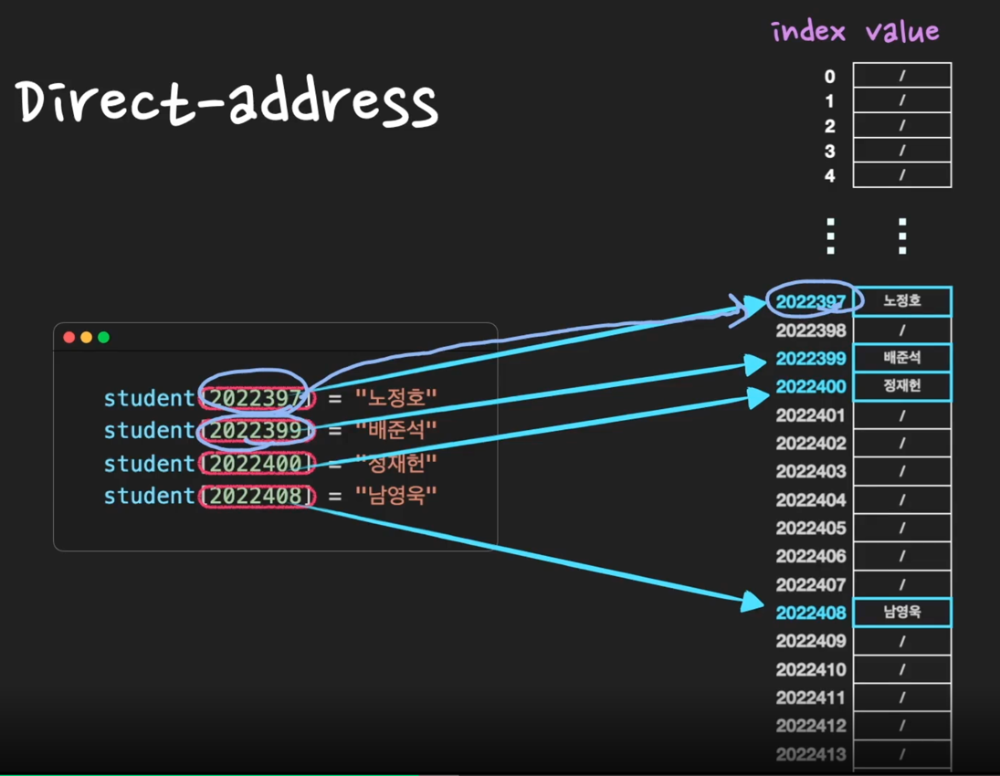
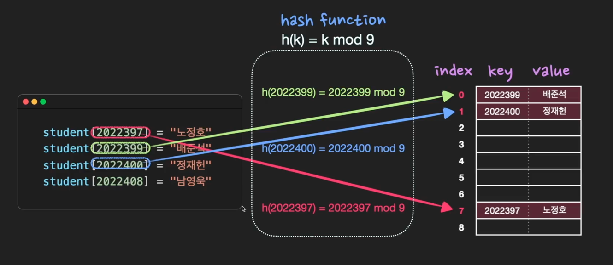
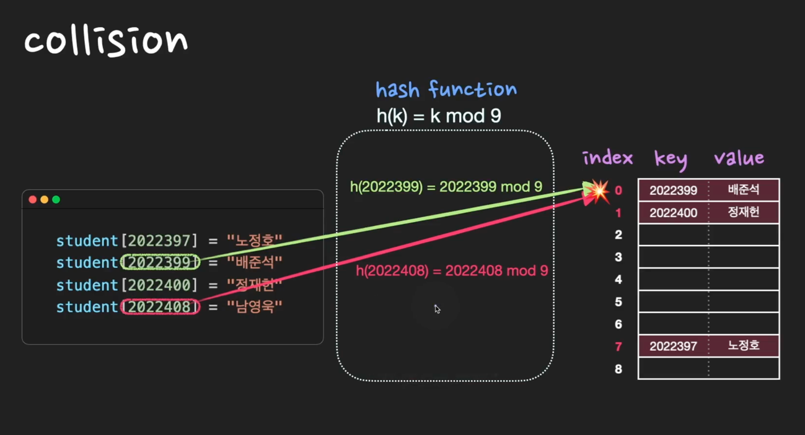

# Hash Table 

Q. ⭐⭐Hash Table은 어떤 자료구조인가?️

       

Hash Table은 `효율적인 탐색(빠른 탐색)`을 위한 자료구조로써 key-value쌍의 데이터를 입력받는다.  
hash function ***h***에 key값을 입력으로 넣어 얻은 해시값 *h(k)*를 위치로 지정하여 key-value 데이터 쌍을 지정한다. 
저장, 삭제, 검색의 시간복잡도는 모두 O(1)이다. 

> TIP) CS 면접에서 가장 자주 나오는 질문중에 하나이다. hashtable이 면접 단골질문인 이유는 다음과 같다. 
> 1)실무에서도 활용도가 높은 자료구조이다. 2)Linked List, Array 더 나아가면 Tree까지 질문할 수 있다. 
> 3)시간복잡도에 대해서 물어보기 좋다. (Hash Table을 공부할 때는 다방면으로 깊은 이해를하고 있어야한다.)
> 
> 한편, 좋은 hash function의 조건을 물어보는 경우도 있다. **좋은 hash function의 핵심적인 조건**은 `해시값이 고르게 분포되게하는 것`이다.

## Direct-address Table 
> Direct-address Table(직접 주소화 테이블)이란, key 값으로 k를 갖는 원소는 index k에 저장하는 방식이다. 

ex) 
> key: 출석번호, value: 이름
> 
> (3, 노정호)
> 
> (5, 배준석)
> 
> (6, 정재헌)
> 
> (7, 남영욱)

### Direct-address Table의 문제점 
직접 주소화 방법으로 key-value쌍의 데이터를 저장하고자하면 많은 문제가 발생한다.

* 불필요한 공간 낭비 

> key: 학번, value: 이름 
> 
> (2022390, 노정호)
> 
> (2022392, 배준석)
> 
> (2022393, 정재헌)
> 
> (2022401, 남영욱)
> 

* key가 다양한 자료형을 담을 수 없게 됨
  * key가 문자열이라면...? index(=숫자형)으로는 저장할 수 없다는 것

> key: ID, value: 이름
>
> (nossi8128, 노정호)
>
> (js9876, 배준석)
>
> (zebra001, 정재헌)
>
> (nam1234, 남영욱)
> 

위와 같은 문제들을 보완하기위한 것이 `Hash Table`이다.

### Hash Table 

(key, value) 데이터 쌍을 저장하기 위한 방법으로 직접 주소화 방법이 잘 맞지않는다. hash table은 hash function ***h***를 
이용해서 (*key*, *value*)를 index: *h(k)*에 저장한다. 이 때, `"키 k값을 갖는 원소가 위치 h(k)에 hash된다. 또는 h(k)는 키 k의 해시값이다`라고 
표현한다. key는 무조건 존재해야하며, 중복되는 key가 있어서는 안된다. 

한편, hash table을 구성하고 있는, (key, value) 데이터를 저장할 수 있는 각각의 공간을 slot 또는 bucket이라고 한다. 

## Collision 
collision이란 서로 다른 key의 해시값이 똑같을 때를 말한다. 
즉, 중복되는 key는 없지만 해시값은 중복될 수 있는데 이 때 'collision이 발생했다'라고 한다.
따라서 collision이 최대한 적게 나도록 hash function을 잘 설계해야하고, 어쩔 수 없이 collision이 발생하는 경우 
`separate chaining` 또는 `open addressing`등의 방법을 사용하여 해결한다.  (두 해결방식에 대해서는 추후 더 자세히 다룰 예정)

 

## 시간복잡도와 공간효율 

> `시간복잡도`는 저장, 삭제, 검색 모두 기본적으로 O(1)이지만, collision으로 인하여 최악의 경우 O(n)이 될 수 있다.
> 
> `공간효율성`은 떨어진다. 데이터가 저장되기 전에 미리 저장공간(slot, bucket)을 확보해야하기 때문이다. 
> 따라서 저장공간이 부족하거나 채워지지 않은 부분이 많은 경우가 생길 수 있다. 

## 심화 질문 

Q. 좋은 Hash Function의 조건은 무엇인가?️

       

각 상황마다 good hash function은 달라질 수 있으나(= 만능은 없다) 대략적인 기준은 `연산 속도가 빨라`야하고, `해시값이 최대한 겹치지 않아야`한다.

