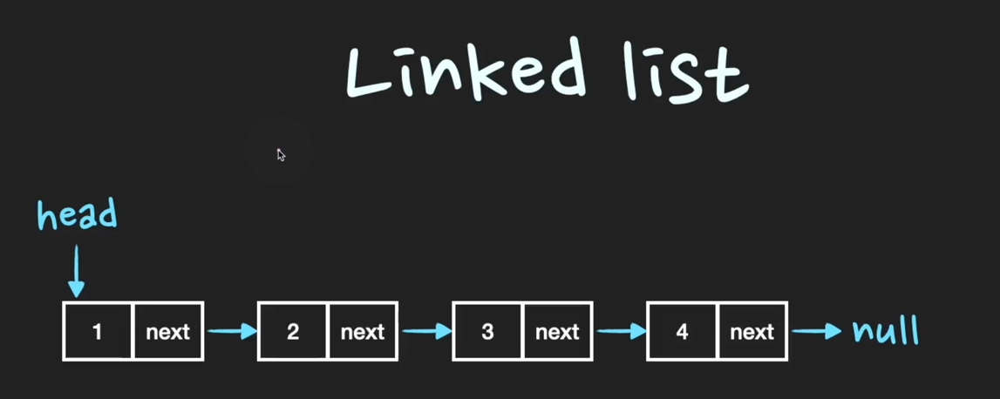

# Linked List 

Q. Linked List에 대해서 설명해 주세요.

       

Linked List는 Node라는 구조체로 이루어져 있는데, `Node`는 **데이터 값**과 **다음 Node의 address**를 저장한다. 
Linked List는 **물리적인 메모리상에서 비연속적으로 저장**이 되지만 Linked List를 구성하는 **각각의 Node가 다음 Node의 address를 가리킴으로써 
논리적인 연속성**을 가진 자료구조이다. 

> TIP) Linked List는 tree, graph 등 다른 자료구조를 구현할 때 자주 쓰이는 기본 자료구조이다. 
> 면접에서 Linked List를 설명할 때에는 ₩메모리상에서 불연속적으로 데이터가 저장되는 점₩과 `Node의 next address를 통해` 
> 불연속적인 데이터를 연결하여 `논리적 연속성`을 보장한다는 점을 중심으로 설명하면 된다. 
> 또한, `데이터가 추가되는 시점에서 메모리를 할당`하기 때문에 `메모리를 좀 더 효율적으로 사용할 수 있다`는 장점

## Linked List 

* 첫 번째 노드는 Head라는 포인터로 가리키고 있다. 
* 마지막 노드의 next address 값은 null 값으로 저장되어있다.

### 논리적 연속성 
> 각 Node들은 next address 정보를 가지고 있기 떄문에 논리적으로 연속성을 유지하면서 연결되어 있다.
> Array의 경우 연속성을 유지하기 위해 물리적 메모리 상에서 순차적으로 저장하는 방법을 사용하였고, 
> Linked List에는 메모리에서 연속성을 유지하지 않아도 되기 때문에 메모리 사용이 좀 더 자유로운 대신, 
> Next address를 추가적으로 저장해야하기 때문에 데이터 하나당 차지하는 메모리가 더 커지게 된다. 

### Linked List의 데이터 삽입, 삭제 

[삽입]

A -> B -> C  
위와 같은 Linekd List가 있을 때, D를 B와 C 사이에 삽입한다면...
B의 next address를 D의 주소 값으로 변경하고, D의 next address를 C의 주소 값으로 변경하면 된다.
 
[삭제]
A -> B -> C  
위와 같은 Linekd List가 있을 때, B를 삭제한다면...
A의 next address 값을 C의 주소로 변경하기만하면 된다. 

### 데이터 삽입/삭제 O(1)
> Array의 경우 중간에 데이터를 삽입/삭제하게 되면 해당 인덱스의 뒤에 있는 모든 원소들을 shift를 해야만했다.
> 그러다 보니 O(n)의 시간복잡도를 갖게 되었다. 하지만 Linked List를 물리적으로 옮길 필요없이 next address가 가리키는 주소값만
> 변경하면 되기 때문에 O(1)의 시간복잡도로 삽입/삭제가 가능하다.

### Time Complexity
|             | LinkedList  |
|:-----------:|:-----------:|
|   access    |    O(n)     |
|   search    |    O(n)     |
|  insertion  |    O(1)     |
|  deletion   |    O(1)     |

