

Q. ⭐️Queue vs priority queue를 비교하여 설명해 주세요.

       

Queue 자료구조는 시간 순서상 먼저 집어 넣은 데이터가 먼저 나오는 **선입선출 FIFO(First In First Out)** 구조로 저장하는 형식이다.
이와 다르게 우선순위큐(priority queue)는 들어간 순서에 상관없이 우선순위가 높은 데이터가 먼저 나온다.

Queue는 operation 시간복잡도는 `enqueue` O(1), `dequeue` O(1)이고,

Priority queue는 `push` O(logN), `pop` O(logN) 이다.

> TIP) 면접질문에서 우선순위큐를 잘 답하기 위해서는 구현 방법과 operation의 시간복잡도를 잘 설명할 수 있어야 한다. 
> 우선순위큐를 구현하라고 하면 Heap을 구현하면 된다. Heap 자료구조는 이진완전트리를 활용하는 것이고, 대표적인 operation의 시간복잡도는 
> `push` O(logN), `pop` O(logN)이다. 이 두 가지 특징을 중심으로 공부해가면 충분히 답변할 수 있다.
> 또한 tree가 그려져 있는 상태에서 최대힙, 최소힙의 삽입과 삭제시에 어떻게 node가 삭제되고 연결이 변경되는지의 과정을 그려서 설명할 수 있다면 더 좋다.

## Heap 

> Heap은 그 자체로 우선순위큐(priority queue)의 구현과 일치하다. 
> Heap은 완전이진트리 구조이다. Heap이 되기 위한 조건은 다음과 같다. 
>  
>  *각 node에 저장된 값은 child node들에 저장된 값보다 크거나 같다(max heap)
>   --> root node에 저장된 값이 가장 큰 값이 된다.
>  *각 node에 저장된 값은 child node들에 저장된 값보다 작거나 같다(min heap)
>   --> root node에 저장된 값이 가장 작은 값이 된다.

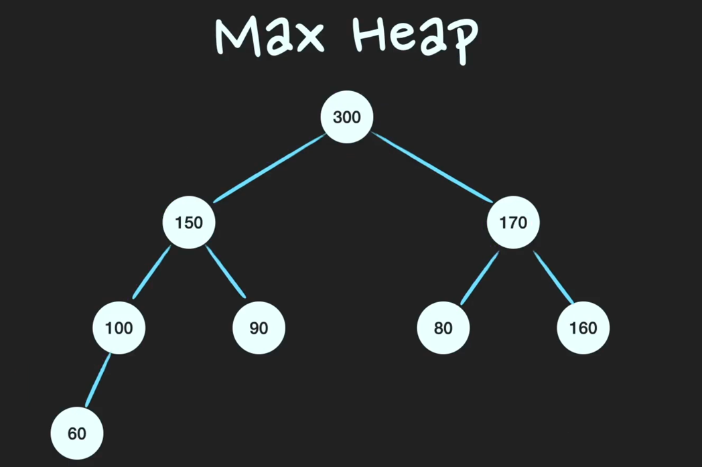
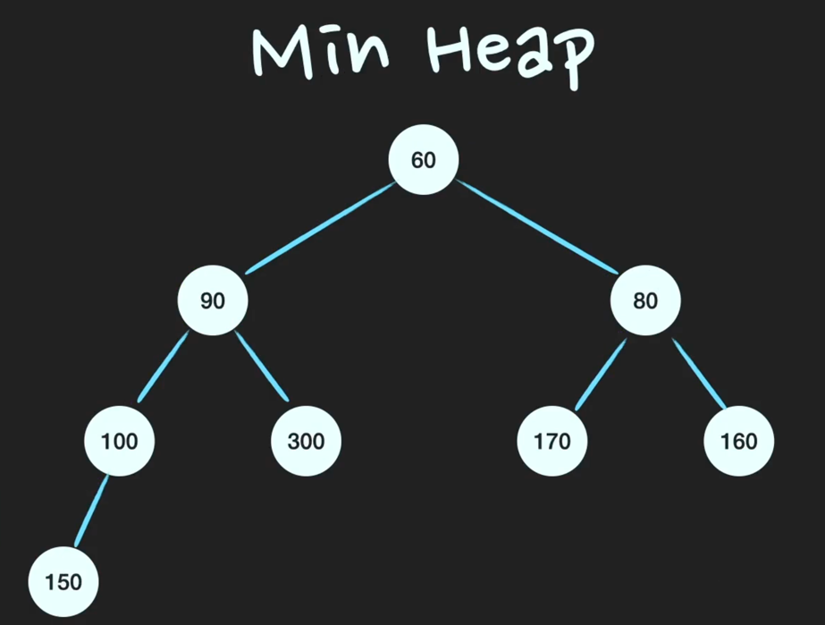

## Heap구현
> 트리는 보통 Linked List로 구현한다. 하지만 Heap은 tree임에도 불구하고 array를 기반으로 구현해야한다.
> 그 이유는 새로운 node를 힙의 `마지막 위치`에 추가해야 하는데, 이 때 array기반으로 구현해야 이 과정이 수월해지기 때문이다. 

* 구현의 편의를 위해 array의 0번 째 index는 사용하지 않는다. 
* 완전이진트리의 특성을 활용하여 array의 index만으로 부모 자식간의 관계를 정의한다. (시작 index를 1번부터 둔다)
  * n번 째 node의 left child node = 2n
  * n번 째 node의 right child node = 2n + 1
  * n번 째 node의 parent node = n / 2

## Max Heap에 Push, Pop 동작

만약 Push(190)을 한다면...? 

* 새로운 데이터를 push하면 heap의 맨 마지막 인덱스에 값을 저장한다. 
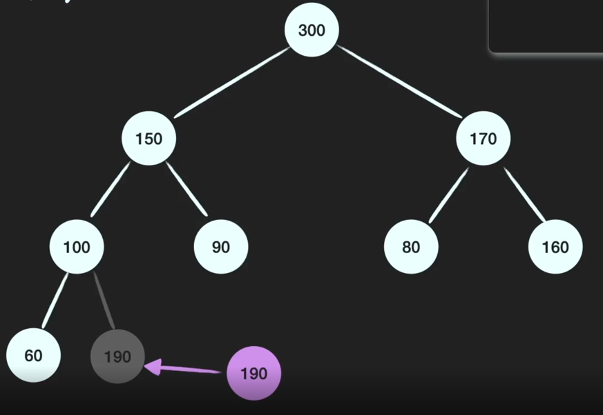

* 부모 Node의 값이 더 작다면 swap을 한다. 
  * 이 과정을 계속 반복한다.
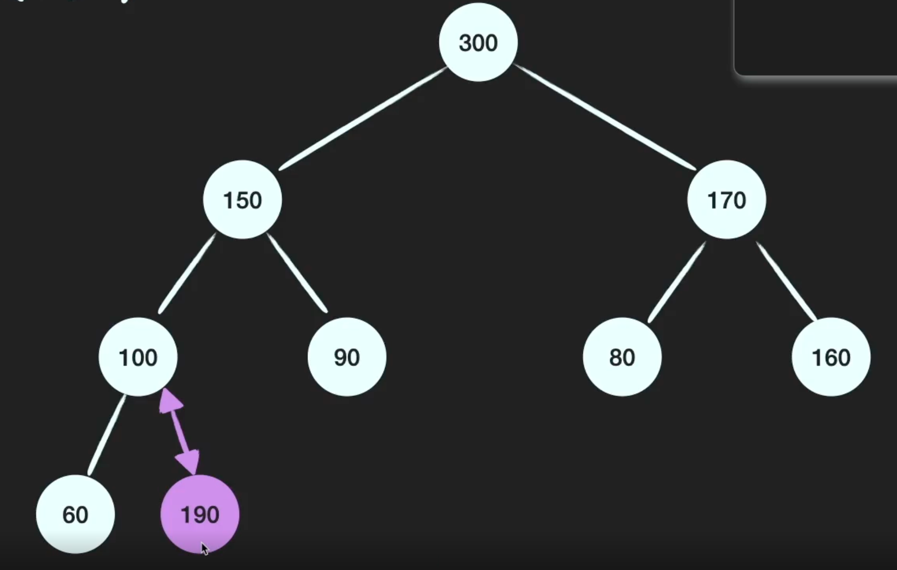

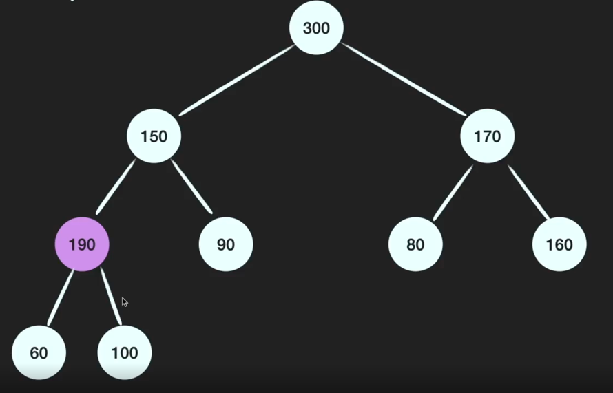

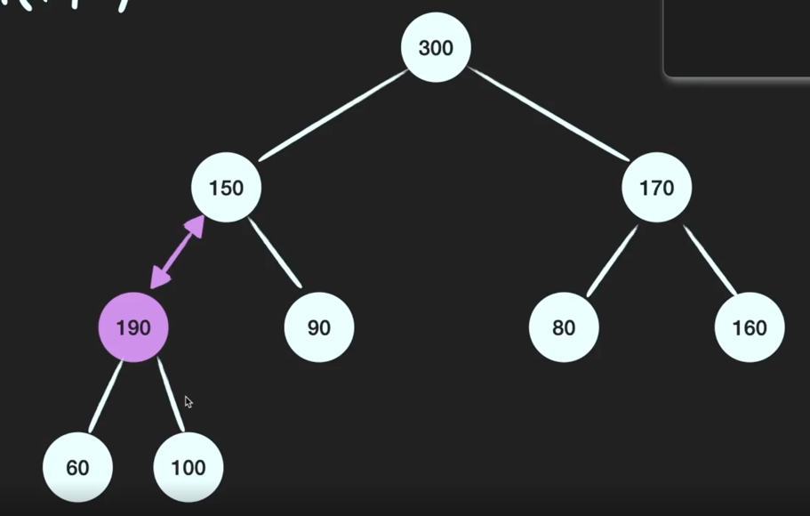

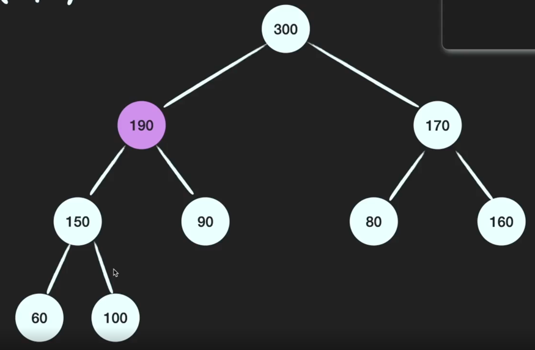

* push 완료 - O(logN)

만약 pop()을 한다면...? -> 기댓값: Heap에서 가장 큰 값이 나와야한다.(루트 노드의 값을 추출해야 한다)

* 첫 번째 인덱스에 저장되어 있는 값을 pop해준다. 
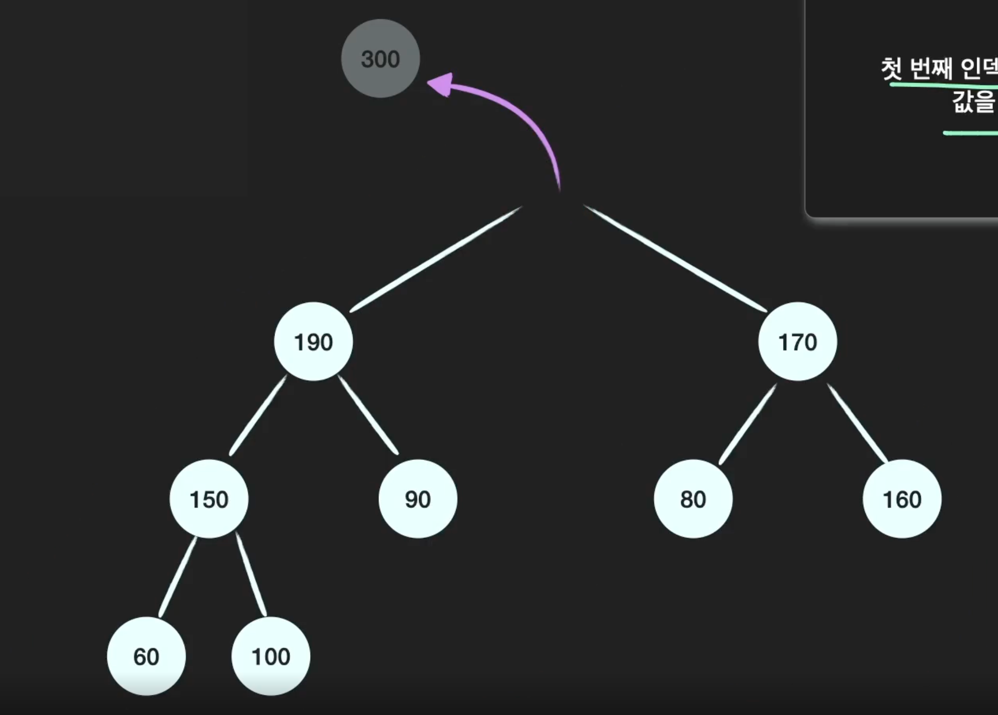

* 마지막 인덱스에 저장되어 있는 값을 top으로 옮긴다.
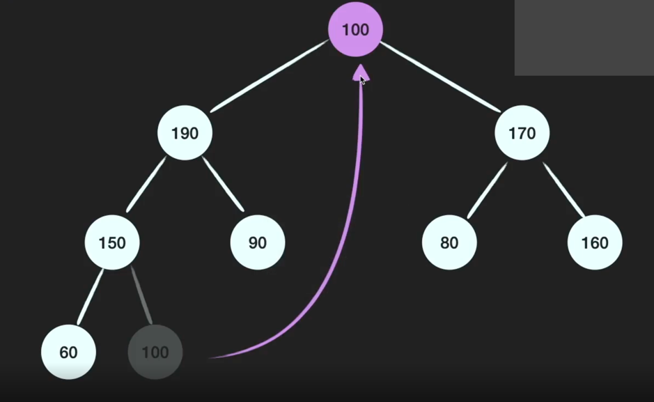

* Top에 저장되어있는 값이 child node보다 작다면 child node들 중에 큰 값과 swap을 해준다. 
  * child node가 더 크지 않을 때 까지 같은 과정을 반복한다. 
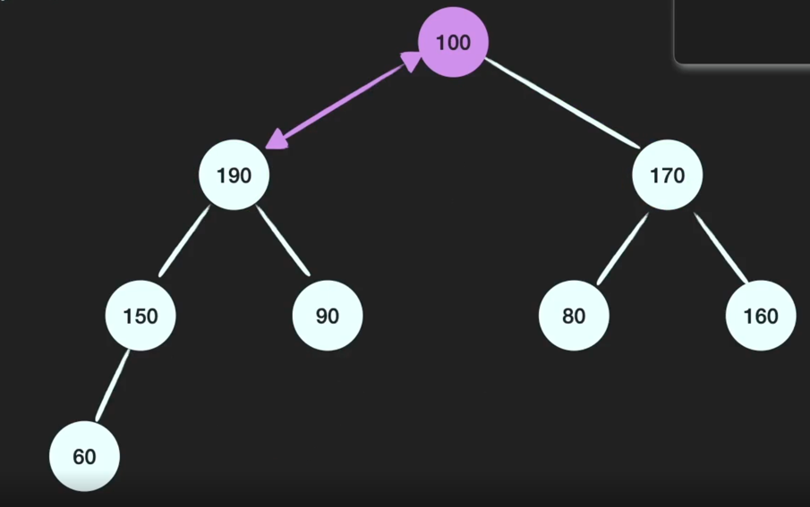

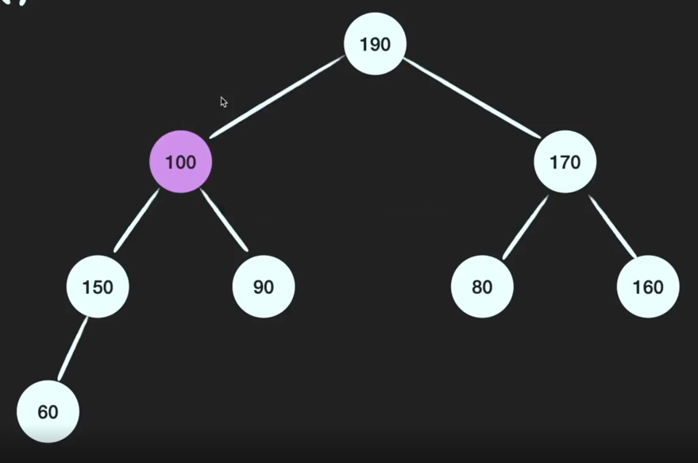

* pop 완료 - O(logN)

### Heap push - O(logN)
> heap tree의 높이는 logN 이다. 
> `push()`를 했을 때, swap하는 과정이 최대 logN 번 반복되기 때문에 시간복잡도는 O(logN)이다. 

### Heap pop - O(logN)
> `pop()`을 했을 때, swap하는 과정이 최대 logN번 반복되기 때문에 시간복잡도는 O(logN)이다. 

