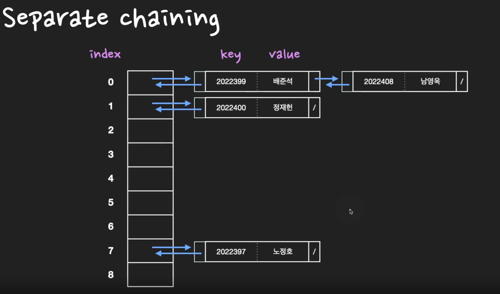

Q. ⭐⭐⭐⭐Hash Table에서 collision이 발생하면 어떻게 될까? 해결방법엔 뭐가 있을까?️

       

collision이 발생할 경우 대표적으로 2가지 방법으로 해결한다. 

첫 번째, `open addressing 방식`은 collision이 발생하면 미리 정한 규칙에 따라 hash table의 비어있는 slot을 찾습니다. 
빈 slot을 찾는 방법에 따라 크게 **Linear Probing**, **Quadratic Probing**, **Double Hashing**으로 나뉜다. 

두 번째, `separate chaining 방식`은 linked list를 이용한다. 만약에 collision이 발생하면 linked list에 노드(slot)를 추가하여 데이터를 저장한다. 

> TIP) 정말 자주나오고 중요한 면접 질문이기 때문에 철저히 준비해가는 것을 추천한다. 
> hashtable에서 collision이 발생했을 때, separate chaining과 open adressing 두 가지 방식으로 해결을 한다. 
> 두 가지 방법이 어떤 메커니즘으로 작동하는지, 어떤 차이점이 있는지를 잘 학습해야한다. 
> 
> 또한 separate chaining의 경우 worst case의 시간복잡도에 대해서 설명할 줄 알아야한다. 삽입과 검색, 삭제의 시간복잡도는 O(1)이지만, 
> worst case의 경우에 O(n)이 될 수 있다. 왜 O(n)이 되는지를 설명할 수 있도록 collision에 대해서 살펴보자. 
> 

## Open addressing 
open addressing 방식은 collision이 발생하면 미리 정한 규칙에 따라 hash table의 비어있는 slot을 찾는다. 
추가적인 메모리를 사용하지 않으므로 linked list 또는 tree 자료구조를 통해 추가로 메모리 할당을 하는 separate chaining방식에 비해 `메모리를 적게 사용`한다.

open addressing은 빈 slot을 찾는 방법에 따라 크게 Linear Probing, Quadratic Probing, Double Hashing으로 나뉜다. 

### Linear Probing(선형 조사법)&Quadratic Probing(이차 조사법) 
* `Linear Probing(선형 조사법)`: 선형 조사법은 충돌이 발생한 해시값으로부터 일정한 값만큼(+1, +2, +3, ...) 건너 뛰어, 비어있는 slot에 데이터를 저장한다.
* `Quadratic Probing(이차 조사법)`: 이차 조사법은 제곱수(+1^2, +2^2, +3^2, ...)로 건너 뛰어, 비어있는 slot을 찾는다.

충돌이 여러번 발생하면 여러번 건너 뛰어 빈 slot을 찾는다. 선형조사법과 이차 조사법의 경우 충돌 횟수가 많아지면 특정 영역에 데이터가 집중적으로 몰리는
클러스터링(clustering)현상이 발생하는 단점이 있다. 클러스터링 현상이 발생하면, 평균 탐색 시간이 증가하게 된다. 

### Double Hashing(이중해시, 중복해시)
이중 해싱은 open addressing 방식을 통해 collision을 해결할 때, probing하는 방식중에 하나이다.
linear probing이나 quadratic probing을 통해 탐사할 때는 탐사이동폭이 같기 때문에 클러스터링 문제가 발생할 수 있다. 
클러스터링 문제가 발생하지 않도록 2개의 해시함수를 사용하는 방식을 이중 해싱이라고 한다. 하나는 최초의 해시값을 얻을 때 사용하고 또 다른 하나는 
해시 충돌이 발생할 때 탐사 이동폭을 얻기 위해 사용한다. 

## Separate chaining 

Separate chaining 방식은 linked list(또는 Tree)를 이용하여 collision을 해결한다. 
충돌이 발생하면 linked list에 노드(slot)를 추가하여 데이터를 저장한다. 

* 삽입: 서로 다른 두 key가 같은 해시값을 갖게 되면 linked list에 node를 추가하여 (key, value) 데이터 쌍을 저장한다. 삽입의 시간복잡도는 O(1)이다. 
* 검색: 기본적으로 O(1)의 시간복잡도이지만 **최악의 경우 O(n)**의 시간복잡도를 갖는다. 
* 삭제: 삭제를 하기 위해선 검색을 먼저 해야하므로 검색의 시간복잡도와 동일하다. 기본적으로 O(1)이지만 **최악의 경우 O(n)**의 시간복잡도를 갖는다. 

`worst case의 경우 n개의 모든 key가 동일한 해시값을 갖게되면 길이 n의 linked list가 생성되게 된다. 이 때, 검색의 시간복잡도가 O(n)이 된다.`

### 심화 질문 

Q. worst case에 시간복잡도는 O(n)이라고 했는데 어떤 상황일까?

(꽤 자주나오는 질문)

n개의 모든 key가 동일한 해시값을 갖게 되면 길이 n의 linked list가 생성되게 된다. 
이 때, 특정 key를 찾기 위해서는 길이 n의 linked list를 검색하는 O(n)의 시간복잡도와 동일하게 된다. 

Q. 이중해싱(double hashing)이 뭔가요?

이중 해싱 open addressing 방식을 통해 collision을 해결할 때, probing하는 방식중에 하나이다.
linear probing이나 quadratic probing을 통해 탐사할 때는 탐사이동폭이 같기 때문에 클러스터링 문제가 발생할 수 있다.
클러스터링 문제가 발생하지 않도록 2개의 해시함수를 사용하는 방식을 이중 해싱이라고 한다. 
하나는 최초의 해시값을 얻을 때 사용하고 또 다른 하나는 해시 충돌이 발생할 때 탐사 이동폭을 얻기 위해 사용한다. 

