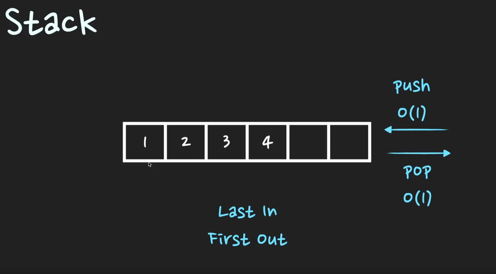

# Stack

Q. Stack은 어떤 자료구조인가요?

       

stack은 후입선출 LIFO(Last In First Out)의 자료구조이다.
시간복잡도는 `push`: O(1), `pop`: O(1) 이다.
활용 예시는 후위 표기법 연산, 괄호 유효성 검사, 웹 브라우저 방문기록(뒤로 가기), 깊이 우선 탐색(DFS) 등이 있다.

> TIP) 코딩테스트에서는 stack이 굉장히 중요한 자료구조이지만, 면접에서는 stack을 단독으로 질문하는 경우는 많이 없다. 
> 따라서 Queue의 FIFO와 대조되는 LIFO라는 특성과, 활용예시정도의 기본적인 내용만 이해하고 가면 충분하다. 

### LIFO
> stack은 시간 순서상 가장 최근에 추가한 데이터가 가장 먼저 나오는 후입선출 LIFO(Last In First Out) 형식으로 
> 데이터를 저장한는 자료구조이다. 

### push & pop 
> stack에서 데이터를 추가하는 것을 push라고 하고 데이터를 추출하는 것은 pop이라고 한다. 
> push의 경우 stack의 맨 뒤에 데이터를 추가하면 완료되기 때문에 시간복잡도는 O(1)이다. 
> 이와 동일하게 pop의 경우도 맨 뒤의 데이터를 삭제하면 완료되기 때문에 O(1)의 시간복잡도를 갖는다. 
> push와 pop은 모두 stack의 top에 원소를 추가하거나 삭제하는 형식으로 구현된다. 

### 활용 
> stack은 재귀적인 특징이 있어서 프로그램을 개발할 때 자주 쓰이는 자료구조이다. 활용 예시로는 call stack, 후위 표기법 연산, 
> 괄호 유효성 검사, 웹 브라우저 방문기록(뒤로 가기), 깊이우선탐색(DFS) 등이 있다. 

