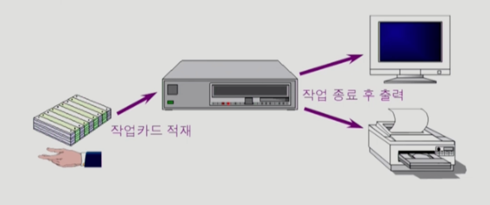
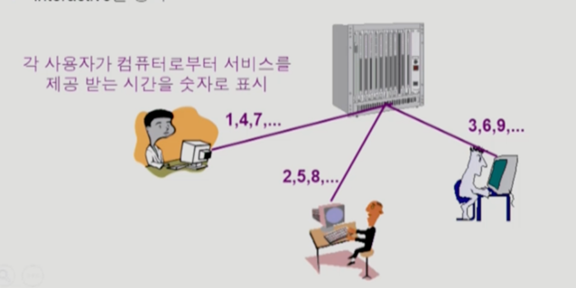
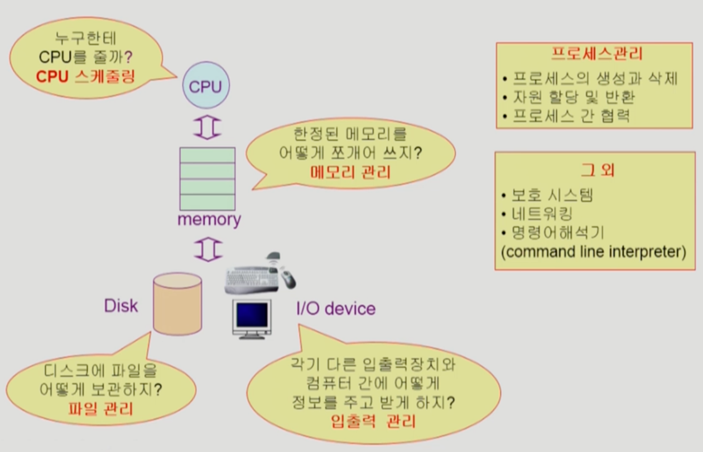

# OS (OPERATING SYSTEM)

> **운영체제**는 컴퓨터 하드웨어 바로 위에 설치되는 소프트웨어 계층으로서 모든 컴퓨터 시스템의 필수적인부분이다.

운영체제는 하나의 소프트웨어지만 컴퓨터의 세계를 통치하는 중요한 SW이다.
컴퓨터 안의 여러가지 하드웨어들을 어떻게 잘 관리하고 이 위에서 돌아가는 프로그램이 여러개있는데, 이를 어떻게 관리할 것인가

## 운영체제란 무엇인가? 

* 운영체제(Operating System, OS)란?

> 컴퓨터 하드웨어 바로 위에 설치되어 사용자 및 다른 모든 소프트웨어와 하드웨어를 연결하는 소프트웨어 계층

운영체제가 설치되어있지 않으면, 컴퓨터 하드웨어는 하나의 고철덩어리일뿐이다. 

운영체제의 목표는 2가지로 나타내보면...

* 하드웨어 <-> 운영체제
* 운영체제 <-> 각종 소프트웨어

## 운영체제의 목표

### 운영체제 <-> 각종 소프트웨어 관점
* 컴퓨터 시스템을 편리하게 사용할 수 있는 환경을 제공
  * 운영체제는 동시 사용자/프로그램들이 각자 독자적 컴퓨터에서 수행되는 것 같은 경험을 제공
  * 하드웨어를 직접 다루는 복잡한 부분을 운영체제가 대행

### 운영체제 <-> 하드웨어 관점
* 컴퓨터 시스템의 `자원을 효율적으로 관리` (OS의 가장 핵심적인 기능)
  * 프로세서(CPU), 기억장치(Memory), 입출력 장치(HDD, SSD) 등의 효율적 관리 (-> HW 자원)
    * 사용자간의 형평성있는 자원 분배 (= 형평성)
    * 주어진 자원으로 최대한의 성능을 내도록 (= 효율성)
  * 사용자 및 운영체제 자신의 보호
  * 프로세스, 파일, 메시지 등을 관리 (-> SW 자원)

(주기억장치 - RAM, ROM /  보조기억장치 - HDD, SSD)

> Q. OS가 무엇인가? 
> A. 컴퓨터 시스템의 자원을 효율적으로 관리해주는 것 (= 자원 관리자)

'어떻게 한정된 CPU, Memory를 가지고 좋은 성능을 뽑아낼 수 있느냐?'가 관건 

## 좁은 의미로 부르는 운영체제 (= 커널)
* 운영체제의 핵심 부분으로 (전원을 켠 다음에 부팅이 일어난 이후로 항상) 메모리에 상주하는 부분
* 전공자 입장에서는 OS는 대부분 커널만을 의미 

## 넓은 의미로 부르는 운영체제
* 커널 뿐 아니라 각종 주변 시스템 유틸리티를 포함한 개념 
* 메모리에 상주하지 않는 일종의 별도의 프로그램들이지만 운영체제의 범주에 포함시키는 것 

# 운영 체제의 분류 
* 동시 작업 가능 여부
* 사용자의 수 
* 처리 방식 

## 동시 작업 가능 여부 
* 단일 작업 (single tasking)
  * 한 번에 하나의 작업만 처리
    * 옛날 OS는 단 하나의 작업밖에 처리하지 못함. 
    * ex) MS-DOS 프롬프트 상에서는 한 명령의 수행을 끝내기 전에 다른 명령을 수행시킬 수 없음
* 다중 작업 (multi tasking)
  * 동시에 두 개 이상의 작업 처리
    * 요즘은 OS는 대부분 다 다중 작업이 가능. 
    * ex) UNIX, MS Windows 등에서는 한 명령의 수행이 끝나기 전에 다른 명령이나 프로그램을 수행할 수 있음.

## 사용자의 수
> 컴퓨터 한 대를 여러 사용자가 동시에 접속해서 쓸 수 있는지를 기준으로 분류 

* 단일 사용자(single user)
  * ex) MS-DOS, MS Windows
* 다중 사용자(multi user)
  * ex) UNIX, NT server 

## 처리 방식
* 일괄 처리 (batch processing)
  * 작업 요청을 일정량 모아서 한꺼번에 처리 
  * 작업이 완전히 종료될 때까지 기다려야 함.
  * interactive하지 않음.
  * ex) 초기 Punch Card 처리 시스템 

* 시분할(time sharing)
  * 여러 작업을 수행할 때, 컴퓨터 처리 능력을 일정한 시간 단위로 분할하여 사용 
  * 일괄 처리 시스템에 비해 짧은 응답 시간을 가짐 
    * ex) UNIX
  * interactive(= 상호 작용을 하는)한 방식 -> ex) 키보드를 두드리자마자 화면에 출력인 나옴
  * 일반적인 범용 컴퓨터에 사용되는 운영체제에서 사용
  * deadline이 있지는 않음. (너무 많은 작업이 있을 경우 느릴 수 있음)
  * 사람이 느끼기에 빠르게해주면서, 동시에 주어진 자원을 최대한 활용하는 것이 목적

* 실시간(Realtime OS)
  * 정해진 시간 안에 어떠한 일이 반드시 종료됨이 보장되어야하는 실시간 시스템을 위한 OS
  * deadline이 있음.
  * 특수한 목적을 가진 시스템에서 그 작업이 반드시 정해진 시간안에 처리되도록함.
  * ex) 원자로/공장 제어, 미사일 제어, 반도체 장비, 로보트 제어 
  * 실시간 시스템의 개념 확장
    * Hard readtime system (경성 실시간 시스템)
    * Soft readtime system (연성 실시간 시스템)

# 용어 정리
> 아래의 용어들은 컴퓨터에서 여러 작업을 동시에 수행하는 것을 의미함.
* Multitasking: 여러 작업을 동시에 수행하는 것 (일반적인 용어)
* Multiprogramming: 여러 프로그램이 메모리에 올라가 있음을 강조
  * 사실 여러 프로그램이 동시에 실행되려면 당연히 메모리에 여러 프로그램이 동시에 올라가야되지만, 특별히 메모리 측면을 강조한 방식
* Time sharing: CPU의 시간을 분할하여 나누어 쓴다는 의미를 강조 (= CPU를 조금 더 강조)

(조금 다른 의미)
> 위의 경우는 CPU가 1개여도 가능, BUT 아래의 케이스는 CPU가 여러 개 있어야 함. (환경이 다름)
* `Multiprocessor`: 하나의 컴퓨터에 CPU(=processor)가 여러 개 붙어 있음을 의미

일반적인 운영체제는 CPU가 1개인 범용 운영체제에 대해서 배우게 된다. 

# 운영체제의 예시 

* 유닉스 (UNIX)
  * 대형 컴퓨터를 위해서 만들어 짐(= 서버를 위한 OS)
  * 코드의 대부분을 C언어로 작성 
    * 유닉스를 개발하기 위해 C언어를 만듦 
    * 시스템 SW를 만들 때에는 아직도 C언어를 씀
    * C언어는 기계어와도 가까우면서 사람과도 가까움.
  * 높은 이식성(= Portable)
  * 최소한의 커널 구조 
  * 복잡한 시스템에 맞게 확장 용이
  * 소스 코드 공개 
    * 이제는 대부분 공개 X
    * Linux만 여전히 소스코드 공개
  * 프로그램 개발에 용이 
  * 다양한 버전
    * System V, FreeBSD, SunOS, Solaris
    * Linux 
      * 서버에 설치해서 여러 사용자가 동시에 쓸 수도 있지만, 
      * PC에 설치해서 개인이 쓰기에도 좋다.
      * AOS도 Linux 커널을 쓰고 있음.

### MS사
* DOS(Disk Operating System)
  * MS사에서 1981년 IBM-PC를 위해 개발
  * 단일 사용자용 OS, 메모리 관리 능력의 한계(주 기억 장치 640KB)
* MS Windows
  * MS사의 다중 작업용 GUI 기반 OS
  * Plug and Paly, 네트워크 환경 강화
  * DOS용 응용 프로그램과 호환성 제공
  * 불안정성
  * 풍부한 지원 소프트웨어

* Handheld device를 위한 OS
  * PalmOS, Pocket PC(WinCE), Tiny OS
  
## 운영체제의 구조 
> 뒤에서 자세히 다룬다. 그냥 도식적으로 이런 것들에 대해 배우는구나 정도로 생각하자. 

CPU와 Disk는 관점이 조금 다르다. 
* CPU는 너무 빠르기 때문에 이걸 어떻게 관리할 것인가? 
* Disk는 Head가 움직이면서 처리하기 때문에 어떻게하면 이 움직임을 최소화하면서 많은 요청을 처리할 수 있을까?

I/O device: Interrupt를 걸어서 CPU에게 요청을 한다.  

 
