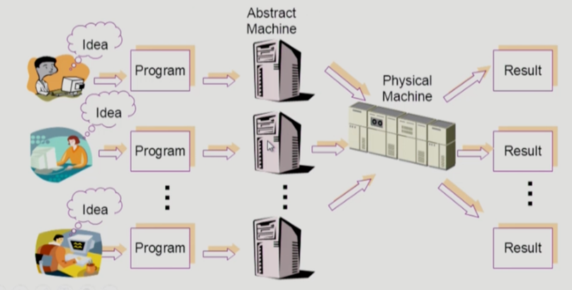

# OS (OPERATING SYSTEM)

> **운영체제**는 컴퓨터 하드웨어 바로 위에 설치되는 소프트웨어 계층으로서 모든 컴퓨터 시스템의 필수적인부분이다.

운영체제는 하나의 소프트웨어지만 컴퓨터의 세계를 통치하는 중요한 SW이다.
컴퓨터 안의 여러가지 하드웨어들을 어떻게 잘 관리하고 이 위에서 돌아가는 프로그램이 여러개있는데, 이를 어떻게 관리할 것인가

## 운영체제란 무엇인가? 

* 운영체제(Operating System, OS)란?

> 컴퓨터 하드웨어 바로 위에 설치되어 사용자 및 다른 모든 소프트웨어와 하드웨어를 연결하는 소프트웨어 계층

운영체제가 설치되어있지 않으면, 컴퓨터 하드웨어는 하나의 고철덩어리일뿐이다. 

운영체제의 목표는 2가지로 나타내보면...

* 하드웨어 <-> 운영체제
* 운영체제 <-> 각종 소프트웨어

## 운영체제의 목표

### 운영체제 <-> 각종 소프트웨어 
* 컴퓨터 시스템을 편리하게 사용할 수 있는 환경을 제공
  * 운영체제는 동시 사용자/프로그램들이 각자 독자적 컴퓨터에서 수행되는 것 같은 경험을 제공
  * 하드웨어를 직접 다루는 복잡한 부분을 운영체제가 대행

### 운영체제 <-> 하드웨어 
* 컴퓨터 시스템의 `자원을 효율적으로 관리` (OS의 가장 핵심적인 기능)
  * 프로세서(CPU), 기억장치(Memory), 입출력 장치(HDD, ) 등의 효율적 관리

(주기억장치 - RAM, ROM /  보조기억장치 - HDD, SSD)

> Q. OS가 무엇인가? 
> A. 컴퓨터 시스템의 자원을 효율적으로 관리해주는 것 (= 자원 관리자)

'어떻게 한정된 CPU, Memory를 가지고 좋은 성능을 뽑아낼 수 있느냐?'가 관건 
