# 시스템 구조와 프로그램 실행
목차: 2-1 System Structure & Programe Execution 1

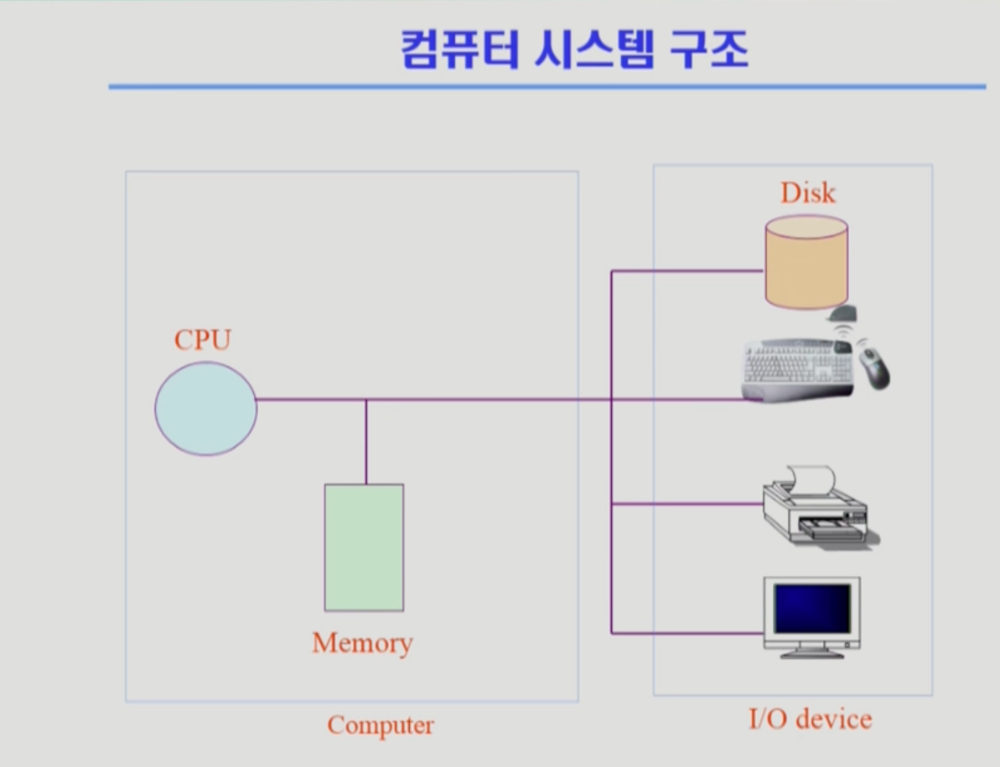

* 전문가적인 입장에서 컴퓨터라고하면 `CPU`와 `Memory`를 뜻함.
* I/O device : Input과 Output을 담당하는 장비들

CPU의 작업 공간이 Memory이기 때문에 CPU는 매 순간(= 매 Clock Cycle 마다) Memory에서 instruction(= 기계어)를
하나씩 읽어서 실행을 하게된다.

조금 더 자세히 살펴보면... 아래의 구조를 가진다. 

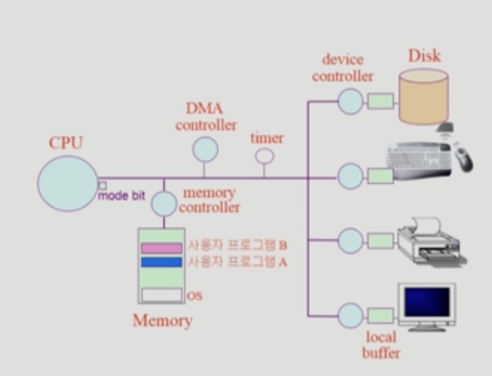

하드디스크는 일반적으로 보조기억장치로 많이 이야기하지만 I/O Device라고도 볼 수 있다.
하드디스크는 데이터를 읽어서 메모리로 읽어들이기도하고(= Input Device) 처리 결과를 Disk의 File System에 
저장을 하기도 함. Output Device로써의 역할도 동시에 수행하는 장치이다. 

이런 각각의 I/O Device는 그 device를 전담하는 작은 CPU 같은 것들이 붙어있게 된다. 
그것을 `Device Controller`라고 부른다. 그래서 Disk에서 Head가 어떻게 움직이고 어떤 데이터를 읽을지 
그 Disk의 내부를 통제하는 것은 CPU의 역할이 아니고 Disk에 붙어있는 **Disk Controller**가 그런 작업을 하게 된다. 

메인 CPU의 작업 공간인 메인 Memory가 있듯이 Device Controller들도 그들의 작업 공간이 필요하다. 
그 작업 공간들이 각각 이렇게 존재하는데, 그걸 우리는 `local buffer`라고 부름. 

I/O Device는 처리하는 속도차이가 굉장히 많이 난다. 대략적으로만봐도 CPU에 비해서 100만배 정도는 느리다. 
* CPU의 역할: 매 Clock마다 메모리에서 Instruction을 하나씩 읽어서 실행하고 또 다음 것을 읽어서 실행
* register: 메모리보다 더 빠르면서 정보를 저장할 수 있는 작은 공간
* mode bit: CPU안에 존재하고 지금 CPU에서 실행되는 것이 OS인지 아니면 사용자 프로그램인지를 구분
* interrupt line: CPU는 Memory에 있는 Instruction만 계속 실행한다. 정확하게는 Instruction 하나가 실행되고나면 다음번에 실행할 Instruction
  * I/O Device들에 접근하는 Instruction들이 된다. 
  * CPU는 직접 I/O Device에 접근하지 않고 메모리에 접근하는 Instruction만 실행하게 되있다. 그러다가 Disk에서 뭔가를 읽어와야할 때는 Disk Controller에게 특정 데이터를 읽어오라고 일을 시킨다.  (본인이 직접 접근 X)
  * Disk는 컨트롤러의 지시를 받아서 데이터를 읽어온다. (시간이 꽤 오래 걸린다)
    * Disk는 읽은 데이터를 자신의 local buffer에 집어넣게 된다.
  * 그러는 동안 굉장히 빠른 CPU는 놀고있지 않고 프로그램이 쭉 메모리 접근만하면서 실행이 되다가 I/O를 하게되면 그 I/O는 I/O Controller에게 시키고 CPU는 놀지않고 메모리 접근을 계속하면서 Instruction을 실행한다.
* timer: timer는 CPU를 독점하는 것을 막기 위한 거다. (보통 수십 ms 정도)
  * 만약 무한루프를 도는 작업에 CPU가 할당되면... CPU가 다른 프로그램한테 넘어가지 못해서 Time Share를 못함.
  * timer에 할당된 시간만큼만 CPU를 넘겨준다. 셋팅된 시간이되면은 timer가 CPU에세 interrupt를 건다. 
  * CPU는 매번 Instruction을 하나씩 실행하다가 Instruction이 끝나고나면 interrupt line을 체크한다. 
    * interrupt 들어온게 없으면 다음 Instruction을 실행한다. (CPU는 이 작업을 반복한다)
    * CPU를 (다른 사용자 프로그램에게) 넘겨준 다음에는 OS가 CPU를 뺏을 방법이 없다. 
    * 그래서 timer라는 추가적인 하드웨어를 둬서 CPU 제어권이 자동으로 사용자 프로그램으로부터 OS로 넘어오도록 만들었다.
    * OS가 CPU를 얻게되면 
    * 프로그램이 종료가되면 자동으로 CPU를 자동으로 반납함. 
    * 프로그램이 I/O가 필요한 작업에 도달할 경우에는 해당 프로그램이 자진해서 OS에게 (I/O를 해달라고) CPU를 넘겨주게된다.
      * (정확히는 프로그램이 OS에 요청을 하기 위해서 SW적으로 직접 interrupt를 건다. mode bit이 1이므로 바로 OS를 호출할 수는 없음!) 
      * I/O 작업이필요했던 프로그램은 I/O Controller가 자신의 작업을 완료한 뒤, CPU에게 interrupt를 걸게된다. 
      * 그러면 자연스럽게 CPU 제어권이 OS에게 넘어가고 OS는 프로그램의 메모리에 I/O 작업의 결과물(local buffer에 저장된 값)카피해주고 일단은 방금까지 CPU를 쓰고있던 프로그램에게 다시 CPU를 준다. 
      * 할당된 시간이 남아있다면 그 시간만큼 CPU를 더 쓰게하고 언젠가는 I/O 작업을 요청했던 프로그램의 차례가 돌아와서 CPU를 얻어 작업을 처리한다. 

## Mode bit 
> 사용자 프로그램의 잘못된 수행으로 다른 프로그램 및 운영체제에 피해가 가지 않도록하기 위한 보호 장치 필요 

* Mode bit을 통해 하드웨어적으로 두 가지 모드의 operation을 지원 
  * `1`(사용자 모드): 사용자 프로그램 수행 
  * `0`(모니터 모드* or **커널 모드**): OS가 CPU에서 실행중인 것
    * 보안을 해칠 수 있는 중요한 명령어는 모니터 모드(= 커널 모드)에서만 수행 가능한 `특권 명령`으로 규정 
    * 커널 모드일 때는 아무거나 CPU에서 실행이되고, OS가 CPU를 사용자 프로그램에 넘겨줄 때, modebit을 1로 바꿔서 보내주기 때문에 한정된 Instruction만 실행할 수 있도록한다.
    * Interrupt나 Exception 발생하게되면 CPU 제어권이 OS에 넘어가면서 mode bit은 자동으로0으로 바뀌게된다. 
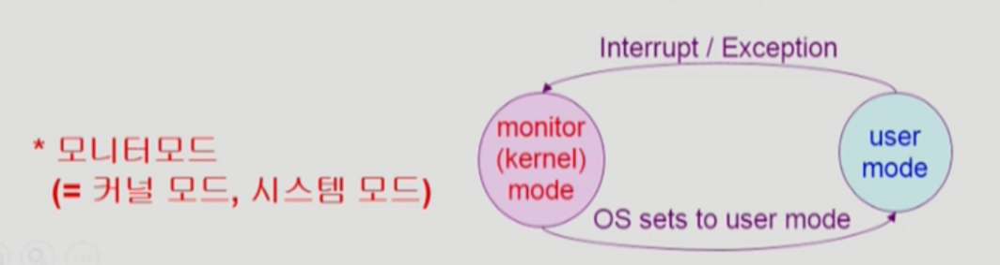

## Timer 
* 타이머
  * 정해진 시간이 흐른 뒤 OS에게 제어권이 넘어가도록 인터럽트를 발생시킴 
  * 타이머는 매 클럭 틱 때마다 1씩 감소
  * 타이머 값이 0이 되면 타이머 인터럽트 발생 
  * CPU를 특정 프로그램이 독점하는 것으로부터 보호 
* 타이머는 time sharing을 구현하기 위해 널리 이용된다. 
* 타이머는 현재 시간을 계산하기 위해서도 사용됌. 

## Device Controller 
* I/O device controller
  * 해당 I/O 장치유형을 관리하는 일종의 작은 CPU 
  * 제어 정보를 위해 control register, status register를 가짐 
  * local buffer를 가짐 (일종의 data register)
* I/O는 실제 device와 local buffer 사이에서 일어남
* Device Controlelr는 I/O가 끝났을 경우 interrupt로 CPU에 그 사실을 알린다. 

* device driver (장치구동기)
  * OS 코드 중 각 장치별 처리루틴 -> software
  * HW를 하나 붙이면 그것을 접근하기위한 device driver를 설치해야한다.
* device controller (장치제어기)
  * 각 장치를 통제하는 일종의 작은 CPU -> hardware 

## DMA (Direct Memory Access)
CPU는 메인 메모리 접근도 할 수 있고, local buffer 접근도 할 수 있다. 
작은 CPU(= device controller)는 local buffer만 접근할 수 있음. 
그런데 CPU에 인터럽트가 너무 많이 걸리면 아무리 빠른 CPU라 할지라도 효율성이 떨어진다. 
그래서 `DMA Contorller`를 둔다. 약어를 그대로 해석한 것처럼 `직접 메모리에 접근할 수 있는 컨트롤러이`다. 
DMA controller를 두게되면, 메모리를 CPU도 접근할 수 있고, DMA도 접근할 수 있다. 
만약 둘이서 특정 메모리 영역을 동시에 접근하면 문제가 생길 수 있어서, Memory Controller는 그런 상황을 중재하는 역할을 담당한다. 

### DMA를 단 이유는?
I/O 장치가 너무 자주 interrupt를 거니까 CPU가 방해를 너무 많이 받는다. 그런 상황을 막기 위해서 달았음. 
I/O 작업이 완료됐을 때, CPU한테 interrupt를 거는 것이 아니라 DMA가 직접 local buffer의 내용을 메모리에 복사하는 일을 해준다. (CPU는 자기 할 일을 계속할 수 있다!)
그 작업이 다 끝났으면, CPU에게 interrupt를 한 번만 걸어서 보고한다. 그러면 CPU가 중간에 interrupt 당하는 빈도가 줄어서 CPU를 효율적으로 쓸 수 있다.

## 입출력(I/O)의 수행 
* 모든 입출력 명령은 특권 명령 
* 사용자 프로그램은 어떻게 I/O를 하는가? 
  * `시스템콜`(system call = OS에게 부탁하는 것)
    * 사용자 프로그램은 OS에게 I/O 요청 
  * trap을 사용하여 인터럽트 벡터의 특정 위치로 이동 
  * 제어권이 인터럽트 벡터가 가리키는 인터럽트 서비스 루틴으로 이동
  * 올바른 I/O 요청인지 확인 후 I/O 수행 
  * I/O 완료 시 제어권을 시스템 콜 다음 명령으로 옮김 
  
interrupt는 HW가 CPU한테 뭔가 정보 교신을 하기 위해 걸어줄 수도 있고, 
사용자 프로그램이 돌아가다가 내가 직접처리하지 못하고 OS에게 대신해달라고 요청해야하는 황에서도 interrupt line을 셋팅해서 OS한테 CPU가 넘어갈 수 있다.
후자를 SW interrupt(= trap) 라고 함. 그리고 일반적인 interrupt를 HW interrupt라고 한다. 

## 인터럽트(Interrupt) 
* 인터럽트
  * 인터럽트 당한 시점의 레지스터와 program counter를 save한 후 CPU의 제어를 인터럽트 처리 루틴에 넘긴다. 
* Interrupt (넓은 의미)
  * Interrupt (HW 인터럽트): 하드웨어가 발생시킨 인터럽트 
  * Trap (SW 인터럽트) 
    * Exception: 프로그램이 오류를 범한 경우 
    * System call: 프로그램이 커널 함수를 호출하는 경우 
* 인터럽트 관련 용어 
  * 인터럽트 벡터
    * 해당 인터럽트의 처리 루틴 주소를 가지고 있음 
  * 인터럽트 처리 루틴 (= interrupt Service Routine, 인터럽트 핸들러)
    * 해당 인터럽트를 처리하는 커널 함수 

인터럽트가 들어오지않으면 OS는 CPU를 쓸 일이 없음. 만약 인터럽트가 1도 없다면 항상 사용자 프로그램이 CPU를 사용하게된다.

## 시스템콜 (System Call)
* 사용자 프로그램이 운영체제의 서비스를 받기 위해 커널 함수를 호출하는 것 

---
목차: 2-2 System Structure & Programe Execution 2

## 동기식 입출력과 비동기식 입출력

* 동기식 입출력 (synchronous I/O)
  * I/O 요청 후 입출력 작업이 완료된 후에야 제어가 사용자 프로그램에 넘어감. 
  * Read는 동기식 방식이 자연스러움. 
  * 구현 방법 1
    * I/O가 끝날 때까지 CPU를 낭비시킴 
    * 매시점 하나의 I/O만 일어날 수 있음. 
  * 구현 방법 2 
    * I/O가 완료될 때까지 해당 프로그램에게서 CPU를 빼앗음 
    * I/O 처리를 기다리는 줄에 그 프로그램을 줄세움 
    * 다른 프로그램에게 CPU를 줌.
  * 비동기식 입출력 (asynchronous I/O)
    * I/O가 시작된 후 입출력 작업이 끝나기를 기다리지 않고 제어가 사용자 프로그램에 즉시 넘어감.
    * Write는 비동기식 방식이 자연스러움.

**두 경우 모두 I/O의 완료는 인터럽트로 알려줌** 

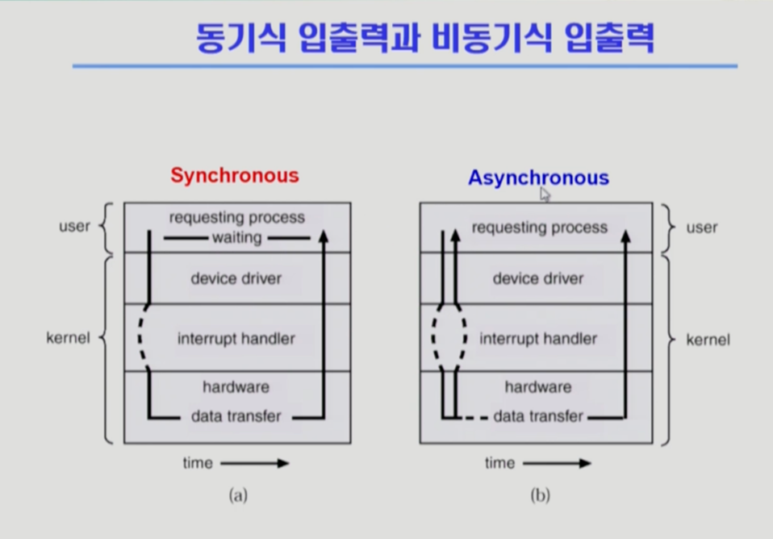

## DMA (Direct Memory Access) 
* 빠른 입출력 장치를 메모리에 가까운 속도로 처리하기 위해 사용
* CPU의 중재 없이 device controller가 device의 buffer storage의 내용을 메모리에 block 단위로 직접 전송
* 바이트 단위가 아니라 block 단위로 인터럽트를 발생시킴

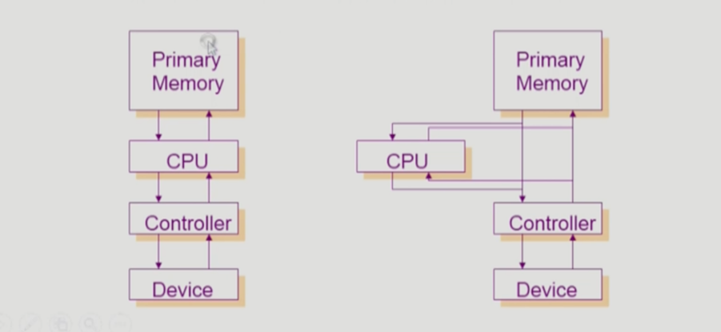

## 서로 다른 입출력 명령어 
* I/O를 수행하는 special instruction에 의해 
* Memory Mapped I/O에 의해 

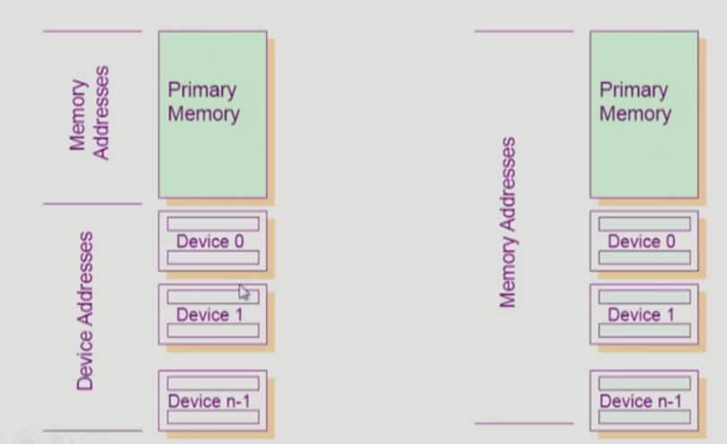
* 좌측 그림: 메모리 접근하는 Instruction 따로 있고, I/O를 하려면 그 I/O를 하는 Special Instruction에 의해서 I/O를 하게 만든다. (일반적임)
* 우측 그림: 메모리 주소에 연장 주소를 붙인 뒤, 접근하는 메모리 주소에 따라서 메모리 접근 vs I/O를 하는 접근 (ex. 100번대까지는 메모리, 1000번대는 I/O)

## 저장장치 계층구조

* (그림 상에는 없지만) 사실상 맨 위에 CPU가 있음. 
* CPU 안에 Register가 있음.
* (Cache Memory는 컴퓨터 구조 시간에 배움, 운영체제에서는 약간만 언급됌)
* DRAM으로 구성된 Main Memory가 있고 
* 그 다음부터는 Secondary Storage 쪽
* 위로 갈 수록 속도가 빨라지고 대신 단위공간당 가격이 비싸지기 때문에 용량이 적다. 
* Volatility(=휘발성)
  * Secondary 영역의 Hard Disk나 Magnetic Tape 등은 비휘발성임. (=전원이 나가도 내용이 사라지지 않음)
  * DRAM, SRAM(= Cache Memory) or CPU 안의 Register 등은  휘발성이다. 
* CPU에서 직접 접근할 수 있는 Memory Storage 매체를 `Primary`라고 부름 (Executable = '실행가능하다' 라고도 함)
* CPU가 직접 접근해서 처리 못하는 것을 `Secondary` 라고 함.
* CPU가 직접 접근하려면 Byte 단위로 접근이 가능한 매체여야 한다. -> DRAM Memory는 byte 단위로 주소를 매겨서 Byte단위로 접근 할 수 있기 때문에 실행할 수 있음. 
  * 그에 비해서 Hard Disk는 sector 단위로 접근이 되기 때문에 CPU가 직접 실행할 수 없다.
* `Caching`: 빠른매체로 정보를 읽어들여서 쓰는 것.
  * 보통 캐싱은 재사용을 목적으로한다. (처음 요청됐을 때는 어쩔 수 없이 밑에서부터 위로 읽어들여야 함)
  * 같은 것을 두 번째 요청할 때는 밑에까지 가지않고 이미 위에 읽어온 데이터가 있으면 위에서 바로 읽어갈 수 있다.
  * 기존에있던 것 중에 새로운 것이 들어오면 기존에 있던 것을 쫓아내야할텐데... 이런 내용은 메모리 관리쪽에서 자세히 다룬다.

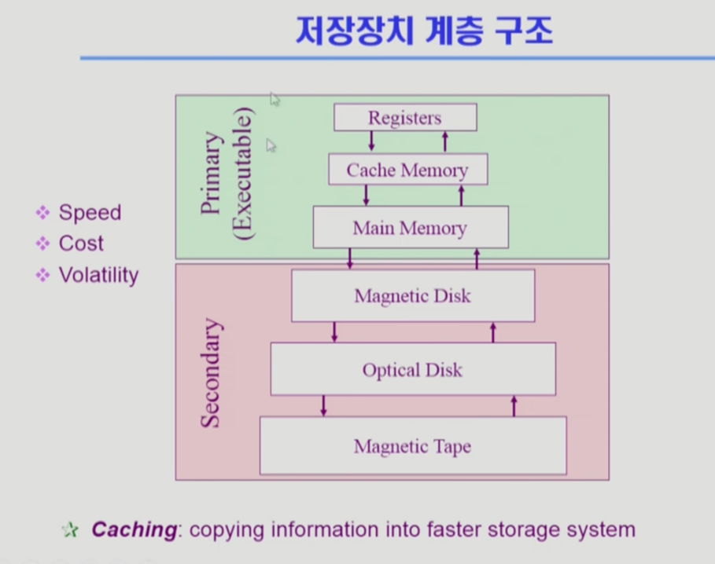

## 프로그램의 실행 

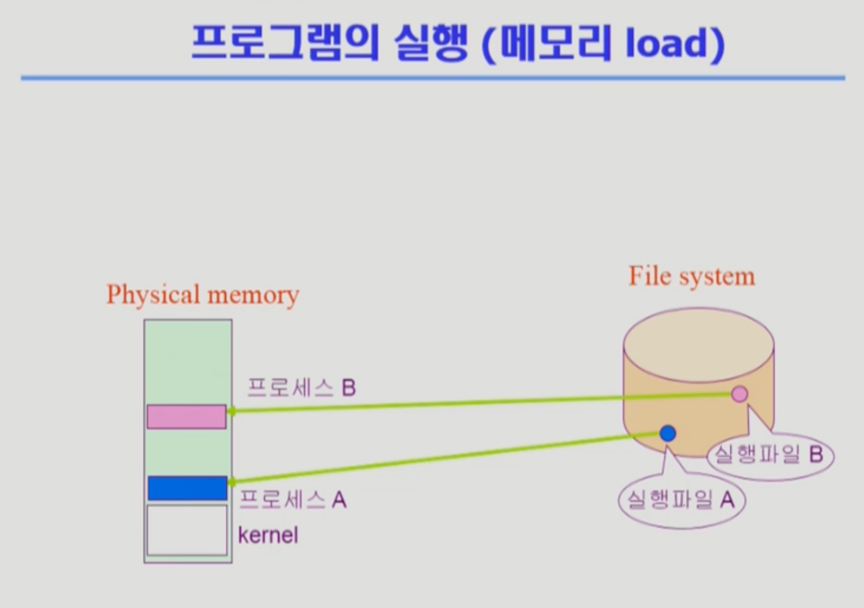
프로그램은 실행파일 형태로 하드 디스크(= File System)에 저장되어있다.
그런 실행파일을 실행시키게되면 그게 메모리로 올라가서 `프로세스`가 된다. 그렇게 실행이 된다.

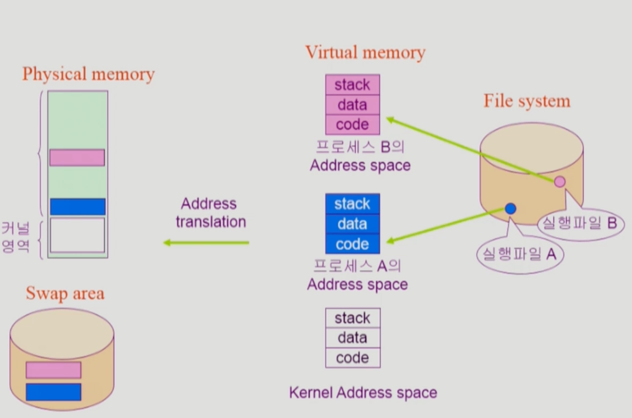
정확하게는 물리적인 메모리에 바로 올라가는 것이 아니라  중간에 한 단계를 더 거치게되고 그것은 **VM**(Virtual Memory)가 된다.
각 프로그램이 실행되면 VM에 각 프로그램마다 자기 자신만의 독자적인 주소공간(= Address Space)이 만들어진다. 
이런 주소공간은 `code`, `data`, `stack` 이런 영역으로 구성이된다. 그래서 모든 프로그램은 이러한 독자적인 주소공간을 가지고 있는데, 
이것을 물리적인 메모리에 올려서 실행을 시키는 것이다. 커널은 부팅을 하는 순간부터 실행이돼서 메모리에 항상 상주해서 올라가있지만, 
이러한 사용자 프로그램들은 실행을 시키면 이러한 주소 공간이 생겼다가 이 프로그램을 종료시키면 이게 사라진다. 

하지만 이 프로그램을 실행시켰을 때, 만들어지는 이 주소공간을 물리적인 메모리에 통째로 다 올려놓는 것은 아니다. 
그러면 메모리가 낭비가되기 때문에 필요한 부분만 물리적 메모리에 올려둔다. 디스크의 swap area에 내려놓게된다.  

(code는 CPU에서 실행할 기계어 코드를 담고 있고, data는 프로그램이 사용하는 자료구조를 담고있음, 
stack은 함수를 호출하거나 return할 때, 어떤 데이터를 쌓았다가 꺼내가고 이런 용도로 사용한다.  뒤에서 자세히 설명할 예정)

> 참고사항) 같은 DISK라도 File System과 Swap area는 전혀 다른 용도이다. 
> Swap Disk는 전원이 나가면 의미가 없는 정보가된다. (= 휘발성) 

* Swap Disk: Memory 용량의 한계로 Memory 연장공간으로 활용하는 곳 
* File System: 비휘발성의 용도. 전원이 나가도 내용이 유지되는 그런 용도로 사용.

메모리 주소변환을 해주는 계층이 있음. (VM Address space -> Physical Memory) 
-> 운영체제가 할 수 있는 것은 아니고, (주소변환을해주는) HW의 지원을 받아서  

## 커널 주소 공간의 내용 
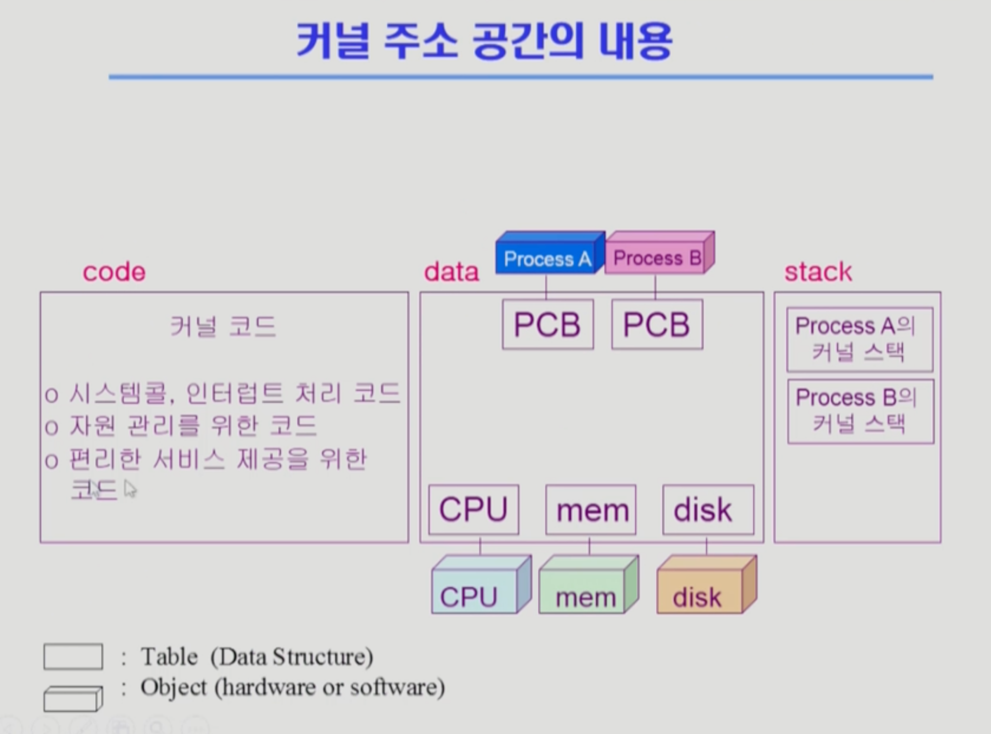

* code: 자원관리를 위한 코드, (사용자에게) 편리한 서비스 제공을 위한 코드, 시스템콜(SW), (HW들의) 인터럽트 처리 코드
* data: CPU, Memory, Disk 를 직접 관리하고 통제함.
  * PCB는 뒤에 챕터에서 다루게 됌. Process Controller Block의 준말 
* stack: process마다(=사용자 프로그램마다) kernel stack을 따로  

## 사용자 프로그램이 사용하는 함수 
* 함수 (function) 
  * 사용자 정의 함수 
    * 자신의 프로그램에서 정의한 함수 
    * ex) 사용자 프로세스 A,B Address Space의 code 영역 
  * 라이브러리 함수
    * 자신의 프로그램에서 정의하지 않고 갖다 쓴 함수
    * 자신의 프로그램의 실행 파일에 포함되어 있다. 
    * ex) 프로세스 A,B Address Space의 code 영역 (사용자 정의 함수와 동일한 위치)
  * 커널 함수
    * 운영체제의 프로그램 함수
    * 커널 함수의 호출 = 시스템 콜 
    * ex) kernel Address Space의 code 영역

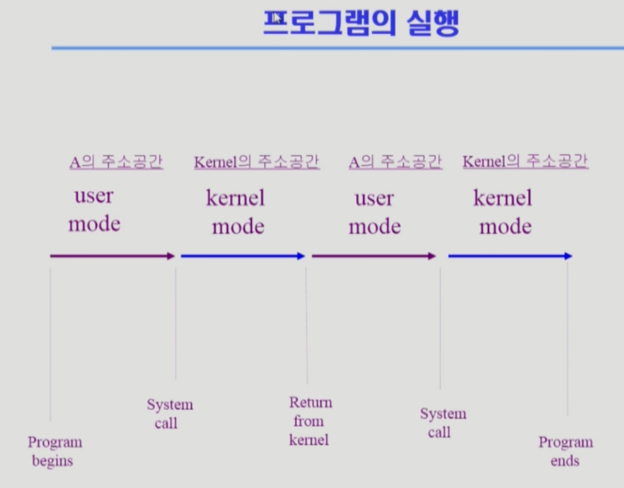

참고) Instruction: 기계어, 명령어 
