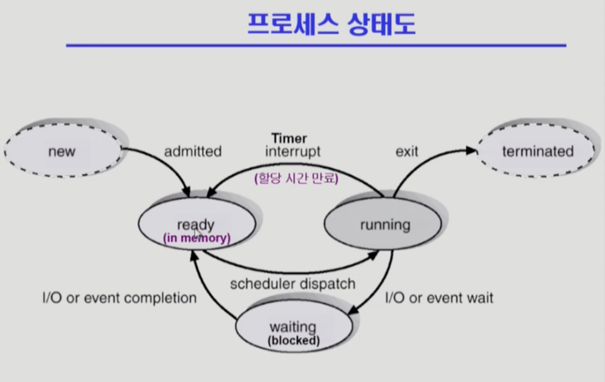
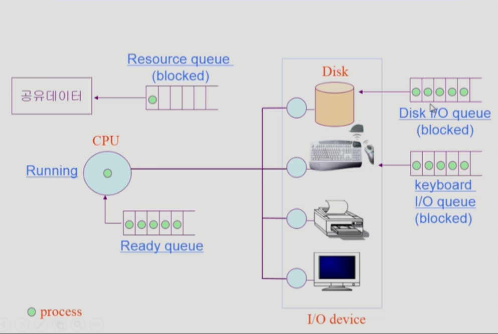
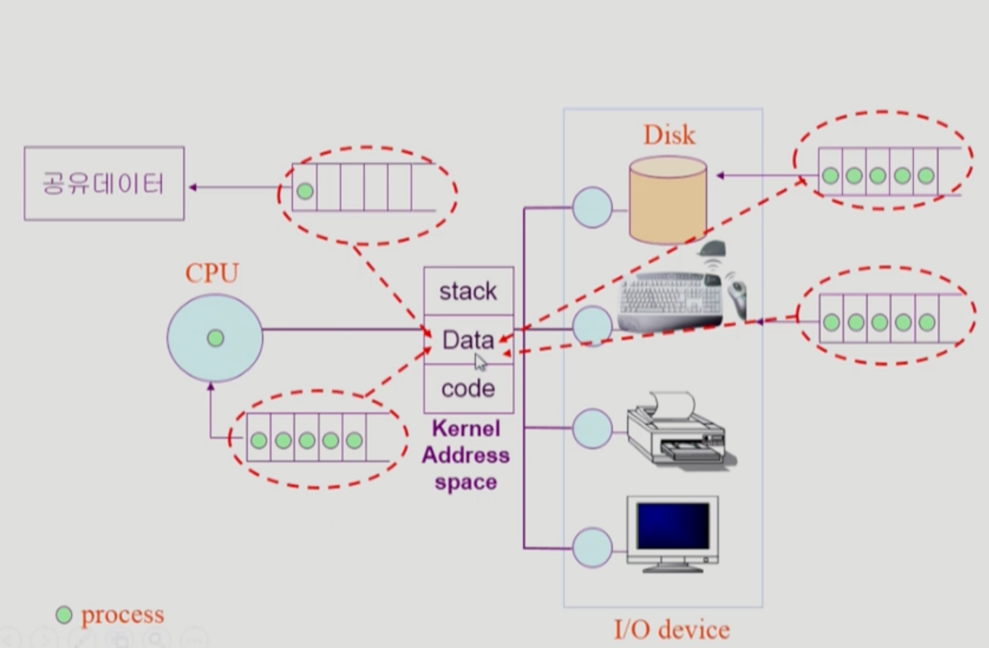
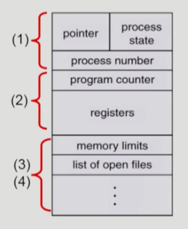
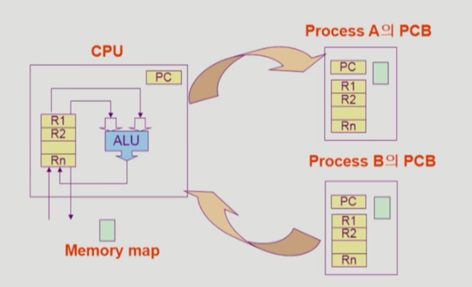
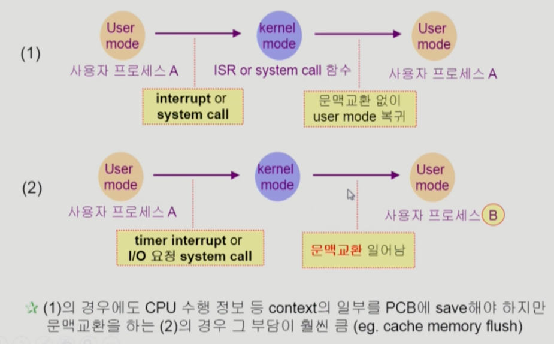
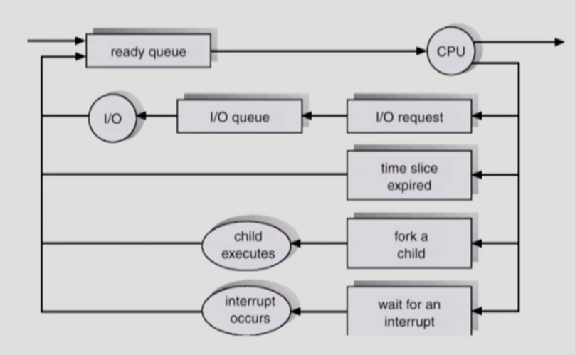
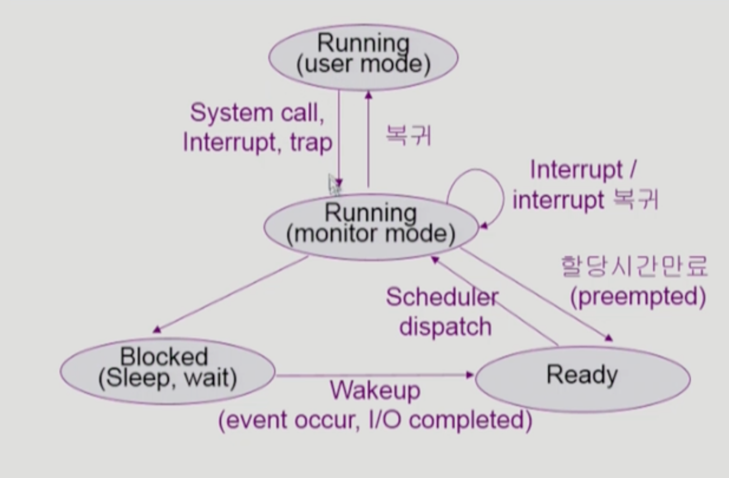
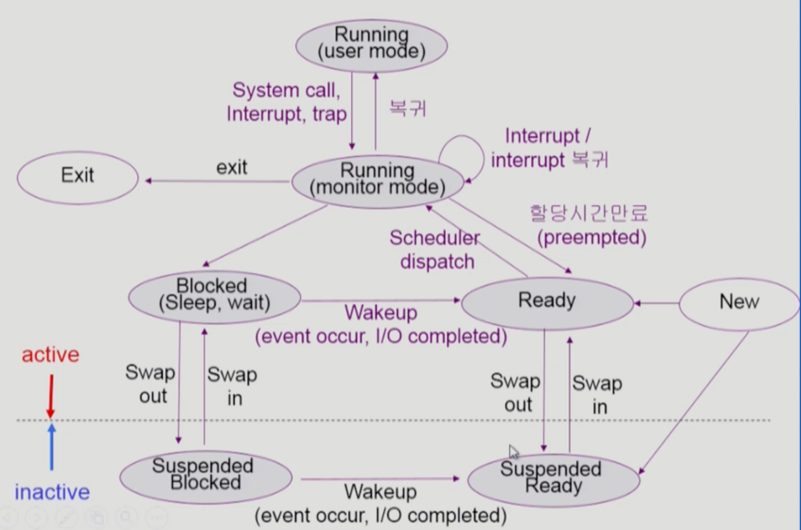

# 프로세스의 개념 

* "Process is a `program in execution`"
  * 즉, `실행 중인 프로그램`을 의미한다.

* 프로세스의 문맥(context)
  * CPU 수행 상태를 나타내는 하드웨어 문맥 (CPU와 관련)
    * Program Counter(PC)
    * 각종 register 
  * 프로세스의 주소 공간 (메모리와 관련)
    * code, data, stack
  * 프로세스 관련 커널 자료 구조 ()
    * PCB (Process Control Block)
    * Kernel stack

> 프로세스의 상태를 나타낼 수 있는 모든 요소를 `프로세스의 문맥`이라고 한다. 

이러한 일련의 정보를 가지고 있으면 프로세스가 현재 어떠한 상태를 가지고있는지 정확하게 규명을 할 수 있게된다.
프로세스 혼자 실행이된다면 이런 것들을 알 필요가 없을텐데 현대의 컴퓨터 시스템에서는 `Time Sharing`, `Multi Tasking` 
즉 프로세스들이 번갈아가면서 실행이되기 때문에 하나의 프로세스가 CPU를 잡고 실행을하다가 또 CPU를 놓고 다른 프로세스에게 CPU가 넘어가고하게 돼있다. 
그러면 현재 이 프로세스가 CPU의 레지스터 값을 어떤 것을 넣고 실행하고있었다고 할 때, 이 것을 백업하지 않으면 (= 이 프로세스의 문맥을 알고있지 않으면)
다음꺼 CPU를 잡았을 때, 앞부분부터 다시 실행을 해야할 것임. 

항상 프로세스의 문맥을 파악하고있다가 해당 프로세스가 어디까지 실행을 했는지를 알고 있어야 바로 그 다음 시점부터 instruction을 실행할 수 있게된다.

## 프로세스의 상태 (Process State)

* 프로세스는 상태(state)가 변경되며 수행된다. 
  * Running
    * CPU를 잡고 instruction을 수행중인 상태
  * Ready
    * CPU를 기다리는 상태(메모리 등 다른 조건을 모두 만족하고)
  * Blocked (wait, sleep)
    * CPU를 주어도 당장 instruction을 수행할 수 없는 상태
    * Process 자신이 요청한 event(얘: I/O)가 즉시 만족되지 않아 이를 기다리는 상태 
    * (예) 디스크에서 file을 읽어와야하는 경우

> 아래의 두 개의 상태는 포함을 안하는 경우도있고 경우에 따라서 포함시키는 경우도 있음 

  * New: 프로세스가 생성중인 상태
  * Terminated: 수행(execution)이 끝난 상태
    * 프로세스의 수행이 끝났지만 정리할게 조금 남은 상황

**공유데이터: 자원중에는 SW자원도 있음. 
공유데이터는 어떤 프로세스가 이미 접근한 경우라면 다른 프로세스가 접근할 수 없도록 막아준다. 
그것 때문에, Process가  Resource queue(blocked) 상태가 된다.

> 모든 자원들이 놀지않고 일을 할 수 있도록해주는 매커니즘이 필요하다.

> 위에서 언급했던 Queue는 사실 Kernel이 본인의 data영역에 자료구조로 Queue를 만들어두고, 프로세스 상태를 바꿔가며 
Ready 상태에 있는 프로세스에게 CPU를 주고, Blocked 상태에있는 프로세스들에게는 CPU를 안주는 식으로 운영을하게된다. 

## Process Control Block (PCB)

* PCB
  * 운영체제가 각 프로세스를 관리하기 위해 프로세스당 유지하는 정보
  * 다음의 구성 요소를 가진다 (구조체로 유지)
    * (1) OS가 관리상 사용하는 정보
      - Process state, Process ID
      - scheduling information, priority
    * (2) CPU 수행 관련 하드웨어 값
      - Program counter, registers
    * (3) 메모리 관련 
      - Code, data, stack의 위치 정보 
    * (4) 파일 관련
      - Open file descriptors...

## 문맥 교환 (Context Switch)

* CPU를 한 프로세스에서 다른 프로세스로 넘겨주는 과정
* CPU가 다른 프로세스에게 넘어갈 때 운영체제는 다음을 수행
  * CPU를 내어주는 프로세스의 상태를 그 프로세스의 PCB에 저장
  * CPU를 새롭게 얻는 프로세스의 상태를 PCB에서 읽어옴
  
* System call이나 interrupt 발생 시 반드시 context switch가 일어나는 것은 아니다! 

Context Switch는 사용자 프로세스 하나로부터 또 다른 사용자 프로세스로 CPU가 넘어가는 과정을 의미함.

System Call이나 Interrupt는 사용자 프로세스로부터 CPU가 운영체제로 넘어간다. 이 경우는 Context Switch가 아니다! 

**하지만** System Call or Interrupt가 발생한 이후에 운영체제가 CPU를 다른 프로세스에게 넘겨주는 경우가 있는데, 이런 경우에는 Context Switch다. - 2번 케이스
(System Call or Interrupt를 처리하고 다시 발생하기 이전의 프로세스로 돌아가면 Context Switch가 아님! - 1번 케이스)

## 프로세스를 스케줄링하기 위한 큐 

* Job queue
  * 현재 시스템 내에 있는 모든 프로세스의 집합 
* Ready queue
  * 현재 메모리 내에 있으면서 CPU를 잡아서 실행되기를 기다리는 프로세스의 집합
* Device queues
  * I/O device의 처리를 기다리는 프로세스의 집합
* 프로세스들은 각 큐들을 오가며 수행된다. 

### 프로세스 스케줄링 큐의 모습

## 스케줄러 (Scheduler)

* Long-term scheduler (장기 스케줄러 or job scheduler)
  * 시작 프로세스 중 어떤 것들을 ready queue로 보낼지 결정 
  * 프로세스에 memory(및 각종 자원)을 주는 문제 
  * degree of Multiprogramming을 제어 
  * time sharing system에는 보통 장기 스케줄러가 없음 (무조건 ready)
* Short-term scheduler (단기 스케줄러 or CPU scheduler)
  * 어떤 프로세스를 다음번에 running 시킬지 결정 
  * 프로세스에 CPU를 주는 문제 
  * 충분히 빨라야 함 (millisecond 단위)
* Medium-Term Scheduler (중기 스케줄러 or Swapper)
  * `여유 공간 마련을 위해 프로세스를 통째로 메모리에서 디스크로 쫓아냄`
  * 사실 지금의 시스템은 시작되면 무조건 메모리는 준다. -> 이러다보니 메모리에 너무 많은 프로그램이 동시에 올라가있으면 문제가 됌.
      * 이 때, 필요한 것이 중기 스케줄러(= Swapper)이다.
  * **프로세스에게 memory를 뺏는 문제** 
  * degree of Multiprogramming을 제어 

## 프로세스의 상태 (Process State)
> 대부분의 내용은 앞에서 이미 동일하게 다룸.

* 프로세스는 상태(state)가 변경되며 수행된다.
  * Running
    * CPU를 잡고 instruction을 수행중인 상태
  * Ready
    * CPU를 기다리는 상태(메모리 등 다른 조건을 모두 만족하고)
  * Blocked (wait, sleep)
    * CPU를 주어도 당장 instruction을 수행할 수 없는 상태
    * Process 자신이 요청한 event(얘: I/O)가 즉시 만족되지 않아 이를 기다리는 상태
    * (예) 디스크에서 file을 읽어와야하는 경우
  * `Suspended` (stopped)
    * 외부적인 이유로 프로세스의 수행이 정지된 상태
    * 프로세스는 통째로 디스크에 swap out 된다.
    * (예) 사용자가 프로그램을 일시 정지시킨 경우 (break key) 시스템이 여러 이유로 프로세스를 잠시 중단시킴 (메모리에 너무 많은 프로세스가 올라와있을 때)
    
> *Blocked: 자신이 요청한 event가 만족되면 Ready 
> *Suspended: 외부에서 resume해 주어야 Active

위의 그림은 모두 사용자 프로그램의 상태도를 나타내는 것이다! (Running의 개념은 나누어두었을 뿐, Running으로 똑같음.)

blocked 상태에서 Suspended가 되었느냐, Ready 상태에서 Susopended가 되었느냐에 따라 SuspendedBlocked, SuspendedReady로 구분했음.
어쨋거나 suspended 상태들은 프로세스가 inactive 상태임. 

> SuspendedBlocked -> SuspendedReady로 바뀔 수는 있다. (진행 가능) 
> Suspended는 memory를 완전히 잃어버리는(= swap out) 것이므로 CPU 관점에는 아무것도 할 수 없으나, I/O 같은 작업이 진행중이었다면 
> 그것은 계속해서 진행돼서 SuspendedReady로 넘어갈 수 있다! 

