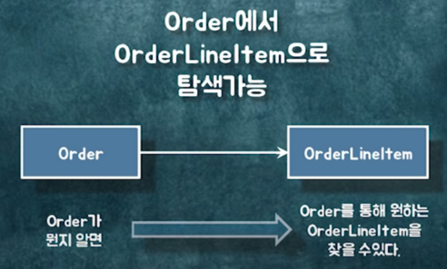
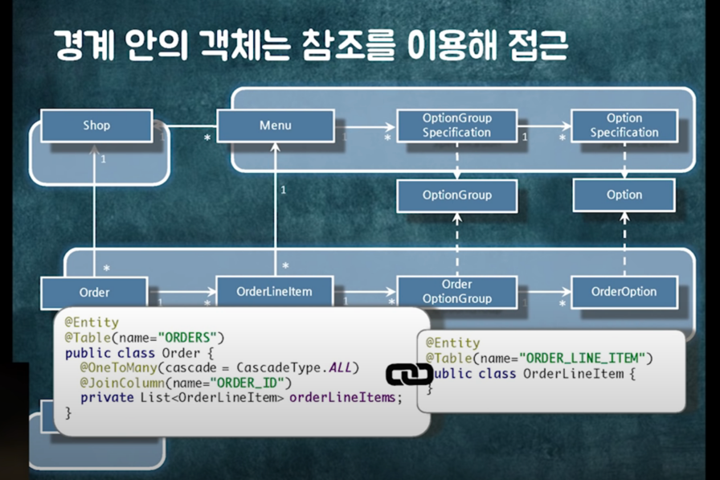
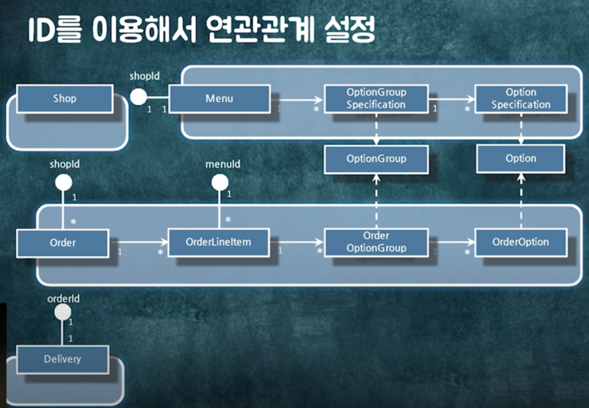
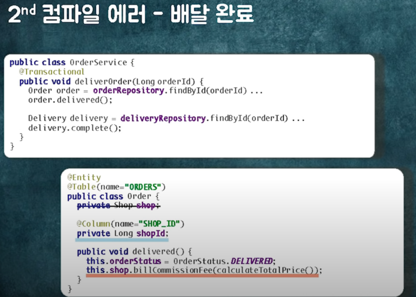
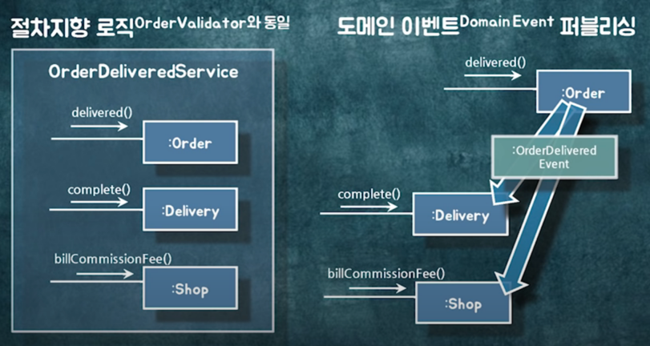
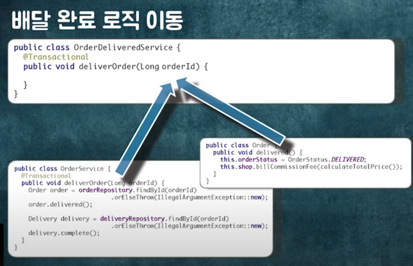
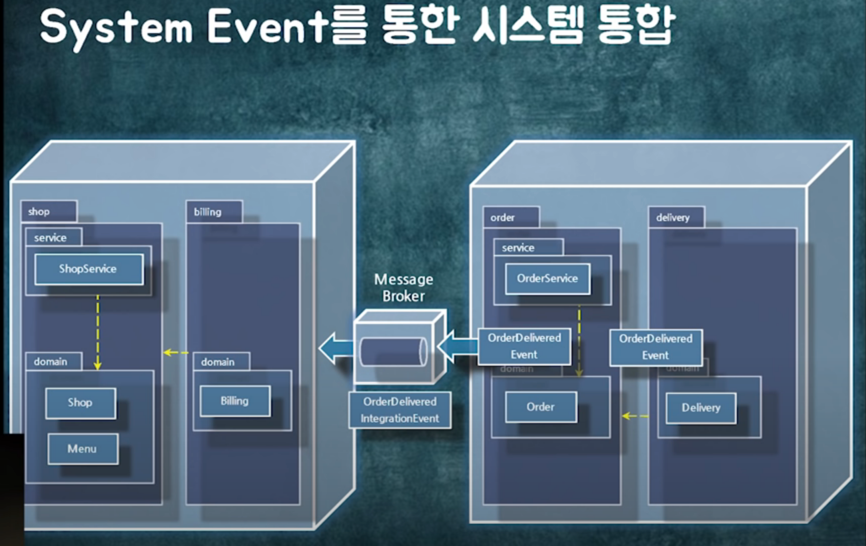

의존성은 변경과 관련이 있다.

사전 참고영상: https://www.youtube.com/watch?v=26S4VFUWlJM (참고로 나도 아직 안봄... 봐야함) 
발표자료: https://www.slideshare.net/baejjae93/ss-151545329
예제 코드: https://github.com/eternity-oop

`설계를 잘하면` B 클래스의 구현이 변경되더라도 A클래의 영향을 주지 않을 수도 있다.
`Dependency`는 변경에 의해서 영향을 받을 수 있는 가능성이라 볼 수 있다.

Dependency는 크게 2가지 종류가 있다.

* 클래스 의존성
* 패키지 의존성

# 클래스 의존성

> 4가지가 있다.

* 연관관계(Association)
    * A에서 B로 영구적으로 갈 수 있는 경로가 있는 것
    * A에서 B로 이동할 수 있다.
    * 
* 의존 관계(Dependency)
    * 협력을 하는 그 시점에 일시적으로 관계를 맺고 끊어지는 것
    * 의존성이 아니라 의존관계는 코드상에서 파라미터에 그 타입이 나오거나
    * 메서드 안에서 그 인스턴스를 생성한다면..
* 상속 관계(Inheritance)
    * `구현이 바뀌더라도 영향을 받을 수 있다`.
    * B 클래스 구현을 A가 상속받기 때문에 B가 변경될 때 A도 같이 변경된다.
* 실체화 관계(Realization)
    * 인터페이스의 `시그니처가 바꼈을 때`만 영향을 받음.
    * 인터페이스를 implements 하는 관계라고 생각하면 된다.

# 패키지 의존성

> 어떤 패키지안에 있는 클래스가 다른 패키지안에 있는 의존성(4가지 중 어떤 것이든 상관X)이 있으면 두 패키지간에 의존성이 있다고 본다.
> 잘 모르겠다면 어떤 클래스를 열어봤는데 `import`가 존재한다면 의존성이 있다고 보면 된다.

# 설계 가이드

> 이것이 무조건 정답은 아니다.
> 좋은 의존성을 관리하기 위해서는 몇 가지 규칙이 있다.

## 양방향 의존성을 피하라

### 양방향(Bi-Directional)

> A가 바뀔 때, B가 바뀌고 B가 바뀔 때, A도 바껴야 한다.
> 이는 사실 하나의 클래스를 찢어놓은 것이라 봐야한다!
> 또한 항상 A와 B사이의 관계를 동기화시켜줘야한다.
> 따라서 연관관계가 양방향일 경우 신경쓸 부분이 굉장히 많아진다.
> ex) 성능 이슈, 씽크를 맞추는데에서 발생하는 수많은 버그들..

### 단방향(Uni-Directional)

> 따라서 피할 수 있다면 `단방향 연관관계`로 바꿔야한다.

## 다중성이 적은 방향을 선택하라

### 일대다(One-To-Many)

> LIST나 SET 같은 컬렉션을 인스턴스 변수로 가지면 굉장히 다양한 이슈가 발생한다.
> ex) 성능 이슈, 객체들의 관계를 유지하기 위해 다양한 노력들이 필요하다.

### 다대일(Many-To-One)

## 의존성이 필요없다면 제거하라

### 단방향(Uni-Directional)

### 없음(None)

## 패키지 사이의 의존성 사이클을 제거하라

> 설계에서 가장 중요한 것은 변경이다.
> 내가 코드 배치를 하는데 얘네들이 어떻게 바뀔거야? 라는 것에 포커스를 맞춰야한다.  
> 패키지 세 개가 Dependency가 사이클이 돈다는 것은, 세 개의 패키지가 원래 하나의 패키지라고 봐야한다.

### 양방향(Bi-Directional)

### 단방향(Uni-Directional)

# 예제 코드

## 주문 플로우

가게선택 -> 메뉴선택 -> 장바구니담기 -> 주문완료

### Domain Concept - 가게 & 메뉴

> 왼쪽의 화면을 클래스에 맵핑한 예제

### Domain Concept - 주문

> 왼쪽의 화며면을 클래스에 맵핑한 예제

## Domain Object - 메뉴 & 주문

### 문제점

> 시나리오를 가정하자.
> 장바구니 정보는 로컬(=스마트폰)에 저장된다.
> 그런데 만약 13,000원짜리 1인 정식 셋트를 유저가 장바구니에 담아놓은 상태였는데,
> 가게 주인이 13,000원짜리 1인 정식 셋트의 메뉴의 가격을 낮추고 메뉴 구성을 변경했고,
> 유저는 장바구니에 담아둔 메뉴를 주문한다면 어떤 일이 발생할까?
> `메뉴 불일치 문제`가 발생한다.

`메뉴 불일치 문제`를 방지하기 위해서 `유효성 검증`이 필요하다!!!

### 주문 Validation

* `메뉴의 이름`과 주문항목의 이름 비교
* `옵션그룹의 이름`과 주문옵션그룹의 이름 비교
* `옵션의 이름`과 주문옵션의 이름 비교
* `옵션의 가격`과 주문옵션의 가격 비교
* 가게가 영업중인지 확인
* 주문금액이 최소주문금액 이상인지 확인

## 협력 설계하기

1. 가게가 영업중인지 확인, 주문금액이 최소주문금액 이상인지 확인
   

2. 메뉴의 이름과 주문항목의 이름 비교
   

3. 옵션그룹의 이름과 주문옵션그룹의 이름 비교
   

4. 옵션의 이름과 주문옵션의 이름 비교, 옵션의 가격과 주문옵션의 가격 비교
   

## 클래스 다이어그램(Class Diagram)

> 개발자는 변하무쌍한 가능성들을 모두 정적인 코드에 담아야한다.
> 동적인 구조를 짯지만 정적인 구조를 찾으려면 무언가를 찾아야한다.  
> 관계라고 하는 것이 들어간다 즉, 의존성

`관계`: 어떤 객체가 어떤식으로 의존을 할 것인지하는 부분을 정적으로 정의하는 것
> 클래스와 클래스 사이에 어떤 관계가 있다는 것은 런타임에 그 클래스의 인스턴스가 다른 클래스의 인스턴스랑 어떤 식으로든 협력이 이루어진다는 것을 암시한다.

> 객체에서 관계는 `방향성`이 필요하다.
> 의존성이라는 것은 Source부터 Target까지를 결정해줘야한다.
> DB와는 다르다. (DB는 FK만 정해두면 왔다갔다 모두 가능하다)

### 관계의 방향 = 협력의 방향 = 의존성의 방향

> 관계를 결정하는 것은 객체가 어떤식으로 협력하는지 런타임에 객체들이 어떤 방향으로 협력을 하고있어...? 를 바탕으로해서 관계를 잡아야한다.

물론 이 외에도 데이터적으로 꼭 이 관계가 필요한 경우도있다.

### 관계의 종류 결정하기

> 협력을 위해 필요한 영구적인 탐색 구조 (객체참조)

> 협력을 위해 일시적으로 필요한 의존성 (파라미터, 리턴타입, 지연변수)

### 연관관계 = 탐색가능성(navigability)

> 연관관계의 정의: `탐색가능성`이다.  
> 내 손안에 Order라는 객체가 있다면 어떤 식으로든 OrderItem을 찾아갈 수 있다.

### 연관관계와 협력

> 연관관계를 잡는 것은 두 객체간의 통로가 영구적으로 유지가 되어야 해! 라는 판단 근거가 있어야 한다.

### 객체 참조를 이용한 연관관계 구현

> 일반적으로 연관관계를 구현하는 방식은 `객체 참조`이다.

### 구현하기

https://youtu.be/dJ5C4qRqAgA?t=2195 (여기서부터 구현하는 내용)

어떤 객체가 어떤 메시지를 받는다는 것은 그 객체의 public 메서드로 구현이 된다는 것이다.

> 메서드가 필요한 이유는 메시지를 받기 때문이다.
> 메시지를 결정하고 메서드를 만드는 것이 맞다.

> parameter로 자기자신(=oil)를 넘긴다!

### 레이어 아키텍처(Layered Architecture)

이 설계를 할 때, 객체간의 관계는 레이어 아키텍처에서 `도메인 레이어`에 속한다.

> 도메인을 구성하는 객체들 사이에 어떤식으로 협력이 일어나야돼라는 관계를 잡았다.
> 실제로 비즈니스 로직을 구현하는 영역의 객체들의 사이의 관계를 잡은 것
> 실제 코드를 구현하려면 request를 받아야하고 DB에 저장도 해야한다.
> 도메인을 개념을 벗어난 영역에 있는 객체들도 구현해야한다.

# 설계 개선하기

depenency가 어떻게 되는지 봐야한다.

> 영호님의 경우 항상 코드를 짠 뒤, 종이에 Dependency를 그려본다.
> Dependency를 그려봤을 때, 이상한 부분이 있다면 실제로 그 코드는 이상한게 많다.
> Dependency를 그려봤을 때, 찝찝한 것이 보인다.
> 초반에는 절차적으로 짜기도한다.
> 일단 짠 뒤에, Dependency를 보면서 개선을 하다보면 내가 원하는 구조로 바뀌는 경우가 많다.

> 일단 Dependency를 그려보라!

## 두 가지 문제

### 객체 참조로 인한 결합도 상승

### 패키지 의존성 사이클

### 의존성 살펴보기

> Layer는 개념이다. Java에서는 Layer를 Package로 구현한다.
> Package에 도메인적인 모듈을 어떻게 구현하는가? 마찬가지로 패키지로 구현한다.

의존성을 살펴봤을 때 문제가 무엇일까?

### 의존성 사이클이 돈다.

> Domain Layer의 Shop과 Order 사이에 사이클이 돈다.

무엇이 문제일까?

Order -> Shop Dependency가 걸려있다. Shop -> OrderOptionGroup, OrderOption이 파라미터로 Dependency가 걸려있다.

## 패키지의 양방향 연관관계가 나오는 케이스가 3가지가 있다.

1. 중간 객체를 이용한 의존성 사이클 끊기

조금 이상해보일 수도 있지만, 뒤에서 `의존성 역전 원칙`(클래스들이 구체적인 것에 의존하지말고 추상화에 의존하라는 원칙)이 나올 것이고 이 것으로 패키지의 사이클을 끊는 예제가 뒤에 나올 것인데, 사람들은
추상화는 `추상 클래스`나 `인터페이스`여야한다는 선입견이있다.

`추상화`는 잘 안 변하는 것이다.

이런 식으로 중간 객체를 넣는게 중요한게 아니라 Dependency를 보면서 설계를 개선할 수 있는 포인트가 있지 않을까? 라는 포인트를 보면된다.

2. 연관관계 다시 살펴보기
   

### 객체 참조로 구현한 연관관계의 문제점

> 협력을 위해 필요하지만 두 객체 사이의 결합도가 높아진다.

(1). 성능 문제 - 어디까지 조회할 것인가?

> 객체들이 다 연결되어있기 때문에 객체들 어디든 탐색이 가능하다.
> 메모리 상에 있을 때는 큰 문제가 안된다.. 하지만 ORM 혹은 DB를 직접 맵핑하는 순간부터는 헬게이트가 열린다.
> 즉 Lazy Loading 이슈가 엄청 많이 발생한다.

(2). 객체 수정 시 도메인 규칙을 함께 적용할 경계는? -> (다른말로) 트랜잭션 경계는 어디까지인가?
> Order의 상태를 변경할 때 연관돈 도메인 규칙을 함께 적용해야하는 객체의 범위는?    
> -> 어떤 테이블에서 어떤 테이블까지 하나의 단위로 잠금(Lock)을 설정할 것인가?

> 객체참조의 경우에는 트랜잭션의 경계도 모호해진다.
> 객체에 대한 이야기를 하고 있지만 이것을 실제로 DB에 맵핑하거나 인프라쪽으로 맵핑하다보면 성능 이슈가 발생할 수 있는데,
> 객체 참조는 그것에 대해서 생각을 안하게 만들어버린다.
>
> 비즈니스 로직이 추가될수록 상태를 바꿔줘야하는 객체들은 계속 추가된다. 요구사항이 바뀌고 추가될수록 트랜잭션은 점점 길어진다.

### 예제

> 결제 완료

> 배달 완료

### 배달완료 트랜잭션 범위

뭐가 문제일까?? --> 같은 트랜잭션으로 묶이는 객체들이 각각 `변경의 빈도가 다르다`는 것이 문제이다!
(DB에 Lock이 걸리기 때문에 다른 요청으로 인해 해당 DB를 접근해야하는 경우 접근할 수가 없다!)

### 객체참조가 꼭 필요할까?

객체참조의 문제점은 `모든 것을 연결시킨다는 것`이다.

> 객체 참조는 `결합도가 가장 높은 의존성`
> 필요한 경우에는 `객체참조를 끊어버려야한다`.

결합도를 낮추면서 연관관계를 구현할 수 있는 방법이 있는가?
> 가장 많이 쓰는 방식이 Repository를 쓰는 방식이다.  

> 비즈니스 로직은 단방향으로 깔끔하게 짤 수 있지만, 조회 로직을 처리하기 위해서는 양방향 관계가 들어가야하는 문제점이 발생하기도 한다.

### 모든 객체참조들이 다 불필요한가?

> 그렇지 않다. 어떤 객체들은 같이 묶어도 된다!
> 본질적으로 결합도가 굉장히 높은 객체들이 있다.
> 어떤 객체들은 굳이 연결하지 않더래도 Repository 등으로 탐색 가능한 것이 있다.  
> 이런 것들을 구분해서 해결해야하고 이것들을 구분했을 때 가장 중요한 것은 도메인 룰이다.
> `도메인적인 관점`에서 이 그룹핑을 묶어줘야한다.

### 어떤 객체들을 묶고 어떤 객체들을 분리할 것인가?

> 같이 생성이되고 같이 제거가된다면 걔네들은 하나의 트랜잭션 단위로 묶어줘야하고 하나의 단위로 움직여야하는 것들이다.
> 같이 움직이고 같이 없어지고, 같이 생성된다는 것은 결합도가 높은 애들이다.  
> 걔네들끼리는 객체참조로 연결시켜도 되고, Lazy Loading을 써도 된다.   
> 만약 그렇지 않은 경우에는 끊어버리는게 좋다.

> 도메인 제약사항을 공유하는 객체들을 함께 묶어라

### 객체 묶기

(생성되는 시점을 잘 고민해보면 위의 객체묶기가 이해된다!)

> 경계안에 들어가있는 객체들은 연관관계롤 묶는게 맞다. 안 묶을 수도 있지만, 묶는게 훨씬 편하다.
> 왜냐하면 Lazy Loading이던 Eager Loadin이던 속성을 설정해줘야하고, 같이 생성되거나 같이 삭제되거나, 같이 수정되어야하기 때문에 Cascade roll도 줄 수 있다.

> 그렇다면 객체 그룹끼리는 어떻게 하는가?
> -> id로 참조하면된다.

### 결론

> 모든 것들을 다 객체참조로 묶어도 안돼고, 모든 것들을 다 id로 떨어뜨려 놓아도 안된다.
> 우리 비즈니스가 어떻게 돌아가느냐에 따라서 이 객체 그룹을 잘 찢어서 설계를 해야한다.

### Step

1. (객체) 그룹 간에 객체 참조를 통한 연관관계 제거
   
2. ID를 이용해서 연관관계 설정
   

### 변경 후

Order를 통해서 Shop을 조회하고 싶다면...?

> 일단 이렇게 끊고나면 이 객체들 단위로 트랜잭션을 관리해주면 된다. (왜냐면 같이 변경되기 때문)

> 조회도 이 단위로 한번에 같이 해주면된다.

> 무조건 Lazy Loading을 하자 Eager 로딩을 하자가 아닌

Q. DB 대신 몽고DB를 쓰려고할 때, 어디까지 저장을 해야하나요? A. 이 단위로 저장하면 된다

## 문제점

1. 컴파일 에러
   

## 해결방법

> 객체를 직접 참조하는 로직을 다른 객체로 옮기자!!

> 새 겍체 `OrderValidatior`를 준비하고 (Component로 등록)

> validation Loginc(=컴파일 에러나는 로직들)을 이동

> 영호님은 좋은 설계라고 생각함

1. validation logic을 탐색하는 것은 굉장히 어렵다.
    * 설계는 이뻐보이지만 막상 validation 로직을 쫓는 것은 어렵다.
    * 객체지향은 여러 객체를 오가며 로직을 파악해야한다.
    * 지금처럼 변경하면 `전체 Validation Logic을 한 눈에` 볼 수 있다.
2. Order에 validaton 로직이 있을 때는 Order가 응집도가 낮다.
   
   `위의 로직`은 validation 로직이 바뀔 때 처리한다.
   `아래의 로직`은 주문 처리 로직이 바뀔 때 처리한다. 즉, 변경의 주기가 다른 코드가 한군데 섞여있다.
   

객체안에 validation 로직을 다 넣어야한다는 강박관념을 가진 사람이 많다. 만약 객체안에 상태를 조금 체크하는거라면 그 객체안에 있는 것이 맞다. 하지만 그 객체를 validation하기 위해서 여러 객체들이
합류해야한다면 그게 드러나는 순간 응집도가 확 떨어진다. (찢어내야 한다.)
`객체의 결합도는 높아지지만 객체의 응집도는 낮출 수 있다`.

2. 컴파일에러 - 배달 완료

## 문제의 본질: 도메인 로직의 순차적 실행

### 두 가지 해결방법

1. 절차지향 로직(OrderValidator와 동일)
2. 도메인 이벤트(Domain Event) 퍼블리싱

 

1. `절차지향 로직` 방식

* OrderDeliveredService를 추가하고 
* 배달완료 로직 이동  
* 절차지향적인 OrderDeliveredService 
* OrderService 의존성 주입 

> 좋은점: 비즈니스 플로우가 한 눈에 보인다. (이전 로직은 몇몇 객체를 왔다갔다하면서 체크해야한다.)

> 진짜 잘 된 설계인지 확인하려면 의존성을 그려봐야한다. 

의존성  

> 문제점: 의존성 사이클이 존재한다! 

문제점 해결방법 -> 인터페이스를 이용해서 `의존성을 역전`시키자!

2. 도메인 이벤트(Domain Event) 퍼블리싱 방식 

> 이 로직을 한군데 모아서 눈에 띄게 하고 싶은데, 도메인 이벤트 방식은 잘게 찢어서 뭔가 느슨하게 하고싶은 것! 

Service: 객체간의 결합도는 낮지만 로직간의 결합도를 명확하게 보여주고 싶어
Domain Event: 로직간의  (Messaging과는 관계가 없다. 메모리상에서 돌아가는 것이라고 보면 된다.)

> 이것이 도메인 이벤트를 사용해서 로직의 순서를 처리하는 방법이다. 

> 지금은 비동기로 처리하고 있는데, 동기로도 가능하고, 다른 트랜잭션에서 처리하는 것도 가능하고 같은 트랙잭션에서 
> 처리하는 것도 가능하다. 

> 의존성 사이클이 생긴다! 

### 의존성 사이클 해결방법 

> 원인: Event Handler가 Shop 패키지에 있기 때문에 발생
> 문제되는 부분의 패키지를 분리한다! 

> Event handler가 의존하는 코드를 Shop에서 분리 

> Event Handler에서 따로 콜하게한다. 

패키지를 찢어놓을 때는 도메인적으로 명확한 새로운 개념이 필요해라는 의사결정에 의해서 찢어야한다. 
Dependency를 쭉 쫓아가다보면 Domain에 대한 관점이 바뀔 때가 많다. 

# 정리 
패키지 의존성을 끊는 3가지 방식 
1. 새로운 객체로 변환
2. 의존성 역전 (인터페이스나 추상클래스를 통해서)
3. 새로운 패키지 추가

### 도메인 단위 모듈 = 시스템 분리의 기반 
> Dependency를 관리함으로 인해서 시스템을 찢어내기가 편하다. 

다른 모듈끼리는 `Domain Event`를 통해서 

`  ` <-- 표시된 용어로 불림 
도메인 이벤트인데, 시스템 내부에서 도는 `인터널 이벤트`, `도메인 이벤트`     
도메인 이벤트인데, 시스템 외부에서 `익스터널 이벤트`, `시스템 이벤트`

인터널 이벤트를 익스터널 이벤트로 변경하면 `시스템 간의 통신`이 가능하다!
(배민의 서비스는 대부분 다, 익스터널 이벤트로 시스템 간의 통신을 한다.)

> 시스템을 관리할 때는 Dependency 관점에서 보고 어떤 타이밍에 어디서 꺼내야하는지를 명확하게 판단을 하는 것이 좋다. 
> 항상 시스템을 볼 때는 의존성을 보고 의존성을 어떻게 가는지에 따라서 진화를 시켜주면 된다. 
