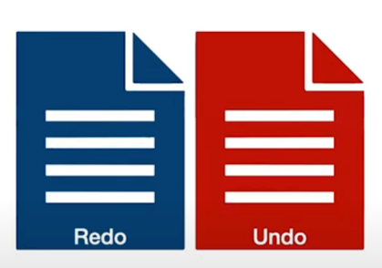

# 트랜잭션

## 테코톡 내용정리 
샐리의 트랜잭션: https://www.youtube.com/watch?v=aX9c7z9l_u8

> 데이터베이스에서는 트랜잭션을 조작함으로써 사용자가 데이터베이스에 대한 완전성을 신뢰할 수 있도록한다. 

### 트랜잭션이란..? 
> 더 이상 나눌 수 없는 가장 작은 하나의 단위를 의미한다. 
> 모든 데이터베이스는 자체적으로 트랜잭션을 지원하는데, 
> 하나의 명령을 실행했을 때 데이터베이스가 온전히 그 명령을 실행해주는 것을 의미한다. 

> 데이터베이스는 기본적으로 트랜잭션을 관리하기 위한 설정을 가지고있다. 

> 데이터베이스에서는 명령을 끝마칠 때까지 수행 내역을 로그에 저장해둔다.    
> 데이터베이스에 반영된 내용을 재반영하기 위한 `redo` log   
> 수행을 실패해 이전의 상태로 되돌리는 `undo` log 
> 위의 2가지 log를 이용해 트랜잭션을 지원한다. 

(트랜잭션의 자세한 매커니즘: 에이든의 테코톡 https://www.youtube.com/watch?v=ImvYNlF_saE 참고)

> 그렇다면... **하나의 명령**이 아니라 `여러 명령`을 하나의 트랜잭션으로 보고 싶은 경우에는 어떻게 적용할 수 있을까? 

## 트랜잭션 정의 
절대로 깨져서는 안되는 하나의 작업

## 트랜잭션의 4가지 성질 
* `원자성`(**A**tomicity): 트랜잭션은 절대 깨지지 않는 원자처럼 하나가 전부 실행되든, 실패하든 해야지 일부만 실행되는 경우는 없다는 의미
  * 어느 하나라도 실패했다면 성공했던 동작들을 없던 일 처럼 되돌리는 Rollback 수행 
  * 하나로 묶여있는 모든 동작을 모두 성공적으로 수행해다면 수정된 내용을 DB에 반영하는 Commit 수행 
  * 즉 롤백이나 커밋이 수행되어야 트랜잭션이 종료되는 것이다. 
* `일관성`(**C**onsistency): 데이터베이스의 상태, 데이터베이스 내의 계층 관계, 컬럼의 속성 등이 항상 일관되게 유지되어야한다는 의미
  * 예를들어 어떤 컬럼의 속성이 수정되었다면 Trigger를 통해 일괄적으로 모든 데이터베이스에 적용해야한다.
* `지속성`(**D**urability): 트랜잭션이 성공적으로 수행되어 커밋되었다면 어떠한 문제가 발생하더라도 데이터베이스에 그 내용이 영원히 지속되어야한다는 의미
  * 이를 위해 모든 트랜잭션은 로그로 남겨져 어떠한 장애에도 대비할 수 있도록한다. 
* `독립성`(**I**solation): 트랜잭션 수행 시, 다른 트랜잭션이 작업에 끼어들 수 없고 각 트랜잭션을 독립적으로 수행해야한다는 의미
  * 트랜잭션은 격리 수준 설정을 통해서 독립성을 보장한다.
  * 하지만 데이터베이스에 작업이 들어왔을 때, 모든 작업의 독립성을 보장해 하나씩 순차적으로 수행하게 된다면 
  * CPU는 DBMS보다 I/O 작업을 빈번히 수행하기 때문에 CPU는 점점 응답을 기다리는 시간이 길어져 프로그램이 비효율적으로 동작하는 문제가 발생할 수 있다. 

> 데이터베이스에 저장된 데이터의 무결성과 동시성의 성능을 지키기 위해서 트랜잭션의 설정이 중요하다! 

DB에서는 각각의 명령을 하나의 트랜잭션으로 보고 보장해주기 때문에 여러 명령을 하나의 트랜잭션으로 묶고 싶은 경우 개발자가 직접 트랜잭션의 경계설정을 통해 
트랜잭션을 명시하는 일이 필요하다. 자바 진영에서는 스프링을 통해 트랜잭션의 경계 설정을 DB에 전달할 수 있다. 

### 스프링에서는 트랜잭션을 어떻게 지원하고 있을까? 

스프링은 트랜잭션 추상화 인터페이스인 `PlatformTransactionManager`를 제공하여 다양한 DataSource에 맞게 트랜잭션을 관리할 수 있게 하고 있다.
PlatformTransactionManager은 `getTransaction()`, `rollback()`, `commit()`으로 구성되어 있다.  
`getTransaction()`: 파라미터로 전달되는 TransactionDefinition에 따라 트랜잭션을 시작한다. 
`commit()`: 트랜잭션을 정상적으로 수행하면 실행된다.
`rollback()`: 트랜잭션의 작업 중, 하나라도 비정상적으로 종료되면 실행된다. 

`getTransaction`부터 `commit`이나 `rollback`을 하는 부분까지가 트랜잭션 경계설정이다. 

### 스프링이 제공하는 다양한 트랜잭션 매니저 구현체 종류 
* DataSourceTransactionManager (at JDBC)
* JpaTransactionManager (at JPA)
* JtaTransactionManager 

> 위의 두 매니저의 경우 하나의 데이터베이스를 사용하거나 각각의 데이터를 독립적으로 사용하는 로컬 트랜잭션의 경우에 사용할 수 있다. 

> 하나 이상의 데이터베이스가 참여하는 경우라면 `글로벌 트랜잭션`에 사용되는 `JtaTransactionManager`를 사용할 수 있다. 
> 여러개의 데이터베이스에 대한 작업을 하나의 트랜잭션으로 묶을 수 있고, 다른 서버에 분산된 것도 묶을 수 있다. 
> 이외에도 다른 DataSource가 들어올 때도 사용할 수 있는 다양한 구현체들이 있다. 
> 하지만 이렇게 직접적으로 코드에 구현하는 방식 외에도 스프링은 `AOP를 이용한 선언적 트랜잭션`을 제공하고 있다.

### 스프링이 제공하는 선언적 트랜잭션 
> 선언적 트랜잭션을 제공하는 방식은 2가지 방식이 있다. 
* tx 네임스페이스를 사용하는 방안
  * 
  * Bean 설정 파일에서 트랜잭션 매니저를 등록
  * 속성과 대상을 정의해 트랜잭션을 적용하겠다고 명시하는 것 
  * 이 방식은 코드에는 영향을 주지 않고 일괄적으로 트랜잭션을 적용하고 변경할 수 있다는 장점이 있음. 
* 애너테이션을 이용하는 방식 
  * 
  * 트랜잭션 애너테이션은 `메서드` ,`클래스`, `인터페이스` 등에 적용할 수 있다.
  * 클래스 상단에 적용한 애너테이션은 클래스 내에 모든 메서드에 애너테이션이 적용된다. 
  * 중첩되어 존재하는 경우 클래스 메서드 > 클래스 > 인터페이스 메서드 > 인터페이스 순으로 우선순위를 갖는다. 
  * 애너테이션이 적용된 메서드는 메서드 시작부터 트랜잭션이 시작되고, 메서드를 성공적으로 끝마치면 트랜잭션 커밋, 도중에 문제가 발생하면 롤백한다. 
  * 애너테이션은 데이터베이스에 여러번 접근하면서 하나의 작업을 수행하는 서비스 계층 메서드에 붙이는 것이 통상적이다. 
  * 코드에 일일히 붙이기 번거롭고 쉽게 놓칠 수 있다는 단점이 있다. 
  * 하지만 세밀한 설정을 손쉽고 간편히 할 수 있다는 장점이 있다. 

### @Transactional 실제 코드 

* 코드에서 알 수 있듯이 트랜잭션 매니저를 속성으로 지정할 수 있다. 
* 빈으로 등록되어있는 트랜잭션 매니저를 지정하고 싶은 경우 지정할 수 있다. 
* 트랜잭션은 그 외에도 `여러가지 속성`을 가지고 필요에 따라 속성 지정이 필요하면 추가할 수 있다.

### @Transactional의 여러가지 속성 

> 트랜잭션 전파란 `트랜잭션의 경계에서 이미 진행중인 트랜잭션이 있을 때, 어떻게 동작할지 결정하는 것`이다.
* Propagation(= 전달받는 트랜잭션 전파)
    * REQUIRED(Default)
      * 두 메서드가 하나의 트랜잭션으로 실행되기 때문에 둘 중 어느 메서드에서 문제가 발생해도 실행했던 모든 메서드가 롤백된다. 
    * SUPPORTS
      * 진행중인 트랜잭션이 있으면 REQUIRED처럼 참여하고 트랜잭션이 없으면 트랜잭션 없이 메서드를 그냥 실행한다.
    * MANDATORY(=필수)
      * 진행중인 트랜잭션이 있으면 참여하고 없으면 예외가 발생한다.
      * 혼자서는 트랜잭션을 시작할 수 없고 메서드를 실행할 수도 없다. 
    * REQUIRES_NEW
      * 항상 새로운 트랜잭션을 시작한다. 
      * 새로운 메서드가 시작될 때 진행중인 트랜잭션이 있다면 이미 진행중인 트랜잭션을 잠시 보류시키고 자신의 메서드를 트랜잭션으로 실행한다.
      * (추가 정정) -> 잠시 보류하는 것이 아니라 중단(Suspend)해서 앞의 트랜잭션은 사용하지 않는 듯함. 
    * NOT_SUPPORTED
      * 이미 시작된 트랜잭션이 있으면 보류하고 자신의 메서드를 실행하는, `트랜잭션을 사용하지 않는 설정` 
    * NEVER
      * 트랜잭션을 사용하지 않도록 강제한다.
      * 이미 진행중인 트랜잭션이 없다면 자신의 메서드를 실행한다. 
      * 이미 진행중인 트랜잭션이 있다면 예외가 발생한다. 
    * NESTED 
      * 이미 진행중인 트랜잭션이 있으면 그 안에 새로운 트랜잭션을 만드는 설정 
      * 트랜잭션 1 내부에 트랜잭션 2로 삽입한다. 
      * 이렇게 중첩된 트랜잭션 2는 부모인 트랜잭션1의 커밋, 롤백에는 영향을 받는다. 
      * 반대로 트랜잭션1은 트랜잭션2의 커밋, 롤백에 영향을 받지 않는다.  
      
  

개인적인 의문점 

`REQUIRES_NEW`, `NOT_SUPPORTED` 의 차이점은...?
전자는 `항상 신규트랜잭션을 개시함. 트랜잭션이 존재하는 경우 해당 트랜잭션을 중단하고 새로운 트랜잭션 개시`   
후자는 `트랜잭션이 존재할 경우 중단(Suspend)해서 트랜잭션을 이용하지 않음` 

둘다 이미 실행중인 트랜잭션이 있다면 중지시킨다.

### 상세 설명 - REQUIRES_NEW
> 트랜잭션이 존재할 경우 해당 트랜잭션을 중단하고 새로운 트랜잭션 경계를 설정하는 속성으로 트랜잭션이 존재하지 않는 경우에는 REQUIRED와 동일한 동작을 합니다. 모든 트랜잭션 매니저가 실제 트랜잭션 중단을 지원하는 것은 아니기 때문에 일반적으로 기존 트랜잭션을 방치한 상태로 새로운 트랜잭션을 생성합니다.  
> 다시 말해서 물리적으로 데이터베이스 커넥션을 새로 얻는다는 의미입니다. 요청이 많은 특정 서비스에 사용할 경우 데이터베이스 커넥션을 얻기위해 대기하는 리소스 데드락(Resource Deadlock - 특정리소스를 점유한 스레드들이 동일한 리소스를 얻으려고 대기하는 상태) 을 유발할 가능성이 있으므로 주의해서 사용해야할 필요가 있습니다. 
> 위에서 설명한 NOT_SUPPORTED의 경우도 트랜잭션이 중단된 상태에서 다시 REQUIRED를 만나게 되면 동일한 현상이 발생할 가능성이 있습니다.

### 상세 설명 - NOT_SUPPORTED
> 트랜잭션이 존재할 경우 해당 트랜잭션을 중단하고 트랜잭션이 없는 상태로 처리를 수행합니다

> 트랜잭션 격리수준은 동시에 여러 트랜잭션이 실행될 때, 트랜잭션의 작업 내역을 다른 트랜잭션에게 보여줄지 말지 결정하는 것으로 
> 가능한 많은 트랜잭션을 동시에 진행하면서도 문제가 생기지 않도록 하려는 설정이다.    
> 기본적으로 DB에 설정되어 있지만 isolation 속성을 통해 재설정할 수 있다. 
* Isolation(= 트랜잭션의 격리수준)
  * DEFAULT 
    * DB의 기본 설정을 따른다는 것이다. 
    * `대부분`의 DB는 `READ_COMMITTED`를 기본 격리수준으로 가지지만 올바른 트랜잭션 설정을 위해서는 확인을 필수적으로 해야함. 
  * READ_UNCOMMITTED
    * 가장 낮은 격리수준으로 `아직 커밋되지 않은 데이터를 다른 트랜잭션이 읽을 수 있는 설정`이다. 
  * READ_COMMITTED
    * 가장 많이 사용되면서 두 번째로 낮은 격리수준으로 `커밋되지 않은 정보는 읽을 수 없다` 
    * 트랜잭션1에서 작업이 완료되어 커밋되어야만 트랜잭션2는 A의 정보를 읽어올 수 있다.  
    * But 트랜잭션2가 읽은 A를 또 다른 트랜잭션3이 수정할 수 있어 트랜잭션2가 다시 읽으면 값이 다르다는 문제가 발생 
  * REPEATABLE_READ
    * 세번째로 낮은 격리수준으로 `하나의 트랜잭션이 읽은 로우를 다른 트랜잭션이 수정할 수 없다`.
    * 읽어온 로우를 수정하는 것은 불가능하나 `새로운 로우를 추가하는 것은 제한되지 않아 다시 조회했을 때, 발견하지 못한 새로운 로우가 발견될 수 있다는 문제`가 있음.
  * SERIALIZABLE
    * 가장 강력한 격리수준으로 `동시에 같은 테이블의 정보를 접근할 수 없다`.
    * 하지만 트랜잭션을 순차적으로 수행하는 것과 다를 바가 없어 성능이 매우 떨어짐으로 극단적인 상황에서만 사용해야한다.  

> DB에서는 이러한 격리 수준에 따라 트랜잭션이 실행되는 동안 각기 다른 Lock을 걸고 데이터를 보호하고자 한다.   
> 격리수준이 높아질수록 더욱 강하게 Lock을 걸고 트랜잭션을 마치면 Lock을 해제한다. 

### Spring 트랜잭션 속성 

### timeout 속성
* 초 단위로 제한시간을 지정할 수 있다. 
* 정해진 시간을 넘기면 예외가 발생돼 롤백된다. 
* 따로 설정하지 않으면 timeout은 없다! 

### readonly 속성 
* 읽기전용 트랜잭션으로 true로 설정하면 트랜잭션 작업안에서 C, U, D 작업이 일어나는 것을 방지한다. 
* 추가적으로 이 옵션을 적용하면 flush 모드가 manual로 설정되어 `JPA의 더티체킹 기능을 무시`할 수 있다.
* 이는 성능 향상에 도움이 된다. 

### rollbackFor 속성 
* 기본적으로 트랜잭션은 런타임 예외와 Error가 발생했을 때만 롤백한다. 
* 하지만, 체크 예외나 예외가 발생하지 않으면 커밋한다. 
* `체크 예외를 롤백 대상으로 삼고싶으면` 특정 Checked Exception을 클래스로 전달해 사용할 수 있다. 

### noRollbackFor 속성 
* 설정하면 롤백 대상인 런타임 예외도 롤백하지 않고 커밋한다.

### Spring 트랜잭션 관리의 이해 - 실전편  
https://reiphiel.tistory.com/entry/understanding-of-spring-transaction-management-practice

