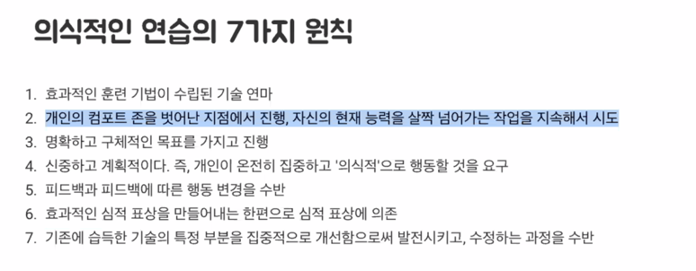
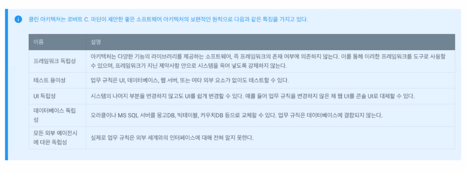
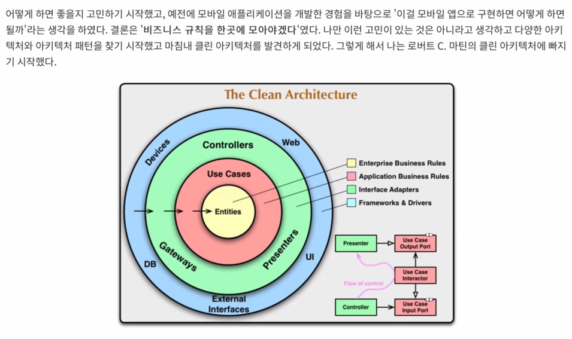
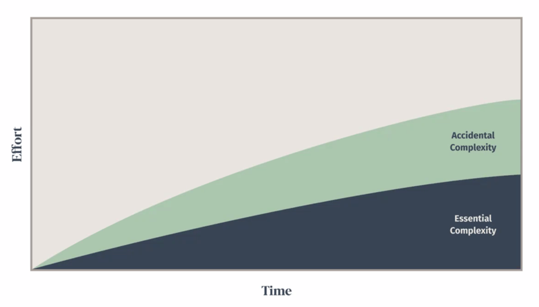
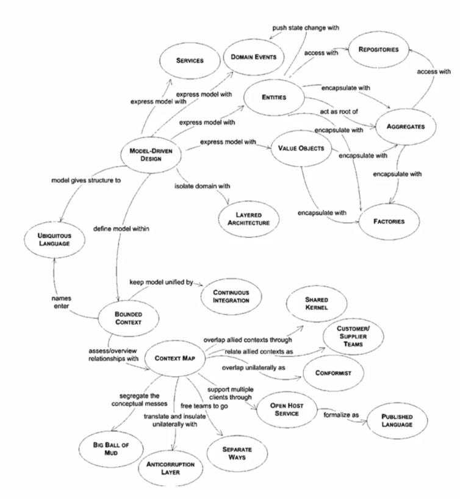

# 대상
* 데이터 중심의 레거시 환경에서 벗어나 현재 업무에 DDD를 적용하고자 하는 분 
* 모놀리식 아키텍처에서 마이크로서비스 아키텍처로 변화를 꿈꾸는 분
* DDD 개념은 들어봤지만, 직접 적용하여 프로젝트를 진행해 본 경험은 없는 분

### 학습효과를 극대화하는 법
> 학습 -> 적용 -> 응용

DDD 아티클, 영상, 책 등을 보기 

### 상황에 맞는 설계와 구현 방법을 찾아라 
* 프로그래밍 설계와 구현은 아날로그적인 영역이 많은 부분이다. 
* 프로그래밍을 기술이 아닌 예술의 일부라고 생각하는 이유도 이런 점 때문이다. 
* 프로그래밍 설계와 구현에 정답은 없다.
* 정답을 찾기보다 요구사항에 적합한 최선의 설계와 구현 코드를 찾기 위해 노력한다.

## 레거시 코드에 대한 생각의 변화 
* 레거시 코드를 바라볼 때 짜증나고, 고통스런 일로 바라보기 보다.
* 재미있고, 도전적인 문제로 바라보는 자세

## 백엔드 3대 스펙
* 대용량 트래픽 
* 무에서 유를 만들어본 경험 
* 대규모 리팩터링 (ex. Java -> Kotlin 마이그레이션, 아키텍처 재설계)

## 학습 로드맵 
* 객체지향의 사실과 오해
* **오브젝트**  <-- DDD라는 개념 하나도 없이 객체지향을 설명하고있음.

## 좋은 DDD란...   (ver. jason)
DDD 언급이나 DDD 용어 언급 없이 설명할 수 있는 것

1. 도메인 주도 개발 시작하기 (최범균님) <-- DDD 책으로 입문한다면
   * DDD보다는 JPA 얘기가 더 많다는 평도 있다
2. 도메인 주도 설계 첫걸음 - 블라드 코노노프 저(원숭이 책) 
3. 도메인 주도 설게 (에릭 에반스 저 / 이대엽 역 | 위키북스) 
   * 추상화된 내용이 많아서 굉장히 어렵다고 함. (원서가 파랑색이라 블루북이라고도 부름)
4. 도메인 주도 설계 구현 (반 버논 저  | 에이콘출판사) 
   * 에릭 에반스 책이 어려워서 반 버논 책을 보는 사람도 많음. (원서가 빨간색이라 레드북이라고도 부름)

# QnA

Q. 항상 궁금했던건데, DDD 과정속에서 기획자의 참여없이 개발자들만 에그리것을 나누고, 도메인을 정의하는 개발이 큰 의미가 있을까요? 실제 회사에서는 어떻게 진행하시는지 궁금합니다.
A. DDD를 프로젝트를 성공시키는 법이라고 표현했는데, 모델링 과정에서 기획자, PM과 함께 애그리거트(= 도메인 모델링)를 함께 정하는 것이 당연히 좋다. 하지만 실제로는 그런 환경이 구성되기 쉽지않다. 하지만 기획자, PM, 그외 디자이너 등 협업자 워크샵을 진행하는 것을 권장한다.

Q. mybatis만 사용하는 프로젝트에서도 DDD 가능한지 궁금합니다.
A. 관계없다. DDD(= 도메인 주도 설계)는 방법론이기 때문에 구현에 대한 관점인 MyBatis 때문에 문제될 일은 없음.

# 본 수업 

## 들어가기 전에 
* 경우에 따라 DDD 기술 규칙과 패턴이 DDD 구현에 방해가 될 수 있다.
* 중요한 것은 패턴 자체가 아니라 **비즈니스 문제에 맞게 코드를 구성하고 동일한 비즈니스 용어(유비쿼터스 언어)를 사용하는 것**이다. 
* CRUD 서비스처럼 간단한 업무는 더 간단한 방법으로 관리할 수 있다. 

## 도메인 주도 설계 등장 배경 

### 나는 왜 DDD를 하고 있는가? 

클린 아키텍처

'비즈니스 규칙을 한곳에 모아

## 도메인 주도 설계
> 엔티티는 가장 일반적이며 고수준인 규칙을 캡슐화한다 - 클린 아키텍처

복잡한 비즈니스 규칙을 다루는

## 기존의 개발 
1. 기획자와 심도있는 논의를 거쳐 기획이 결정 (or 기획자가 일방적으로 결정)
2. 기획서를 보고 데이터베이스 테이블을 설계
3. 데이터베이스 테이블을 기반으로 모델을 만든다.
4. getter, setter 메서드가 모델에 추가된다.
5. **서비스가 매우 커진다**

1. 기획자와 심도있는 논의를 거쳐 기획이 결정 (or 기획자가 일방적으로 결정)
2. 기획서를 보니 데이터를 중복으로 관리하기보다는 기존 테이블에 새로운 컬럼 몇 개만 추가하면 될 것 같다. 
3. 새로운 getter, setter 메서드가 모델에 추가한다.
4. **서비스가 매우 커진다**

# 소프트웨어의 존재 가치 
> 소프트웨어의 본질은 해당 소프트웨어의 사용자를 위해 관련 문제를 해결하는 능력에 있다. 아무리 기술적으로 정교하고 뛰어난
> 성능을 갖추더라도 당면한 문제를 해결하지 못하는 소프트웨어는 실패한 소프트웨어라고 할 수 있다. 얼마나 빠른지, 얼마나 많은 처리가 가능한지, 
> 얼마나 많은 사람이 붙어 사용할 수 있는지는 나중 이야기다!

소프트웨어를 만들려면 비즈니스를 이해하고, 관련 지식을 쌓고, 본질적 복잡성(essential complexity) 
우발적 복잡성(accidental complexity)을 구별하는 것이 매우 중요하다.

> 본질적 복잡성은 문제 자체에서 발생하면 문제의 범위를 줄이지 않고는 제거할 수 없다.
> 반면에 우발적 복잡성은 솔루션으로 인해 발생하며 프레임워크, 데이터베이스 또는 기타 인프라가될 수 있다.

## 도메인

'소프트웨어로 해결하고자하는 문제 영역'이다. 소프트웨어를 사용하는 사용자의 활동이나 관심사와 관련되어있다. 
소프트웨어 산업은 다른 산업 내에서 발생하는 다양한 비즈니스 문제를 해결한다는 점에서 독특하다.

## 도메인 모델 

모델은 목적을 위해 현실 세계에 존재하는 것을 **가공하고 편집**하여 우리에게 정보를 제공한다.
도메인 모델은 특정 다이어그램이 아니라 다이어그램이 전달하려는 아이디어이자 **목적을 가진 의사소통 수단**이다. 
이 의사소통 수단은 회의, 기획, 디자인, 개발에 사용되어야 한다. 

물리적으로 존재하는 것들을 모델링할 수 있고, 물리적으로 존재하지 않는 것들을 모델링할 수 있다.
도메인 모델을 사용하면 여러 이해관계자가 동일한 모습으로 도메인을 이해하고 도메인 지식을 공유하는 데 도움이 된다. 

## 도메인 주도 설계

현실은 어떤가? 기획자가 생각하는 도메인 모델과 개발자가 생각하는 도메인 모델이 같을까? 
개발자는 요구 사항을 기술 언어로 번역하고 솔루션에 집중해 문제를 숨기는 경향이 있다. 번역된 언어는 의사소통을 위해 언어를 다시 번역해야 하고 이 과정에서 많은 의사소통 비용이 낭비된다. 

에릭 에반스의 동명의 책에서 유래한 DDD는 도메인 모델의 적용 범위를 구현으로 확장하기 위해 도메인을 탐색하고 학습하기 위한 다양한
원칙과 패턴을 제안한다. 그러나 결코 "설계를 하라, 그 다음에 구축하라"(= 워터폴)가 아니다.
(처음부터 완벽한 설계는 존재할 수 없다!)

## 세 개의 기둥
* 유비쿼터스 언어
* 전략적 설계
* 전술적 설계

사실 DDD에서 중요한 것은 앞의 2개이지만, 우리는 개발자이기 때문에 전술적 설계에 대해서도 관심은 가져야한다.

### 전술적 설계

DDD light --> 안티패턴이다. 
