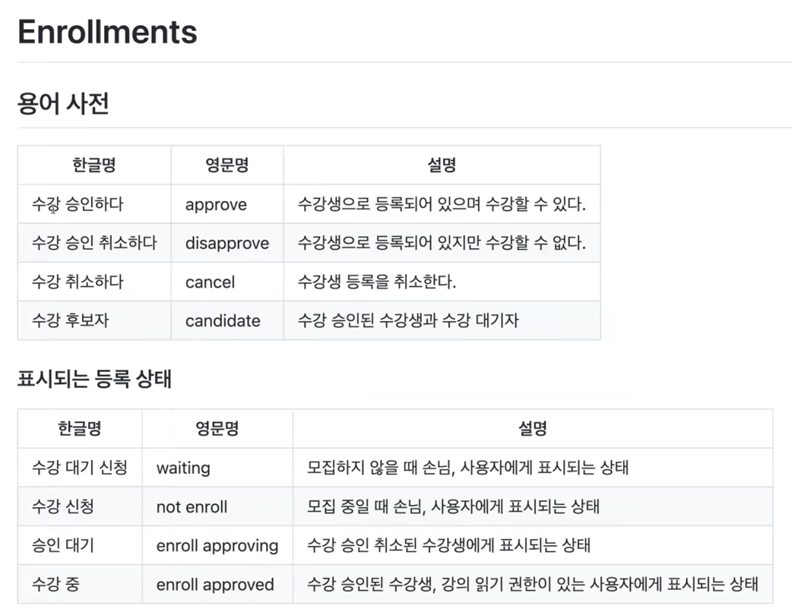

# 테스트의 순서?
1. 가장 잘 아는 도메인 로직부터!

나를 비롯한 대다수의 사람들은 의존성이 적은 테스트부터 테스트한다고 답함

---
# 강의 페이지 정리

# 전략적 설계 - 유비쿼터스 언어  
* 도메인에서 사용하는 용어를 코드에 반영하지 않으면 그 코드는 개발자에게 코드의 의미를 해석해야하는 부담을 준다.
* 코드의 가독성을 높여서 코드를 분석하고 이해하는 시간을 절약한다.
* 용어가 정의 될 때마다 용어 사전에 이를 기록하고 명확하게 정의 함으로써 추후 또는 다른 사람들도 공통된 언어를 사용할 수 있도록한다.

> 유비쿼터스(UBIQUITOUS) : '어디에나 있는', '아주 흔한' 이라는 뜻을 가짐

## 효과적인 모델링 
* 사용자와 개발자는 동일한 언어로 이야기하는가?
* 해당 언어가 애플리케이션에서 수행해야 할 내용에 관한 논의가 이끌어갈 만큼 풍성한가?
* 표현해야 할 것을 더 쉽게 말하는 방법을 찾아낸 다음 그러한 새로운 아이디어를 다이어그램과 코드에 적용한다. 

### 한 팀, 한 언어
* 사업팀도 해당 모델을 이해하지 못한다면 모델이 뭔가 잘못된 것이다.

## UML
모델 기반 의사소통은 UML 상의 다이어그램으로 한정돼서는 안 된다.
[UML: 클래스 다이어그램과 소스코드 매핑](https://www.nextree.co.kr/p6753/)
[\[UML\] 클래스 다이어그램 작성법 - Heee's Development Blog](https://gmlwjd9405.github.io/2018/07/04/class-diagram.html))

# 전략적 설계 - BOUNDED CONTEXT 

## BOUNDED CONTEXT
* 하위 도메인마다 같은 용어라도 의미가 다르고 같은 대상이라도 지칭하는 용어가 다를 수 있기 때문에 한 개의 모델로 모든 하위 도메인을 표현하려는 
시도는 올바른 방법이 아니며 표현할 수도 없다.
* 하위 도메인마다 사용하는 용어가 다르기 때문에 올바른 도메인 모델을 개발하려면 하위 도메인마다 모델을 만들어야한다. 
* 모델은 특정한 컨텍스트(문맥)하에서 완전한 의미를 갖는다. 
* 이렇게 구분되는 경계를 갖는 컨텍스트를 DDD에서는 BOUNDED CONTEXT라고 부름

> **레스토랑 안**에서의 `피자`와 **음식물 쓰레기통 안**의 `피자`를 각각 생각해보자.
> 각각의 케이스에 어떤 생각이 드는가?  
> 전자의 경우 토핑이 무엇인지?, 파인애플이 올라갔는지?, 도우는 무엇인지? 등에 관심이 있을테지만 후자의 경우에는 이런 관심은 전혀 안생길 것이다.
> 이 때, **레스토랑**과 **음식물 쓰레기통**을 `Context`라고 부르고 **피자**를 `Bounded context`라고 부른다!

> 피자 클래스를 만들고 음식물 쓰레기 여부 및 토핑이 무엇인지 등을 알 수 있는 필드를 넣는 것이 아니라 경계를 긋고 경계 안에 맞는 피자 모델을 만들어야한다는 것임.
> 물론 이 과정에서 **데이터 중복**이 발생할 수 있다! 하지만 이 데이터 중복은 `우발적 중복`이지 실제가 우리가 제거해야하는 제거 대상으로 생각하는 중복이 아니라
> 우연히도 두 개의 컨텍스트의 관심사가 겹친것 뿐이다.

> 도메인 모델들은 특정한 Context 안에서 완전한 의미를 갖고 이렇게 구분되는 경계를 갖는 것을 DDD에서는 Bounded Context라고 부른다.

* Problem Solution: 도메인
* Solution Space: Bounded Context

## 좋은 BOUNDED CONTEXT

* 하나의 BOUNDED CONTEXT는 하나의 팀에만 할당되어야 한다. 
  * 하나의 팀은 여러 개의 BOUNDED CONTEXT를 다룰 수 있다. 
* 각각의 BOUNDED CONTEXT는 각각의 개발 환경을 가질 수 있다. 

> 위의 BOUNDED CONTEXT를 Micro Service라는 표현으로 변경해보면, 의미가 똑같음!
> Micro Service를 나누는 기준이 BOUNDED CONTEXT가 될 때, 깔끔하게 잘 나눠진다. 
> (MSA가 DDD보다 늦게 나왔음에도 MSA가 나온이후 DDD가 각광받게된 이유)

## CONTEXT MAP
* 컨텍스트 맵은 상호 교류하는 시스템의 목록을 제공하고, 팀 내 의사소통의 촉매 역할을 한다. 

## 프로젝트와 조직 관계 
* 파트너십(Partnership): 두 CONTEXT가 하나의 트랜잭션으로 묶여 있다. 
* 공유 커널(Shared kernel): 상호 의존하는 공유 모델을 관리한다. 
* 고객-공급자(Customer-Supplier Development): 업스트림(서버:공급자), 다운스트림(클라이언트:고객)로 단방향으로 의존한다.
* 순응주의자(Conformist): 업스트림(서버)이 모든 것을 제어한다. 
* 오픈 호스트 서비스(Open Host Service): REST/API, RPC Socket
* 분리된 방법(Separate Ways): 의존 없음
* 큰 진흙공(Big ball of mud): 안티 패턴!

## DDD vs OOP
* OOP는 상속이나 재활용성을 위해서 공통된 데이터를 공유하는 것을 중요시 함.
* DDD는 도메인 분리를 중시

> 언급하셨다시피, DDD의 진정한 힘은 유비쿼터스 언어와 BOUNDED CONTEXT부터 시작합니다.
유비쿼터스 언어를 반영해야 전술적 설계가 의미가 있는 셈이죠.
OOP에 근간하지만 OOP 원칙을 정면으로 위배하는 패턴도 몇 있어요.
예를 들어 ID를 이용해서 애그리거트 간 decoupling을 시킨다든지,
도메인 서비스는 행동을 객체에서 의도적으로 분리시키는 패턴이 OOP와는 다른 개념입니다.
밸류 타입을 사용하는 것을 권장하는 등,
저는 DDD의 전술적 설계가 순수 OOP보다 더 적용하기 심플한 측면이 있다고 개인적으로 생각해요.

# 이벤트 스토밍(Event Storming)

## DDD가 성공할 수 있는 전제 조건 
* DDD는 현업의 절대적인 도움이 필요하다. 
* 이해관계자(stakeholder)의 스폰서십이 적극 필요하다.

## 이벤트 스토밍(Event Storming)

## DDD 탈주 포인트 3요소
* BOUNDED CONTEXT
* Aggregate
* 도메인 서비스

## 용어 사전 
 

