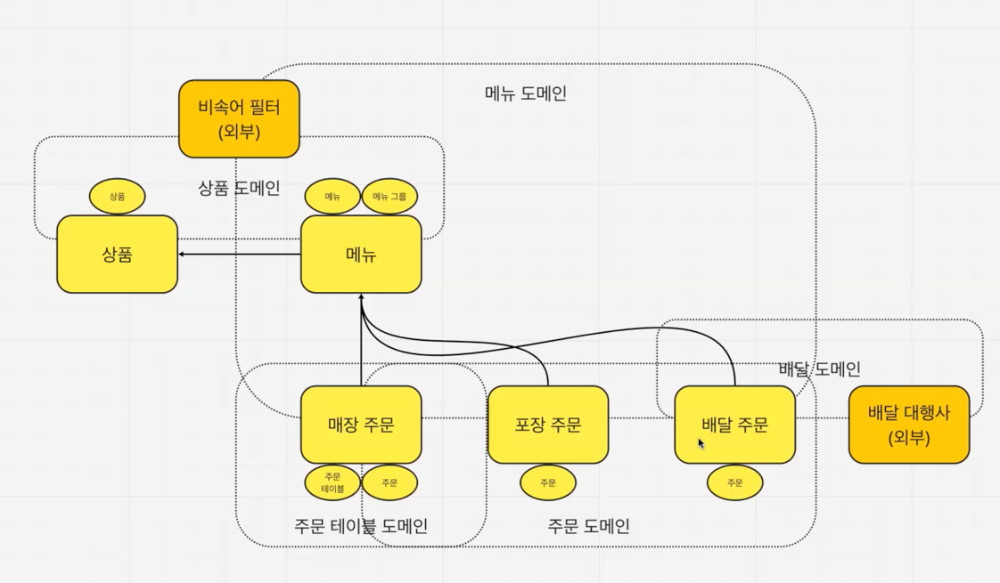
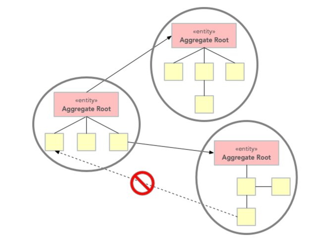
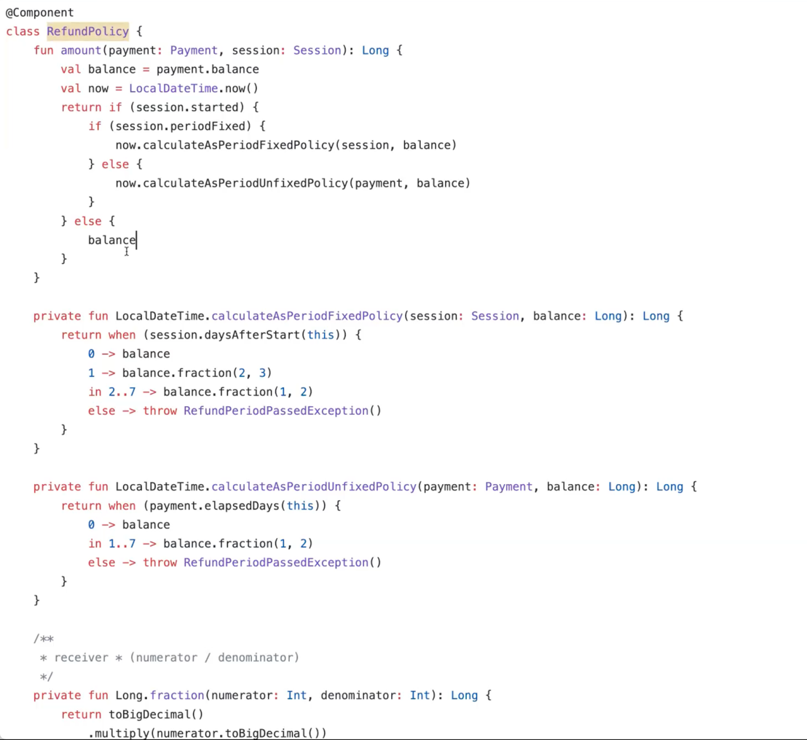
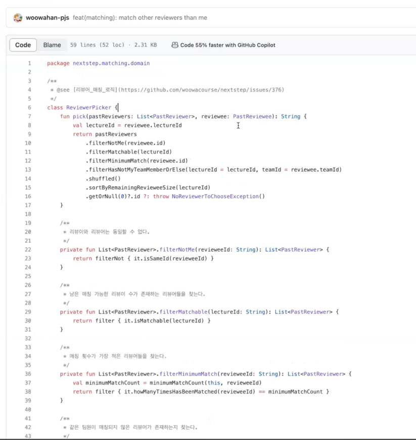
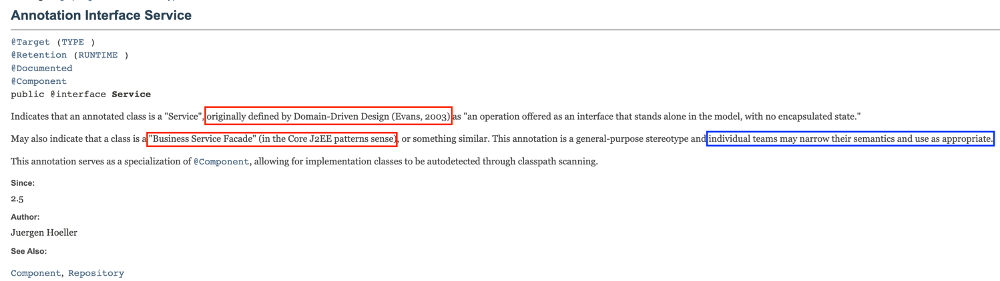
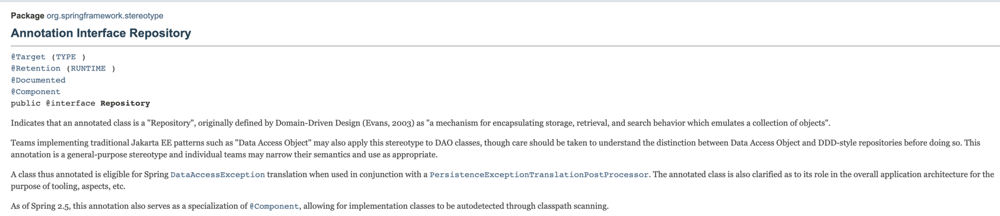
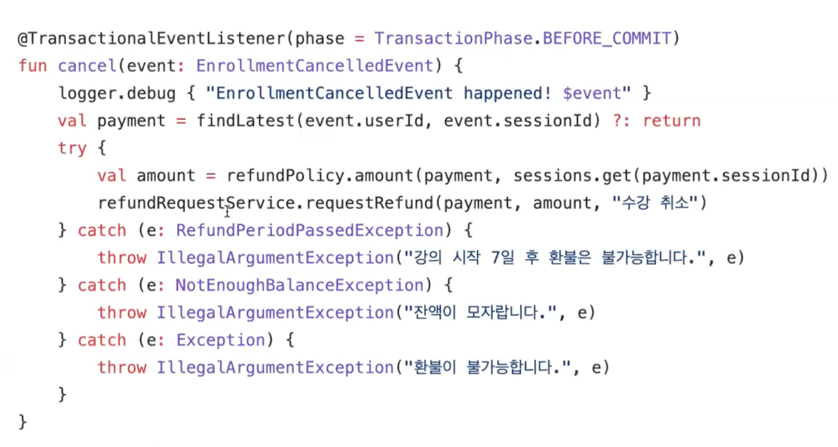

# Domain vs Bounded Context

## 차이점 
먼저 우선적으로 선행되어야할 질문 
> '도메인'은 소프트웨어의 범위를 넘어선 **도메인**(=풀어야할 문제)을 뜻하는 것인지 혹은 **서브 도메인**을 뜻하는 것인지?

* (Sub) Domain(= 하위 도메인): 큰 도메인은 여러가지 하위 도메인으로 이뤄져있음. 
  * 이런 하위 도메인들도 `핵심 하위 도메인`(= Core Sub Domain)과 `지원 하위 도메인`(= Support Sub Domain), `일반 하위 도메인`으로 구분할 수 있음.
  * 키친포스 미션에서는 Core Value(= 다른 경쟁사와 비교했을 때, 우리의 핵심 강점)은 '주문'이다. (Core Sub Domain)
  * 우리의 코어가 잘되도록 지원해주는 주문 테이블, 배달, 상품, 메뉴 같은 것들을 **지원 하위 도메인** (Support Sub Domain)
  * (어떤 서비스던간에 )비속어 필터 같은 것들을 **일반 하위 도메인** (Common Sub Domain)
* Bounded Context: 

> 하위 도메인을 이렇게까지 세부적으로 분류하는 이유는 뭘까? 
> **핵심 가치에 집중**하기 위해서이다!

(점선들이 도메인, 실선들이 바운디드 컨텍스트)

## Q. Bounded Context를 나누는 시점은 언제가 좋을까요? (나중에 중복이 너무 많아지면 다시 합치거나 그럴 일이 있을까봐요)

A. 결국 Trade Off 다.
배우는 내용을 계속 본인이 유지보수하는 서비스에 빗대어서 생각해봐야한다. 
우리의 서비스는 어떻게 나눌 수 있을까? 우리 서비스의 서브 도메인으 어떻게 될까? 우리 서비스의 Bounded Context는 무엇일까? 

`이론적인 답변`: 같은 용어인데 서로 다른 개념을 말함으로써 혼란이 가중될 때.

1. 중복이 너무 많아져서 오히려 불편하다고 봤을 때는 굳이 나누지 않아도 되는 시점일 수도 있다.
2. 공통 요소들만 분리해서 관리하는 (예를들어 주문의 경우...) `공통 주문`(전체 주문의 통합 식별자를 관리) 같은 요소들이 생길 수 있음.
   * 팀이 분리되어있는 경우라면 공통 주문이라는 요소를 결국 만들까? 누가 유지보수할까? (콘웨이의 법칙을 생가해볼 수 있음)
   * 개발자는 전지적 작가시점이다보니 우리는 위에서 이 서비스를 전체적으로 바라볼 수 있음. 

## Q. 팀 내에서 Bounded Context를 나누는 것이 의미가 있을까? 
A. 앞에서 이야기한 것처럼 용어의 혼란이 발생할 때, 의미가 있을 수 있다.
나중에가서 굳이 나눌필요 없겠다는 생각이든다면 다시 합칠 수도 있다. 

DDD는 `일을 잘 하는 방법`이다. 라는 개념을 떠올리면 된다.
결국 '우리가 일을 잘할 수 있는 방법'을 찾는다는 관점으로 접근하자!

# AGGREGATE와 REPOSITORY

* 관련 객체를 하나로 묶은 군집
* 애그리거트는 군집에 속한 객체들을 관리하는 루트 엔티티를 갖는다.
* 애그리거트로 묶어서 바라보면 좀 더 상위 수준에서 도메인 모델 간의 관계를 파악할 수 있다.
* 애그리거트에 속한 객체는 유사하거나 동일한 라이프사이클을 갖는다.
* 한 애그리거트에 속한 객체는 다른 애그리거트에 속하지 않는다.
* 두 개 이상의 엔티티로 구성되는 애그리거트는 드물게 존재한다.
 
> '애그리거트에 속한 객체는 유사하거나 동일한 라이프사이클을 갖는다'는 표현이 조금 어려울 수 있다. 
> 이 표현은 '불변식을 관리한다', '비즈니스 규칙을 관리한다' 와 같은 표현으로 생각할 수 있다.

## Aggregate Root 

* 애그리거트 루트의 핵심 역할은 애그리거트의 일관성이 깨지지 않도록 하는 것이다.
* 애그리거트 루트는 애그리거트가 제공해야 할 도메인 기능을 구현한다.
* 이는 애그리거트의 내부 구현을 숨겨서 애그리거트 단위로 구현을 캡슐화할 수 있도록 돕는다.
* 엔티티 중에 루트 역할을 할 녀석을 정하기 때문에 루트 엔티티라고 부르기도한다.
* 루트 엔티티는 애그리거트에 속해 있는 엔티티와 밸류 객체를 이용해서 애그리거트가 구현해야 할 기능을 제공한다.

> 제이슨은 '루트 엔티티'를 **반장**으로 비교 Aggregate는 하나의 **반** 반장은 외부와 소통하는 녀석이다.

### 반장이되는 기준은 무엇일까?
> 외부에서 해당 엔티티를 바라보냐? 안바라보냐에 따라서 갈리게된다. 
> 선생님이 호출하는 녀석이 반장이 된다. 

'루트 엔티티의 ID'를 `전역 식별자`라고 부른다. 그 이유는 외부에서도 바라보기기 떄문에 외부에 노출되기 때문이다.
그렇지만 루트 엔티티가 아닌 따른 엔티티가 가진 id를 `지역 식별자`라고 부른다. 
**지역 식별자**는 **애그리거트 안에서만 의미가 있다**.

### 고민해볼 포인트

> 자동차와 자동차 바퀴의 관계를 생각해보자. 
일반적으로 자동차는 반장이고 바퀴는 반장이 될 수 없을 것이다. 
그렇다면 바퀴는 영원히 반장이 될 수 없을까? 

> 결론은 상황에 따라 다르다!
자동차와 짝으로 다니는 바퀴는 영원히 반장이 될 수 없다.
하지만 타이어 가게에서는 바퀴가 반장이 될 수 있다. 
즉, 바운디드 컨텍스트가 달라지면 

### Aggregate의 핵심은 일관성을 보장한다.

일관성이라는 단어는 DB의 트랜잭션 이야기를 할 때, 많이 나오는 용어이다. (about. ACID)
`DB 단`의 일관성을 보장해줘야하는게 **트랜잭션**이라면 `애플리케이션 단`에서 일관성을 보장해줘야하는 것은 **Aggregate**이다.
DB보다 상대적으로 쉽게 구현할 수 있고 보기도 편하다. 결과적으로 ACID를 지켜야한다는 것은 `독립된 단위`여야 한다는 의미이다.

한 트랜잭션에서 한 Aggregate만 수정해야한다는 것이 권고사항인데, 실제로는 쉽지않다.
팀의 기술적 성숙도가 얼마나 올라가있느냐? 혹은 어떤 기술스택을 쓰느냐에 따라서 구현이 가능할 수도 있고 아닐 수도 있다.

### Aggregate 참조
* 애그리거트를 직접 참조할 때 발생할 수 있는 가장 큰 문제는 편리함을 오용할 수 있다.
* ID 참조를 사용하면 모든 객체가 참조로 연결되지 않고 한 애그리거트에 속한 객체들만 참조로 연결된다.
* ID를 이용한 참조 방식을 사용하면 복잡도를 낮추는 것과 함께 한 애그리거트에서 다른 애그리거트를 수정하는 문제를 원칙적으로 방지할 수 있다.

> 애그리거트는 ACID를 보장하는 단위기 때문에 독립성을 보장하기 위해서 서로 참조할 수 없다. 
> 또한 서로 참조안하기 때문에 여러가지 이점들이 있다.
> 우리가 일반적으로 생각하는 OOP의 통념과는 상충되는 부분이다. 

### REPOSITORY
* 엔티티나 밸류가 요구사항에서 도출되는 도메인 모델이라면 **리포지터리는 구현을 위한 도메인 모델**
* **애그리거트 단위로** 도메인 객체를 저장하고 조회하는 기능을 정의한다.
* 애그리거트를 구하는 리포지터리 메서드는 완전한 애그리거트를 제공해야 한다.
* 리포지터리가 완전한 애그리거트를 제공하지 않으면, 필드나 값이 올바르지 않아 애그리거트의 기능을 실행하는 - 도중에 NullPointerException과 같은 문제가 발생하게 된다.
* 리포지토리는 애그리거트(루트) 단위로 존재하며 테이블 단위로 존재하는 것이 아니다.

> 엄밀히 말하면, DDD의 REPOSITORY는 Aggregate 단위로 존재해야한다. (Spring Data 프로젝트 때문에 테이블 단위라고 오해하는 경우가 있음)

## SERVICE 

서비스라는 표현이 쓰이는 곳들이 너무 많다. 
* Micro Service
* Application (Layer) Service
* `Domain Service` <- 강의에서 다루려고하는 부분

### 여러 애그리거트가 필요한 기능

결제 금액 계산 로직

* 상품 애그리거트: 구매하는 상품의 가격이 필요하다. 또한 상품에 따라 배송비가 추가되기도 한다.
* 주문 애그리거트: 상품별로 구매 개수가 필요하다.
* 할인 쿠폰 애그리거트: 쿠폰별로 지정한 할인 금액이나 비율에 따라 주문 총 금액을 할인한다. 할인 쿠폰을 조건에 따라 중복 사용할 수 있다거나 지정한 카테고리의 상품에만 적용할 수 있다는 제약 조건이 있다면 할인 계산이 복잡해진다.
* 회원 애그리거트: 회원 등급에 따라 추가 할인이 가능하다.

> 이 상황에서 실제 결제 금액을 계산해야 하는 주체는 어떤 애그리거트일까?

새로운 `결제 Aggregate`를 만드는 것은 어떨까? -> 비즈니스 룰이나 일관성을 보장해야하는 단위일까? -> 맞다면 새로운 Aggregate를 만들 수 있다. 

결론: 어떤 애그리거트에 넣기 애매한 도메인 개념은 `도메인 서비스`에서 다룰 수 있다.

### 도메인 서비스
* 한 애그리거트에 넣기 애매한 도메인 개념을 구현하려면 애그리거트에 억지로 넣기보다는 도메인 서비스를 이용해서 도메인 개념을 명시적으로 드러내면 된다.
* 응용 영역의 서비스가 응용 로직을 다룬다면 도메인 서비스는 도메인 로직을 다룬다.
* 도메인 영역의 애그리거트나 밸류와 같은 다른 구성요소와 비교할 때 다른 점은 상태 없이 로직만 구현한다.
* 서비스를 사용하는 주체는 애그리거트가 될 수도 있고 응용 서비스가 될 수도 있다.
* 애그리거트 메서드를 실행할 때 도메인 서비스를 인자로 전달하지 않고 반대로 도메인 서비스의 기능을 실행할 때 애그리거트를 전달하기도 한다.
* 특정 기능이 응용 서비스인지 도메인 서비스인지 감을 잡기 어려울 때는 해당 로직이 애그리거트의 상태를 변경하거나 애그리거트의 상태 값을 계산하는지 검사해 보면 된다.

> 제이슨은 도메인 서비스를 `방파제`로 비유한다.
> 도메인 지식, 도메인 로직에 대한 방파제이다. 도메인 지식이나 도메인 로직이 애플리케이션 Layer(= 응용 계층)로 넘어가는 것을 막아주는 역할이다.

 도메인 서비스가 꼭 N개의 Aggregate를 다뤄야만 등장하는 것은 아니다!

#### 도메인 서비스 예시 (NEXTSTEP 환불정책)

#### 리뷰어 매칭 정책 (NEXTSTEP 리뷰어 매칭 도메인 서비스)

> 도메인 서비스 네이밍을 지을 때, 가급적 XxxService 라는 네이밍 패턴은 정말 지을게 없을 때, 짓는 것을 추천하고 
> 가급적이면 이 이름을 관련있는 이름을 짓는 것을 권장한다. (ex. RefundPolicy, ReviewerPicker)

`@Service` 애너테이션 주석을 읽어봤는가? [링크](https://docs.spring.io/spring-framework/docs/current/javadoc-api/org/springframework/stereotype/Service.html)

`@Repository` 또한 유사한 주석이 있다.

결국 어떻게 쓸지는 개인 or 팀의 선택이다~!

### FACTORY 
* 어떤 객체를 생성하는 일이 복잡하다면 FACTORY를 이용해 이것을 캡슐화할 수 있다.
* 생성자, 팩토리 클래스
* 연관된 애그리거트에서 생성해 보자.
* 어떤 다른 곳에서 해당 객체를 생성할 때 생산자의 정보를 필요로 하는 것을 줄일 수 있다.
* 아울러 생산자와 생성된 객체 사이의 특별한 관계를 전해주기도 합니다.

여기서는 생성자도 Factory에 포함된다. 

### 질의읭답
Q. 혹시 db 트랜잭션 롤백이나, client circuitBreaker 에 따른 분기 같은 것들은 도메인 서비스의 역할일까요? 어플리케이션에 두자니 비즈니스 로직을 어플리케이션이 가지게 되는 것같고, 도메인에 두자니 도메인코드가 더럽혀지는 느낌이라서 고민되네요. 
A. 제이슨은 애플리케이션 레벨에 두는 편이다. 비즈니스 로직자체가 애플리케이션이 가지게된다기보다는 실제 내가 사용하고있는 구현 기술의 실패에 대한 보상이다. 이것을 비즈니스 로직이라고 볼 수 있을까?  ex) 결제 대행사를 사용하으로써 결제 실패가 발생할 수도 있음. 이것이 비즈니스 로직이라고 볼 수 있을까?

Q. 여러 바운디드 컨텍스트를 넘나드는 도메인 서비스도 있나요?
A. 있을 수 있다. 컨텍스트 맵을 잘 그려봐야한다. Shared Kunnel과 같은 모든 혹은 N개의 Bounded Context를 공유하는 개념이 있을 수 있는데 여기에 도메인 서비스가 모여있다면 Bounded Context를 넘나든다고 표현할 수도 있을 것 같다. 
도메인이 서비스가 어떤 컨텍스트에 포함되어있는가에 따라서 달라질 것 같다. 

Q. DomainService의 메서드가 aggregate를 매개변수로 받는것같은데...그렇다면은 domain service는 어디서 호출을 하게 되나요?
A. 수업시간이 언급됐었던 내용이다. 도메인 서비스를 애플리케이션 레이어에서 호출할 수 도 있고 애그리거트의 인자로 넣어서 애그리거트에서 호출할 수도 있다.
이러면 도메인서비스가 애그리거트를 매개변수로 안 받아도 된다.  

Q. 여러 바운디드 컨텍스트에 걸친 도메인서비스가 있을 때, shared kernel이 아닌 다른 방식으로 걸쳐있을 때 (리모트의 무언가) 이럴 때는 도메인서비스를 구성할 수 있나요? 있다면 어떻게 리모트에 있는 에그리거트에 접근할 수 있고 정보를 수정할 수 있을까요?!
A. 라이브러리의 개념이 될 것 같다. 

Q. 한 애그리거트가 다른 애그리거트와 같이 합쳐져서 불변식을 유지해야하는 경우는 없을까요?
A. 있다. 그래서 그것을 보장하는게 `결과적 일괄성`이라는 개념이다. -> 다음 수업 피드백 시간에 다룰 예정
