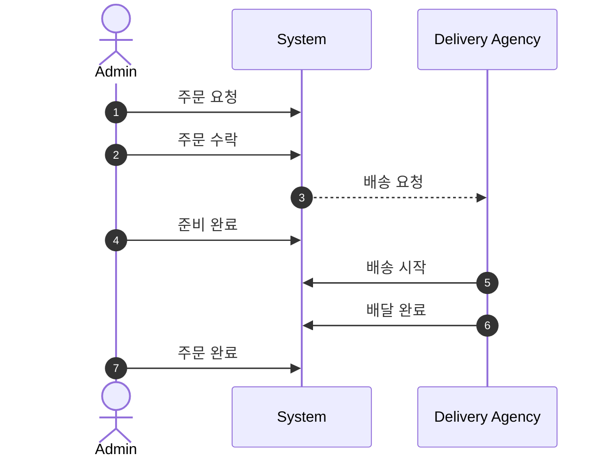
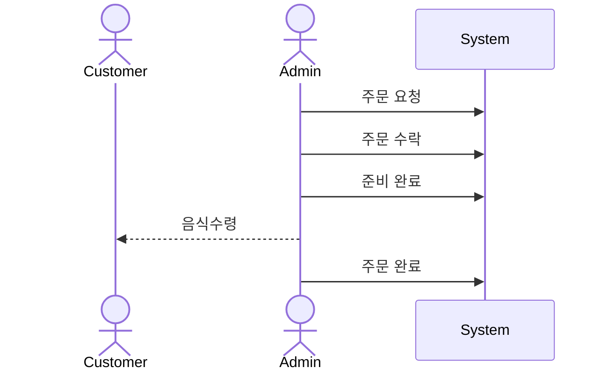

# 예시)

```mermaid
seok-2-o marked this conversation as resolved.
sequenceDiagram
    actor Admin 
    autonumber
		Admin ->> System : 테이블 선택 및 인원 지정
		Admin ->> System : 주문 등록(요청)
		Admin ->> System : 주문 수락
		Admin ->> System : 준비 완료
		Admin ->> System : 주문 완료
```
- `매장 주문(table order)`은  **요청  →** **수락** → **준비 완료** → **주문 완료** 순서로 진행된다.
- `주문테이블(order table)` 은 반드시 이름, `방문 손님 수(number of guest)`, 지정 여부를 가진다.
- `주문테이블(order table)` 의 `방문 손님 수(number of guest)`는 변경할 수 있으며, 0 이상이여야 한다. (**필수값**이 아니다.)
- `주문테이블(order table)` 은 `지정(assign)`되어 있지 않으면 손님 수를 변경할 수 없다.
- `매장 주문(table order)` 주문은  반드시 `지정(assign)` 된 `주문테이블(order table)`을 가진다.
- `매장 주문(table order)` 이 주문완료 된 경우 주문 테이블(order table)을 `정리(clean)` 해야 한다.
    -  주문 완료 되지 않은 테이블을 정리 할 수 없다.
- `매장 주문(table order)` 의 경우 `주문 라인 아이템(Order Line Item)` 의 수량이 0보다 작을 수 있다.

### 배달 주문



- `배달주문(delivery order)` 은 **요청** → **수락** → **준비완료** → **배달시작** → **배달완료** → **주문완료** 순서로 진행된다.
- `배달주문(delivery order)` 은 반드시 `배달주소(delivery address)`를 가진다.
- `배달주문(delivery order)` 이 수락되면 `배달 대행사(deleivery agency)` 에 배달을 요청해야 한다.
- `배달주문(delivery order)` 의 경우 `주문 라인 아이템(order line item)` 의 수량이 0보다 커야 한다.

### 포장 주문



- `포장 주문(take-out order)` 은  **요청  →** **수락** → **준비 완료** → **주문 완료** 순서로 진행된다.
- `포장 주문(take-out order)` 의 경우 `주문 라인 아이템(order line item)` 의 수량이 0보다 커야 한다.
